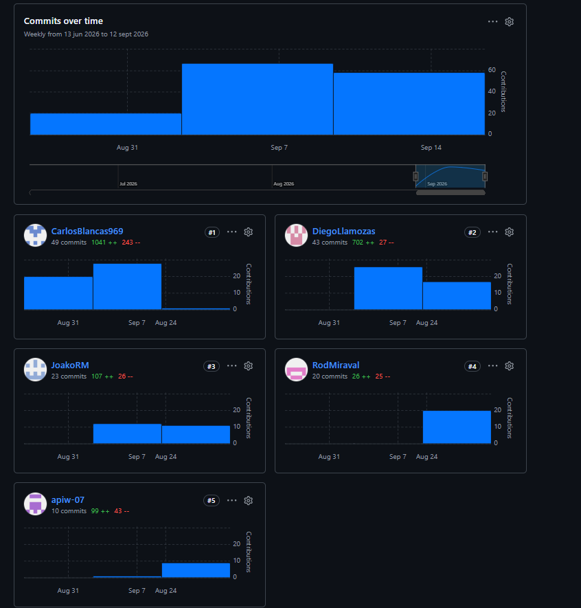
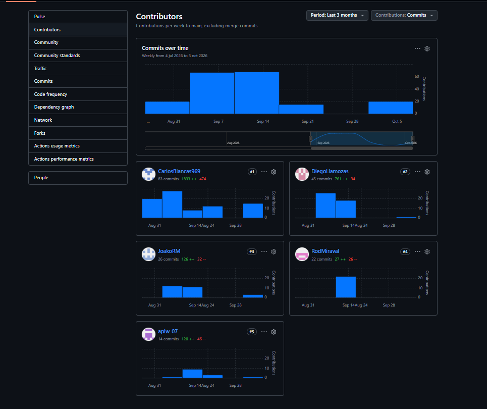

# Universidad Peruana de Ciencias Aplicadas

### Carrera de Ingeniería de Software

### **1ASI0729**

### **Desarrollo de Aplicaciones Open Source**

NRC

### **7769**

### **Informe del Trabajo Final**

Docente

### **Mori Paiva, Hugo Allan**

Equipo

### **UrbanGuardle**

Proyecto

### **UrbanGuard**

### **Integrantes**

| Código     | Apellidos y Nombres             |
| ---------- | ------------------------------- |
| U202311082 | Miraval Pomalaya, Rodrigo Jesus |
| U202319398 | Llamozas Diaz, Edson Diego      |
| U202423262 | Reyes Muñoz, Joaquin Leonardo   |
| U20241A322 | Blancas Chavez, Carlos Franco   |
| U202412447 | Portal Inga, Waldo Alonso       |

### **Período 202620**

**Octubre 2026**
---
### Distribución de contribuciones por integrante

| Integrante | Secciones principales del informe |
|---|---|
| Blancas Chavez, Carlos Franco | Sprint 1: Sprint Planning 1 (preparación), estructura base del Landing Page, funcionalidades interactivas y configuración del despliegue en Vercel (T-02, T-03, T-04) · Sprint 2: implementación del frontend de la Web Application para las áreas de conductor y administrador separadas por rol · API falsa con json-server · Software Deployment Evidence for Sprint Review (5.2.2.7) |
| Llamozas Diaz, Edson Diego | Sprint 1: integración de contenido del Landing Page (T-06) y liderazgo de la corrección de contenido · Capítulo II: narración del Storytelling del Big Picture EventStorming (Paso 10) · Sprint 2: implementación del sistema de notificaciones e historial de turnos · apoyo en la documentación de las funcionalidades desarrolladas durante el Sprint 2 |
| Miraval Pomalaya, Rodrigo Jesus | Sprint 1: revisión y validación del Landing Page (T-07) y liderazgo de la corrección de contenido · Sprint 2: implementación de la gestión de conductores y asignación de unidades · documentación de las funcionalidades relacionadas con la administración de conductores |
| Portal Inga, Waldo Alonso | Sprint 1: configuración inicial del repositorio (T-01) y liderazgo de la configuración del repositorio y CI/CD · Sprint 2: implementación de métricas y funcionalidades de monitoreo · sincronización en vivo entre pestañas y apoyo en la integración de los módulos de la Web Application |
| Reyes Muñoz, Joaquin Leonardo | Sprint 1: implementación de la navegación del Landing Page (T-05) y liderazgo de la corrección de contenido · Sprint 2: integración y validación de las funcionalidades de la Web Application · Execution Evidence for Sprint Review (5.2.2.5) · apoyo en la documentación y revisión de las funcionalidades implementadas |
---

---
# Registro de Versiones del Informe

| Version | Fecha | Autor | Descripción de modificación |
|:------:|:------:|:------:|:---------------------------:|
| AV1 | 20/09/2026 | Todos los integrantes | Primera Version |
| TB1 | 09/10/2026 | Todos los integrantes | Primera Version |

---

## Project Report Collaboration Insights

**Project Report URL:** https://github.com/G3-Avisum-OpenSource/informe-proyecto

El presente apartado tiene como finalidad evidenciar el trabajo colaborativo realizado durante la elaboración del informe del proyecto. Para ello, se considera como fuente principal el repositorio oficial del informe, alojado en GitHub bajo la organización del equipo: [https://github.com/OpenSource-Grupo-1](https://github.com/G3-Avisum-OpenSource/informe-proyecto)

A partir de este repositorio, se analiza la participación de los integrantes mediante indicadores como la distribución de tareas, la frecuencia de contribuciones, la revisión de contenidos y la integración progresiva de los entregables desarrollados durante el avance del proyecto.

En el contexto de la entrega correspondiente a AV1, el análisis de colaboración permite visualizar el aporte individual de cada miembro del equipo, sustentado en los registros de GitHub, la organización de responsabilidades y la evolución del informe. Este seguimiento busca demostrar una distribución ordenada del trabajo, la consistencia en la documentación y el cumplimiento de las actividades asignadas.

### AV1

Durante el desarrollo de la entrega AV1, el equipo organizó la elaboración del informe mediante la asignación de responsabilidades por secciones. Esta distribución permitió avanzar de manera paralela en actividades relacionadas con investigación, análisis del segmento objetivo, definición de requisitos, diseño UX, modelado del dominio, arquitectura de software y documentación técnica.

El proceso de desarrollo del informe se realizó de forma incremental, incorporando progresivamente los contenidos conforme se consolidaban los artefactos del proyecto. Esto se refleja en el Registro de Versiones del Informe, donde se evidencia la evolución del documento desde su estructura inicial hasta la inclusión de elementos como Lean UX, entrevistas, user stories, impact maps, event storming, bounded contexts, diagramas C4, diagramas de clases, diseño de base de datos y evidencias de implementación.

Asimismo, todos los integrantes participaron activamente en la construcción del informe, realizando aportes continuos que permitieron consolidar una documentación coherente y alineada entre sus distintas secciones. La colaboración se evidencia tanto en la planificación de tareas como en los cambios registrados en el repositorio, los cuales reflejan la participación distribuida del equipo.

## TB1

Durante la elaboración de la tb1, el equipo estructuró la elaboración del informe mediante una distribución de tareas por secciones. Esta organización permitió trabajar simultáneamente en actividades de la spint 2, todos los integrantes contribuyeron activamente al proceso, realizando aportes constantes que favorecieron la coherencia y alineación entre las diferentes secciones del documento

## Repositorio del Landing Page

**URL:** https://github.com/G3-Avisum-OpenSource/avisum-landing

Durante el Sprint 1, el equipo realizó commits en el repositorio del Landing Page abarcando desde la estructura inicial hasta el despliegue en producción. A continuación se detalla la participación por integrante:

### Contribuciones por integrante

| Integrante | GitHub Username | Área de contribución |
|---|---|---|
|Miraval Pomalaya, Rodrigo Jesus  | RodMiraval | Diseño visual de secciones · Ajustes de interfaz |
| Llamozas Diaz, Edson Diego | DiegoLlamozas | Integración y consolidación de secciones · Despliegue |
| Blancas Chávez, Carlos Franco | CarlosBlancas969 | Implementación de secciones principales · Navbar · Hero · Características |
|Reyes Muñoz, Joaquin Leonardo | JoakoRM | Diseño de secciones · Cómo funciona · Segmentos |
|Portal Inga, Waldo Alonso | apiw-07 | Diseño de secciones · Cómo funciona · Segmentos |

----

# Repositorio del Frontend

**URL:** https://github.com/G3-Avisum-OpenSource/Avisum-Frontend-main

### Contribuciones por integrante

| Integrante | GitHub Username | Área de contribución |
|---|---|---|
| Blancas Chavez, Carlos Franco | CarlosBlancas969 | Área del conductor, mapa del administrador y despliegue en Vercel |
| Llamozas Diaz, Edson Diego | DiegoLlamozas | Botón de pánico y notificaciones |
| Miraval Pomalaya, Rodrigo Jesus | RodMiraval | Gestión de conductores |
| Portal Inga, Waldo Alonso | apiw-07 | Gestión de conductores y mapa del conductor |
| Reyes Muñoz, Joaquin Leonardo | JoakoRM | Área del administrador y mapa del conductor |

---
# Contenido

- [Carátula](#universidad-peruana-de-ciencias-aplicadas)
- [Registro de Versiones del Informe](#registro-de-versiones-del-informe)
- [Project Report Collaboration Insights](#project-report-collaboration-insights)
- [Contenido](#contenido)
- [Student Outcome](#student-outcome)

- [Capítulo I: Introducción](UrbanGuard/Resources/Chapter1.md)
    - [1.1. Startup Profile](UrbanGuard/Resources/Chapter1.md#11-startup-profile)
        - [1.1.1. Descripción de la Startup](UrbanGuard/Resources/Chapter1.md#111-descripción-de-la-startup)
        - [1.1.2. Perfiles de integrantes del equipo](UrbanGuard/Resources/Chapter1.md#112-perfiles-de-integrantes-del-equipo)
    - [1.2. Solution Profile](UrbanGuard/Resources/Chapter1.md#12-solution-profile)
        - [1.2.1. Antecedentes y problemática](UrbanGuard/Resources/Chapter1.md#121-antecedentes-y-problemática)
        - [1.2.2. Lean UX Process](UrbanGuard/Resources/Chapter1.md#122-lean-ux-process)
            - [1.2.2.1. Lean UX Problem Statements](UrbanGuard/Resources/Chapter1.md#1221-lean-ux-problem-statements)
            - [1.2.2.2. Lean UX Assumptions](UrbanGuard/Resources/Chapter1.md#1222-lean-ux-assumptions)
            - [1.2.2.3. Lean UX Hypothesis Statements](UrbanGuard/Resources/Chapter1.md#1223-lean-ux-hypothesis-statements)
            - [1.2.2.4. Lean UX Canvas](UrbanGuard/Resources/Chapter1.md#1224-lean-ux-canvas)
    - [1.3. Segmentos objetivo](UrbanGuard/Resources/Chapter1.md#13-segmentos-objetivo)

- [Capítulo II: Requirements Elicitation & Analysis](UrbanGuard/Resources/Chapter2.md)
    - [2.1. Competidores](UrbanGuard/Resources/Chapter2.md#21-competidores)
        - [2.1.1. Análisis Competitivo](UrbanGuard/Resources/Chapter2.md#211-análisis-competitivo)
        - [2.1.2. Estrategia y tácticas frente a competidores](UrbanGuard/Resources/Chapter2.md#212-estrategia-y-tácticas-frente-a-competidores)
    - [2.2. Entrevistas](UrbanGuard/Resources/Chapter2.md#22-entrevistas)
        - [2.2.1. Diseño de entrevistas](UrbanGuard/Resources/Chapter2.md#221-diseño-de-entrevistas)
        - [2.2.2. Registro de entrevistas](UrbanGuard/Resources/Chapter2.md#222-registro-de-entrevistas)
        - [2.2.3. Análisis de entrevistas](UrbanGuard/Resources/Chapter2.md#223-análisis-de-entrevistas)
    - [2.3. Needfinding](UrbanGuard/Resources/Chapter2.md#23-needfinding)
        - [2.3.1. User Personas](UrbanGuard/Resources/Chapter2.md#231-user-personas)
        - [2.3.2. User Task Matrix](UrbanGuard/Resources/Chapter2.md#232-user-task-matrix)
        - [2.3.3. User Journey Mapping](UrbanGuard/Resources/Chapter2.md#233-user-journey-mapping)
        - [2.3.4. Empathy Mapping](UrbanGuard/Resources/Chapter2.md#234-empathy-mapping)
    - [2.4. Big Picture EventStorming](UrbanGuard/Resources/Chapter2.md#24-big-picture-eventstorming)
    - [2.5. Ubiquitous Language](UrbanGuard/Resources/Chapter2.md#25-ubiquitous-language)

- [Capítulo III: Requirements Specification](UrbanGuard/Resources/Chapter3.md)
    - [3.1. User Stories](UrbanGuard/Resources/Chapter3.md#31-user-stories)
    - [3.2. Impact Mapping](UrbanGuard/Resources/Chapter3.md#32-impact-mapping)
    - [3.3. Product Backlog](UrbanGuard/Resources/Chapter3.md#33-product-backlog)

- [Capítulo IV: Product Design](UrbanGuard/Resources/Chapter4.md)
    - [4.1. Style Guidelines](UrbanGuard/Resources/Chapter4.md#41-style-guidelines)
        - [4.1.1. General Style Guidelines](UrbanGuard/Resources/Chapter4.md#411-general-style-guidelines)
        - [4.1.2. Web Style Guidelines](UrbanGuard/Resources/Chapter4.md#412-web-style-guidelines)
    - [4.2. Information Architecture](UrbanGuard/Resources/Chapter4.md#42-information-architecture)
        - [4.2.1. Organization Systems](UrbanGuard/Resources/Chapter4.md#421-organization-systems)
        - [4.2.2. Labeling Systems](UrbanGuard/Resources/Chapter4.md#422-labeling-systems)
        - [4.2.3. SEO Tags and Meta Tags](UrbanGuard/Resources/Chapter4.md#423-seo-tags-and-meta-tags)
        - [4.2.4. Searching Systems](UrbanGuard/Resources/Chapter4.md#424-searching-systems)
        - [4.2.5. Navigation Systems](UrbanGuard/Resources/Chapter4.md#425-navigation-systems)
    - [4.3. Landing Page UI Design](UrbanGuard/Resources/Chapter4.md#43-landing-page-ui-design)
        - [4.3.1. Landing Page Wireframe](UrbanGuard/Resources/Chapter4.md#431-landing-page-wireframe)
        - [4.3.2. Landing Page Mock-up](UrbanGuard/Resources/Chapter4.md#432-landing-page-mock-up)
    - [4.4. Web Applications UX/UI Design](UrbanGuard/Resources/Chapter4.md#44-web-applications-uxui-design)
        - [4.4.1. Web Applications Wireframes](UrbanGuard/Resources/Chapter4.md#441-web-applications-wireframes)
        - [4.4.2. Web Applications Wireflow Diagrams](UrbanGuard/Resources/Chapter4.md#442-web-applications-wireflow-diagrams)
        - [4.4.3. Web Applications Mock-ups](UrbanGuard/Resources/Chapter4.md#443-web-applications-mock-ups)
        - [4.4.4. Web Applications User Flow Diagrams](UrbanGuard/Resources/Chapter4.md#444-web-applications-user-flow-diagrams)
    - [4.5. Web Applications Prototyping](UrbanGuard/Resources/Chapter4.md#45-web-applications-prototyping)
    - [4.6. Domain-Driven Software Architecture](UrbanGuard/Resources/Chapter4.md#46-domain-driven-software-architecture)
        - [4.6.1. Design-Level Event Storming](UrbanGuard/Resources/Chapter4.md#461-design-level-event-storming)
        - [4.6.2. Software Architecture Context Diagram](UrbanGuard/Resources/Chapter4.md#462-software-architecture-context-diagram)
        - [4.6.3. Software Architecture Container Diagrams](UrbanGuard/Resources/Chapter4.md#463-software-architecture-container-diagrams)
        - [4.6.4. Software Architecture Components Diagrams](UrbanGuard/Resources/Chapter4.md#464-software-architecture-components-diagrams)
    - [4.7. Software Object-Oriented Design](UrbanGuard/Resources/Chapter4.md#47-software-object-oriented-design)
        - [4.7.1. Class Diagrams](UrbanGuard/Resources/Chapter4.md#471-class-diagrams)
    - [4.8. Database Design](UrbanGuard/Resources/Chapter4.md#48-database-design)
        - [4.8.1. Database Diagrams](UrbanGuard/Resources/Chapter4.md#481-database-diagrams)

- [Capítulo V: Product Implementation, Validation & Deployment](UrbanGuard/Resources/Chapter5.md)
    - [5.1. Software Configuration Management](UrbanGuard/Resources/Chapter5.md#51-software-configuration-management)
        - [5.1.1. Software Development Environment Configuration](UrbanGuard/Resources/Chapter5.md#511-software-development-environment-configuration)
        - [5.1.2. Source Code Management](UrbanGuard/Resources/Chapter5.md#512-source-code-management)
        - [5.1.3. Source Code Style Guide & Coding Conventions](UrbanGuard/Resources/Chapter5.md#513-source-code-style-guide--coding-conventions)
    - [5.2. Landing Page, Services & Applications Implementation](UrbanGuard/Resources/Chapter5.md#52-landing-page-services--applications-implementation)
        - [5.2.1. Sprint 1](UrbanGuard/Resources/Chapter5.md#521-sprint-1)
            - [5.2.1.1. Sprint Planning 1](UrbanGuard/Chapter5.md#5211-sprint-planning-1)
            - [5.2.1.2. Aspect Leaders and Collaborators](UrbanGuard/Resources/Chapter5.md#5212-aspect-leaders-and-collaborators)
            - [5.2.1.3. Sprint Backlog 1](UrbanGuard/Resources/Chapter5.md#5213-sprint-backlog-1)
            - [5.2.1.4. Development Evidence for Sprint Review](UrbanGuard/Resources/Chapter5.md#5214-development-evidence-for-sprint-review)
            - [5.2.1.5. Execution Evidence for Sprint Review](UrbanGuard/Resources/Chapter5.md#5215-execution-evidence-for-sprint-review)
            - [5.2.1.6. Services Documentation Evidence for Sprint Review](UrbanGuard/Resources/Chapter5.md#5216-services-documentation-evidence-for-sprint-review)
            - [5.2.1.7. Software Deployment Evidence for Sprint Review](UrbanGuard/Resources/Chapter5.md#5217-software-deployment-evidence-for-sprint-review)
            - [5.2.1.8. Team Collaboration Insights during Sprint](UrbanGuard/Resources/Chapter5.md#5218-team-collaboration-insights-during-sprint)
        - [5.2.2. Sprint 2](UrbanGuard/Resources/Chapter5.md#521-sprint-1)
            - [5.2.2.1. Sprint Planning 2](UrbanGuard/Chapter5.md#5211-sprint-planning-1)
            - [5.2.2.2. Aspect Leaders and Collaborators](UrbanGuard/Resources/Chapter5.md#5212-aspect-leaders-and-collaborators)
            - [5.2.2.3. Sprint Backlog 2](UrbanGuard/Resources/Chapter5.md#5213-sprint-backlog-1)
            - [5.2.2.4. Development Evidence for Sprint Review](UrbanGuard/Resources/Chapter5.md#5214-development-evidence-for-sprint-review)
            - [5.2.2.5. Execution Evidence for Sprint Review](UrbanGuard/Resources/Chapter5.md#5215-execution-evidence-for-sprint-review)
            - [5.2.2.6. Services Documentation Evidence for Sprint Review](UrbanGuard/Resources/Chapter5.md#5216-services-documentation-evidence-for-sprint-review)
            - [5.2.2.7. Software Deployment Evidence for Sprint Review](UrbanGuard/Resources/Chapter5.md#5217-software-deployment-evidence-for-sprint-review)
            - [5.2.2.8. Team Collaboration Insights during Sprint](UrbanGuard/Resources/Chapter5.md#5218-team-collaboration-insights-during-sprint)
   - [Conclusiones](UrbanGuard/Resources/6_Conclusions.md)
   - [Recomendaciones](UrbanGuard/Resources/6_Conclusions.md)
   - [Bibliografia](UrbanGuard/Resources/7_Bibliography.md)
   - [Anexos](UrbanGuard/Resources/anexos.md)
---

## Student Outcome

En Ingeniería de Software el logro contribuye a alcanzar el Student Outcome EAC 3:
<table>
  <thead>
    <tr>
      <th>Criterio específico</th>
      <th>Acciones realizadas</th>
      <th>Conclusiones</th>
    </tr>
  </thead>
  <tbody>
    <tr>
      <td>Comunica oralmente con efectividad a diferentes rangos de audiencia.</td>
      <td>
        <strong>Miraval Pomalaya, Rodrigo Jesus</strong> 
        <em>AV1:</em> Participó en la planificación del Sprint 1 y colaboró en la organización de las actividades iniciales del proyecto, aportando en la coordinación del equipo y en la recopilación de evidencias. 
        <em>TB1:</em> Lideró el desarrollo de las funcionalidades asignadas, coordinando con los demás integrantes la integración de los módulos y el cumplimiento de los objetivos del Sprint 2.  
        <strong>Llamozas Diaz, Edson Diego</strong> 
        <em>AV1:</em> Participó en la planificación y desarrollo de las actividades iniciales, colaborando en la documentación de servicios y en la organización de las evidencias del proyecto. 
        <em>TB1:</em> Lideró las actividades relacionadas con la implementación y documentación de los servicios asignados, coordinando con el equipo para mantener una estructura técnica consistente.  
        <strong>Reyes Muñoz, Joaquin Leonardo</strong> 
        <em>AV1:</em> Colaboró en el desarrollo de las funcionalidades iniciales y en la organización de las evidencias de desarrollo, participando activamente en la coordinación del equipo. 
        <em>TB1:</em> Lideró el desarrollo de las funcionalidades correspondientes a su módulo, coordinando con los demás integrantes la integración de los componentes implementados.  
        <strong>Blancas Chavez, Carlos Franco</strong> 
        <em>AV1:</em> Lideró la planificación y organización del Sprint Backlog 1, coordinando la distribución de tareas y el desarrollo de las actividades iniciales del proyecto. 
        <em>TB1:</em> Lideró el desarrollo de las funcionalidades asignadas a su módulo, coordinando su integración con los demás componentes desarrollados por el equipo.  
        <strong>Portal Inga, Waldo Alonso</strong> 
        <em>AV1:</em> Participó en la implementación de las funcionalidades iniciales y en la preparación de las evidencias de ejecución, colaborando con el equipo en la validación de los resultados. 
        <em>TB1:</em> Lideró las actividades de implementación y validación correspondientes a su módulo, coordinando con los demás integrantes para garantizar el correcto funcionamiento de las funcionalidades.
      </td>
      <td>
        A lo largo de AV1 y TB1, el equipo demostró liderazgo compartido al distribuir responsabilidades según las fortalezas técnicas de cada integrante. En AV1 el liderazgo se concentró en la planificación, organización y desarrollo inicial del proyecto; mientras que en TB1 se orientó hacia la implementación e integración de las funcionalidades. Esta progresión evidencia que el equipo no dependió de un único líder, sino que cada integrante asumió responsabilidades de liderazgo en su área y colaboró con los demás para cumplir el objetivo común.
      </td>
    </tr>
    <tr>
      <td>Comunica por escrito con efectividad a diferentes rangos de audiencia.</td>
      <td>
        <strong>Miraval Pomalaya, Rodrigo Jesus</strong> 
        <em>AV1:</em> Colaboró en la organización del Sprint 1 y en la recopilación de evidencias, contribuyendo a que el equipo mantuviera una planificación y documentación coherente. 
        <em>TB1:</em> Coordinó sus avances con los demás integrantes, reportando dependencias y apoyando la integración de las funcionalidades desarrolladas durante el Sprint 2.  
        <strong>Llamozas Diaz, Edson Diego</strong> 
        <em>AV1:</em> Colaboró en la organización de la documentación y evidencias del proyecto, manteniendo comunicación con los integrantes para cumplir las actividades asignadas. 
        <em>TB1:</em> Planificó y desarrolló las tareas relacionadas con los servicios asignados, coordinando con el equipo para mantener consistencia entre los diferentes módulos.  
        <strong>Reyes Muñoz, Joaquin Leonardo</strong> 
        <em>AV1:</em> Participó en las actividades de desarrollo y colaboró en la recopilación de evidencias, manteniendo comunicación constante con los demás integrantes para cumplir las tareas planificadas. 
        <em>TB1:</em> Planificó e implementó las tareas correspondientes a su módulo, colaborando en la integración de funcionalidades y en los ajustes necesarios para alcanzar los objetivos del Sprint 2.  
        <strong>Blancas Chavez, Carlos Franco</strong> 
        <em>AV1:</em> Colaboró con el equipo en la planificación del Sprint Backlog 1 y en la distribución de actividades, promoviendo una organización clara de las responsabilidades. 
        <em>TB1:</em> Planificó e implementó las tareas asignadas, colaborando en la integración de los módulos y realizando las validaciones necesarias para cumplir con los objetivos establecidos.  
        <strong>Portal Inga, Waldo Alonso</strong> 
        <em>AV1:</em> Participó en la ejecución de las tareas asignadas y en la recopilación de evidencias de ejecución, contribuyendo al seguimiento de los avances del equipo. 
        <em>TB1:</em> Participó en la implementación y validación de las funcionalidades correspondientes a su módulo, coordinando con el equipo para identificar y resolver problemas durante la integración.
      </td>
      <td>
        El equipo mantuvo un entorno colaborativo e inclusivo durante AV1 y TB1 mediante reuniones de planificación, división de tareas por sprint, uso de ramas en GitHub, seguimiento en Trello y revisión constante de evidencias. Las metas evolucionaron desde una primera organización y desarrollo inicial en AV1 hacia un trabajo más enfocado en la implementación e integración de funcionalidades en TB1. La participación de cada integrante demuestra que el equipo planificó, comunicó avances, resolvió dependencias y cumplió objetivos incrementales durante el desarrollo del proyecto.
      </td>
    </tr>
  </tbody>
</table>

