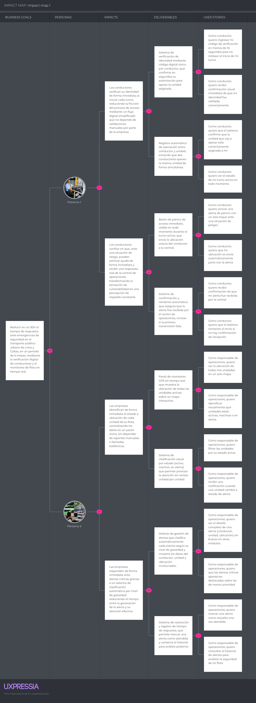

# Capítulo III: Requirements Specification

## 3.1. User Stories

<b>Lista de Epics</b>

| Epic ID | Título | Descripción |
| :-----: | :----- | :---------- |
| **EPAV01** | Verificación de identidad | Como sistema, necesito validar la identidad y autorización del conductor, para garantizar que solo personal habilitado pueda operar cada unidad y mantener trazabilidad de cada servicio. |
| **EPAV02** | Gestión de emergencias | Como sistema, necesito procesar el envío, recepción y seguimiento de alertas de pánico, para habilitar una respuesta rápida ante situaciones de riesgo. |
| **EPAV03** | Monitoreo de flota | Como sistema, necesito registrar y actualizar el estado y la ubicación de cada unidad en tiempo real, para dar visibilidad operativa a las empresas de transporte. |
| **EPAV04** | Plataforma web informativa | Como visitante, quiero conocer la propuesta de Avisum y sus beneficios, para entender cómo la solución protege a conductores y pasajeros. |
| **EPAV05** | API RESTful del sistema | Como developer, necesito exponer endpoints que permitan interactuar con las funcionalidades del sistema, para integrar los distintos componentes de Avisum. |

 

<table border="1" cellpadding="8" cellspacing="0" style="border-collapse: collapse; width: 100%;">
  <thead>
    <tr>
      <th>Story ID</th>
      <th>Título</th>
      <th>Descripción</th>
      <th>Criterios de Aceptación</th>
      <th>Epic ID</th>
    </tr>
  </thead>
  <tbody>
    <tr><td>US01</td><td>Verificar identidad del conductor</td><td>Como conductor, quiero validar mi identidad antes de iniciar el servicio, para asegurar la trazabilidad del turno.</td><td><strong>Escenario (Éxito):</strong> Given que el conductor inicia su jornada When ingresa su código de verificación Then el sistema confirma su identidad  <strong>Escenario (Fracaso):</strong> Given que el conductor inicia su jornada When ingresa un código inválido Then el sistema rechaza el acceso</td><td>EPAV01</td></tr>
    <tr><td>US02</td><td>Registrar inicio de turno</td><td>Como conductor, quiero registrar el inicio de mi turno, para dejar evidencia del recorrido realizado.</td><td><strong>Escenario (Éxito):</strong> Given un conductor validado When inicia el servicio Then el sistema guarda la hora y el estado inicial  <strong>Escenario (Fracaso):</strong> Given un conductor no validado When intenta iniciar el servicio Then el sistema bloquea el registro</td><td>EPAV01</td></tr>
    <tr><td>US03</td><td>Activar alerta de pánico</td><td>Como conductor, quiero enviar una alerta de emergencia, para notificar de inmediato una situación de riesgo.</td><td><strong>Escenario (Éxito):</strong> Given un turno activo When se activa el botón de pánico Then el sistema envía la alerta a la central  <strong>Escenario (Fracaso):</strong> Given que no hay turno activo When se intenta activar la alerta Then el sistema rechaza la solicitud</td><td>EPAV02</td></tr>
    <tr><td>US04</td><td>Recepción de alerta en central</td><td>Como sistema, necesito notificar a la central de operaciones, para gestionar la emergencia reportada.</td><td><strong>Escenario (Éxito):</strong> Given una alerta enviada When el sistema la procesa Then la central la recibe  <strong>Escenario (Fracaso):</strong> Given datos incompletos When se procesa la alerta Then esta es rechazada</td><td>EPAV02</td></tr>
    <tr><td>US05</td><td>Registro histórico de emergencias</td><td>Como sistema, necesito almacenar cada alerta generada, para poder darle seguimiento posterior.</td><td><strong>Escenario (Éxito):</strong> Given una alerta válida When es recibida Then se guarda el evento  <strong>Escenario (Fracaso):</strong> Given un formato inválido When se intenta registrar Then el sistema descarta el evento</td><td>EPAV02</td></tr>
    <tr><td>US06</td><td>Actualizar estado de la unidad</td><td>Como sistema, necesito reflejar el estado operativo de cada unidad, para mantener información confiable en el panel de la empresa.</td><td><strong>Escenario (Éxito):</strong> Given una unidad en operación When cambia su estado Then el sistema lo actualiza  <strong>Escenario (Fracaso):</strong> Given datos de estado inválidos When se intenta actualizar Then el sistema conserva el último estado válido</td><td>EPAV03</td></tr>
    <tr><td>US07</td><td>Consultar ubicación de la unidad</td><td>Como empresa, quiero conocer la ubicación actual de cada unidad, para dar seguimiento a la operación.</td><td><strong>Escenario (Éxito):</strong> Given una unidad activa When se consulta su ubicación Then el sistema retorna las coordenadas  <strong>Escenario (Fracaso):</strong> Given que no hay señal GPS When se consulta Then el sistema indica que la ubicación no está disponible</td><td>EPAV03</td></tr>
    <tr><td>US08</td><td>Visualizar propuesta del servicio</td><td>Como visitante, quiero conocer qué ofrece Avisum, para entender sus beneficios.</td><td><strong>Escenario (Éxito):</strong> Given que el visitante ingresa al sitio When carga la página Then se muestra la información del servicio  <strong>Escenario (Fracaso):</strong> Given contenido no disponible When se accede al sitio Then se muestra un mensaje de indisponibilidad</td><td>EPAV04</td></tr>
    <tr><td>US09</td><td>Visualizar funcionalidades del sistema</td><td>Como visitante, quiero conocer las funcionalidades de Avisum, para evaluar su utilidad.</td><td><strong>Escenario (Éxito):</strong> Given que el visitante navega el sitio When accede a la sección correspondiente Then se muestran las funcionalidades  <strong>Escenario (Fracaso):</strong> Given que no hay funcionalidades registradas When se accede Then se indica ausencia de contenido</td><td>EPAV04</td></tr>
    <tr><td>US10</td><td>Endpoint de validación de conductor</td><td>Como developer, necesito validar la identidad del conductor mediante un servicio API, para consultarla en cualquier momento.</td><td><strong>Escenario (Éxito):</strong> Given credenciales válidas When se envía la solicitud Then el API confirma la identidad  <strong>Escenario (Fracaso):</strong> Given un identificador inválido When se procesa la solicitud Then el API retorna un error</td><td>EPAV05</td></tr>
    <tr><td>US11</td><td>Endpoint de inicio de servicio</td><td>Como developer, necesito registrar el inicio de un servicio mediante API, para realizar pruebas del flujo.</td><td><strong>Escenario (Éxito):</strong> Given una solicitud válida When se envían los datos Then el API registra el inicio  <strong>Escenario (Fracaso):</strong> Given una solicitud inválida When se procesa Then el API retorna un error</td><td>EPAV05</td></tr>
    <tr><td>US12</td><td>Endpoint de alerta de emergencia</td><td>Como developer, necesito enviar alertas mediante API, para testear el flujo de emergencia.</td><td><strong>Escenario (Éxito):</strong> Given datos completos When el API recibe la alerta Then la registra correctamente  <strong>Escenario (Fracaso):</strong> Given datos incompletos When se procesa la alerta Then el API retorna un error</td><td>EPAV05</td></tr>
    <tr><td>US13</td><td>Endpoint de estado de unidad</td><td>Como developer, necesito actualizar el estado de una unidad mediante API, para simular cambios operativos.</td><td><strong>Escenario (Éxito):</strong> Given una solicitud de actualización When se envía el nuevo estado Then el API lo actualiza  <strong>Escenario (Fracaso):</strong> Given un error interno When se procesa la solicitud Then se retorna un mensaje de error y se conserva el estado previo</td><td>EPAV05</td></tr>
    <tr><td>US14</td><td>Validar autorización del conductor</td><td>Como sistema, necesito verificar que el conductor esté autorizado para operar la unidad asignada.</td><td><strong>Escenario (Éxito):</strong> Given un conductor registrado When se valida su autorización Then se confirma que puede operar  <strong>Escenario (Fracaso):</strong> Given un conductor no autorizado When se valida Then se rechaza la operación</td><td>EPAV01</td></tr>
    <tr><td>US15</td><td>Asociar conductor a unidad</td><td>Como sistema, necesito vincular un conductor a una unidad, para asegurar la trazabilidad del servicio.</td><td><strong>Escenario (Éxito):</strong> Given un conductor válido When se realiza la asignación Then el sistema registra el vínculo  <strong>Escenario (Fracaso):</strong> Given datos inconsistentes When se intenta asociar Then el sistema rechaza la asignación</td><td>EPAV01</td></tr>
    <tr><td>US16</td><td>Consultar historial de emergencias</td><td>Como empresa, quiero revisar el historial de alertas registradas, para analizar la seguridad de mi flota.</td><td><strong>Escenario (Éxito):</strong> Given registros almacenados When se consulta el historial Then el sistema devuelve la lista de eventos  <strong>Escenario (Fracaso):</strong> Given que no existen registros When se consulta Then el sistema indica ausencia de datos</td><td>EPAV02</td></tr>
    <tr><td>US17</td><td>Detección de unidad inactiva</td><td>Como sistema, necesito identificar cuando una unidad deja de reportar señal, para alertar a la empresa correspondiente.</td><td><strong>Escenario (Éxito):</strong> Given un intervalo sin señal definido When se supera dicho intervalo Then el sistema genera una alerta  <strong>Escenario (Fracaso):</strong> Given que no existe intervalo definido When se evalúa la señal Then el sistema no genera alerta</td><td>EPAV03</td></tr>
    <tr><td>US18</td><td>Visualizar estadísticas de impacto</td><td>Como visitante, quiero conocer cifras sobre la problemática de seguridad en el transporte, para evaluar la relevancia de la solución.</td><td><strong>Escenario (Éxito):</strong> Given datos disponibles When se accede a la sección Then se muestran las estadísticas  <strong>Escenario (Fracaso):</strong> Given que no hay datos disponibles When se accede Then se muestra un mensaje informativo</td><td>EPAV04</td></tr>
    <tr><td>US19</td><td>Endpoint de consulta de historial</td><td>Como developer, necesito consultar el historial de eventos mediante API, para extraer datos cuando se requiera.</td><td><strong>Escenario (Éxito):</strong> Given una solicitud válida When el API procesa la consulta Then retorna los registros  <strong>Escenario (Fracaso):</strong> Given una solicitud inválida When se procesa Then el API retorna un error</td><td>EPAV05</td></tr>
    <tr><td>US20</td><td>Endpoint de consulta de estado</td><td>Como developer, necesito consultar el estado actual de una unidad, para evitar desconocer su condición operativa.</td><td><strong>Escenario (Éxito):</strong> Given un identificador válido When se consulta el estado Then el API retorna la información  <strong>Escenario (Fracaso):</strong> Given un identificador inválido When se consulta Then el API retorna un error</td><td>EPAV05</td></tr>
    <tr><td>US21</td><td>Navegar entre secciones del sitio</td><td>Como visitante, quiero desplazarme entre las secciones del sitio web, para explorar el contenido disponible.</td><td><strong>Escenario (Éxito):</strong> Given que el visitante ingresa al sitio When navega entre secciones Then el contenido correspondiente se carga  <strong>Escenario (Fracaso):</strong> Given un error de navegación When se intenta acceder a una sección Then el sistema indica error de acceso</td><td>EPAV04</td></tr>
    <tr><td>US22</td><td>Endpoint de autenticación</td><td>Como developer, necesito autenticar las solicitudes al sistema, para evitar accesos no controlados.</td><td><strong>Escenario (Éxito):</strong> Given credenciales válidas When se envía la solicitud Then el API autoriza el acceso  <strong>Escenario (Fracaso):</strong> Given credenciales inválidas When se envía la solicitud Then el API rechaza el acceso</td><td>EPAV05</td></tr>
    <tr><td>US23</td><td>Confirmación de recepción de alerta</td><td>Como sistema, necesito confirmar que una alerta fue recibida por la central, para garantizar visibilidad del evento.</td><td><strong>Escenario (Éxito):</strong> Given una alerta enviada When la central la recibe Then se registra la confirmación  <strong>Escenario (Fracaso):</strong> Given que no llega confirmación When se evalúa el estado Then la alerta se marca como no confirmada</td><td>EPAV02</td></tr>
    <tr><td>US24</td><td>Reintentar envío de alerta</td><td>Como sistema, necesito reenviar alertas no confirmadas, para asegurar que sean atendidas.</td><td><strong>Escenario (Éxito):</strong> Given una alerta no confirmada When se ejecuta el reintento Then la alerta se reenvía  <strong>Escenario (Fracaso):</strong> Given múltiples intentos fallidos When se reintenta el envío Then la alerta se marca como fallida</td><td>EPAV02</td></tr>
    <tr><td>US25</td><td>Registrar cierre de turno</td><td>Como conductor, quiero finalizar mi servicio, para cerrar el registro del turno.</td><td><strong>Escenario (Éxito):</strong> Given un servicio en curso When el conductor lo finaliza Then el sistema registra el cierre  <strong>Escenario (Fracaso):</strong> Given que no hay servicio activo When se intenta finalizar Then el sistema rechaza la operación</td><td>EPAV01</td></tr>
    <tr><td>US26</td><td>Consultar estado del servicio</td><td>Como conductor, quiero conocer el estado actual de mi servicio, para tener claridad de mi turno.</td><td><strong>Escenario (Éxito):</strong> Given un servicio activo When se consulta su estado Then el sistema devuelve la información  <strong>Escenario (Fracaso):</strong> Given que no hay servicio activo When se consulta Then el sistema indica ausencia de información</td><td>EPAV01</td></tr>
    <tr><td>US27</td><td>Visualizar estado de la flota</td><td>Como empresa, quiero conocer el estado de mis unidades en operación, para tener control de mi flota.</td><td><strong>Escenario (Éxito):</strong> Given unidades registradas When se consulta su estado Then el sistema muestra la información actual  <strong>Escenario (Fracaso):</strong> Given que no hay unidades registradas When se consulta Then el sistema indica ausencia de datos</td><td>EPAV03</td></tr>
    <tr><td>US28</td><td>Monitorear flota en tiempo real</td><td>Como empresa, quiero monitorear mis unidades en tiempo real, para gestionar el riesgo operativo.</td><td><strong>Escenario (Éxito):</strong> Given datos disponibles When se genera el reporte Then el sistema lo muestra  <strong>Escenario (Fracaso):</strong> Given datos incompletos When se genera el reporte Then el sistema indica un error en la información</td><td>EPAV03</td></tr>
    <tr><td>US29</td><td>Visualizar segmentos objetivo</td><td>Como visitante, quiero identificar a qué tipo de usuarios está dirigido Avisum, para conocer su alcance.</td><td><strong>Escenario (Éxito):</strong> Given contenido disponible When se accede a la sección Then se muestran los segmentos definidos  <strong>Escenario (Fracaso):</strong> Given que no existe contenido When se accede Then se muestra un mensaje informativo</td><td>EPAV04</td></tr>
    <tr><td>US30</td><td>Visualizar misión y visión</td><td>Como visitante, quiero conocer la misión y visión de Avisum, para entender sus objetivos.</td><td><strong>Escenario (Éxito):</strong> Given contenido disponible When se accede a la sección Then se muestra la misión y visión  <strong>Escenario (Fracaso):</strong> Given contenido no disponible When se accede Then se muestra un mensaje de error</td><td>EPAV04</td></tr>
    <tr><td>US31</td><td>Endpoint de finalización de servicio</td><td>Como developer, necesito finalizar un servicio mediante API, para realizar pruebas del flujo completo.</td><td><strong>Escenario (Éxito):</strong> Given una solicitud válida When se procesa la finalización Then el servicio se cierra correctamente  <strong>Escenario (Fracaso):</strong> Given una solicitud inválida When se procesa Then el API retorna un error</td><td>EPAV05</td></tr>
    <tr><td>US32</td><td>Endpoint de consulta de flota</td><td>Como developer, necesito consultar el estado de la flota mediante API, para conocer las unidades activas.</td><td><strong>Escenario (Éxito):</strong> Given un identificador válido When se realiza la consulta Then el API retorna la información  <strong>Escenario (Fracaso):</strong> Given un identificador inválido When se consulta Then el API retorna un error</td><td>EPAV05</td></tr>
    <tr><td>US33</td><td>Notificar a múltiples destinatarios</td><td>Como sistema, necesito enviar alertas a más de un destinatario, para aumentar el alcance de la notificación.</td><td><strong>Escenario (Éxito):</strong> Given una alerta generada When el sistema la procesa Then se envía a todos los destinatarios definidos  <strong>Escenario (Fracaso):</strong> Given destinatarios inválidos When se intenta enviar Then el sistema registra el fallo</td><td>EPAV02</td></tr>
    <tr><td>US34</td><td>Registrar tiempo de respuesta</td><td>Como sistema, necesito medir el tiempo de respuesta ante una alerta, para dejarlo documentado.</td><td><strong>Escenario (Éxito):</strong> Given una alerta enviada When es atendida Then el sistema registra el tiempo transcurrido  <strong>Escenario (Fracaso):</strong> Given una alerta no atendida When se evalúa el evento Then el sistema registra la ausencia de respuesta</td><td>EPAV02</td></tr>
    <tr><td>US35</td><td>Consultar tiempo promedio de respuesta</td><td>Como empresa, quiero conocer el tiempo promedio de respuesta ante alertas, para evaluar el desempeño operativo.</td><td><strong>Escenario (Éxito):</strong> Given datos históricos disponibles When se realiza el cálculo Then el sistema devuelve el promedio  <strong>Escenario (Fracaso):</strong> Given datos insuficientes When se realiza el cálculo Then el sistema indica que no puede calcularlo</td><td>EPAV03</td></tr>
    <tr><td>US36</td><td>Detección de desvío de ruta</td><td>Como sistema, necesito identificar cuando una unidad se desvía de su ruta asignada, para generar una alerta correspondiente.</td><td><strong>Escenario (Éxito):</strong> Given una ruta definida When se detecta un desvío significativo Then el sistema genera una alerta  <strong>Escenario (Fracaso):</strong> Given datos de ubicación inconsistentes When se analiza el desvío Then el sistema descarta el evento</td><td>EPAV03</td></tr>
    <tr><td>US37</td><td>Visualizar la problemática del transporte</td><td>Como visitante, quiero entender el problema que resuelve Avisum, para tener contexto de la situación actual.</td><td><strong>Escenario (Éxito):</strong> Given contenido disponible When se accede a la sección Then se presenta la problemática  <strong>Escenario (Fracaso):</strong> Given contenido no disponible When se accede Then se muestra un mensaje informativo</td><td>EPAV04</td></tr>
    <tr><td>US38</td><td>Visualizar propuesta de valor</td><td>Como visitante, quiero conocer la propuesta de valor de Avisum, para entender su alcance.</td><td><strong>Escenario (Éxito):</strong> Given contenido definido When se accede a la sección Then se presenta la propuesta  <strong>Escenario (Fracaso):</strong> Given contenido incompleto When se accede Then se muestra un mensaje de falta de información</td><td>EPAV04</td></tr>
    <tr><td>US39</td><td>Validar unidad única por conductor activo</td><td>Como sistema, necesito impedir que un conductor opere más de una unidad a la vez, para evitar suplantación de identidad.</td><td><strong>Escenario (Éxito):</strong> Given un conductor con turno activo en una unidad When intenta iniciar servicio en otra Then el sistema rechaza la operación  <strong>Escenario (Fracaso):</strong> Given datos de identidad inconsistentes When se valida la operación Then el intento se marca como inválido</td><td>EPAV01</td></tr>
    <tr><td>US40</td><td>Clasificación de alertas por gravedad</td><td>Como sistema, necesito clasificar cada alerta según su nivel de gravedad, para priorizar su atención.</td><td><strong>Escenario (Éxito):</strong> Given una alerta generada When el sistema evalúa su tipo Then asigna un nivel de prioridad  <strong>Escenario (Fracaso):</strong> Given datos insuficientes When se intenta clasificar Then se asigna prioridad por defecto</td><td>EPAV02</td></tr>
    <tr><td>US41</td><td>Escalar alertas no atendidas</td><td>Como sistema, necesito escalar alertas que superen un tiempo límite sin atención, para evitar que sean ignoradas.</td><td><strong>Escenario (Éxito):</strong> Given una alerta sin respuesta When se supera el tiempo límite Then el sistema escala la alerta  <strong>Escenario (Fracaso):</strong> Given una alerta atendida When se evalúa el tiempo Then no se realiza escalamiento</td><td>EPAV02</td></tr>
    <tr><td>US42</td><td>Registrar ubicación de la alerta</td><td>Como sistema, necesito almacenar la ubicación exacta de cada alerta, para uso estadístico posterior.</td><td><strong>Escenario (Éxito):</strong> Given una alerta con datos de ubicación When se procesa el evento Then el sistema guarda la ubicación  <strong>Escenario (Fracaso):</strong> Given una alerta sin ubicación When se procesa Then el sistema registra la ausencia de datos</td><td>EPAV02</td></tr>
    <tr><td>US43</td><td>Seguimiento de ubicación de la unidad asignada</td><td>Como empresa, quiero contar con el seguimiento de ubicación de mis unidades, para conocer su posición actual.</td><td><strong>Escenario (Éxito):</strong> Given una unidad en operación When se consulta su ubicación Then el sistema retorna las coordenadas actuales  <strong>Escenario (Fracaso):</strong> Given ausencia de datos de GPS When se consulta Then el sistema indica que la ubicación no está disponible</td><td>EPAV03</td></tr>
    <tr><td>US44</td><td>Comparar operación entre unidades</td><td>Como empresa, quiero comparar el desempeño de mis distintas unidades, para identificar patrones entre rutas.</td><td><strong>Escenario (Éxito):</strong> Given múltiples registros disponibles When se realiza la comparación Then el sistema muestra las diferencias  <strong>Escenario (Fracaso):</strong> Given datos insuficientes When se intenta comparar Then el sistema indica que no es posible</td><td>EPAV03</td></tr>
    <tr><td>US45</td><td>Visualizar beneficios del sistema</td><td>Como visitante, quiero conocer los beneficios de Avisum, para comprender su valor.</td><td><strong>Escenario (Éxito):</strong> Given contenido disponible When se accede a la sección Then se presentan los beneficios  <strong>Escenario (Fracaso):</strong> Given contenido no disponible When se accede Then se muestra un mensaje informativo</td><td>EPAV04</td></tr>
    <tr><td>US46</td><td>Visualizar equipo de trabajo</td><td>Como visitante, quiero conocer al equipo detrás de Avisum, para identificar a los desarrolladores del proyecto.</td><td><strong>Escenario (Éxito):</strong> Given información registrada When se accede a la sección Then se muestra el equipo  <strong>Escenario (Fracaso):</strong> Given ausencia de información When se accede Then se muestra un mensaje de falta de contenido</td><td>EPAV04</td></tr>
    <tr><td>US47</td><td>Endpoint de actualización de conductor</td><td>Como developer, necesito actualizar la información de un conductor mediante API, para mantenerla al día.</td><td><strong>Escenario (Éxito):</strong> Given datos válidos When se envía la solicitud Then el API actualiza la información  <strong>Escenario (Fracaso):</strong> Given datos inválidos When se envía la solicitud Then el API retorna un error</td><td>EPAV05</td></tr>
    <tr><td>US48</td><td>Endpoint de desactivación lógica</td><td>Como developer, necesito desactivar registros sin eliminarlos permanentemente, para mantener control sobre los datos.</td><td><strong>Escenario (Éxito):</strong> Given un registro existente When se solicita su desactivación Then el API cambia su estado a inactivo  <strong>Escenario (Fracaso):</strong> Given un registro inexistente When se solicita la operación Then el API retorna un error</td><td>EPAV05</td></tr>
    <tr><td>US49</td><td>Endpoint de métricas del sistema</td><td>Como developer, necesito obtener métricas generales del sistema, para tener una vista panorámica de los datos registrados.</td><td><strong>Escenario (Éxito):</strong> Given datos disponibles When se consulta el endpoint Then el API retorna las métricas  <strong>Escenario (Fracaso):</strong> Given falta de datos When se realiza la consulta Then el API retorna una respuesta vacía o error</td><td>EPAV05</td></tr>
    <tr><td>US50</td><td>Endpoint de validación de permisos</td><td>Como developer, necesito validar permisos antes de ejecutar una operación, para asegurar que todo se realice correctamente.</td><td><strong>Escenario (Éxito):</strong> Given permisos válidos When se procesa la solicitud Then el API autoriza la operación  <strong>Escenario (Fracaso):</strong> Given permisos insuficientes When se procesa la solicitud Then el API rechaza la operación</td><td>EPAV05</td></tr>
  </tbody>
</table>

## 3.2. Impact Mapping

El Impact Mapping permite organizar y priorizar las funcionalidades del producto en función del objetivo de negocio que se busca alcanzar. Para Avisum, este ejercicio se estructura a partir de la meta principal (why), los actores que pueden ayudar a alcanzarla (who), el cambio de comportamiento esperado en cada uno (how), y las funcionalidades necesarias para lograrlo (what).

**Why (Objetivo de negocio):** Reducir la exposición al riesgo de conductores y pasajeros del transporte público urbano, mediante verificación de identidad, respuesta inmediata ante emergencias y visibilidad operativa en tiempo real.

**Who (Actores):**
- Conductores de transporte público.
- Empresas o consorcios de transporte.
- Visitantes/potenciales clientes del sitio web.
- Developers que integran o consumen el sistema.

**How (Impacto esperado por actor):**
- El conductor se siente respaldado y puede actuar rápido ante una emergencia.
- La empresa gana visibilidad de su flota y reduce el tiempo de reacción ante incidentes.
- El visitante comprende la propuesta de valor y decide evaluar la adopción del sistema.
- El developer puede integrar el sistema de forma confiable mediante servicios documentados.

**What (Funcionalidades / Epics relacionados):**
- Verificación de identidad (EPAV01).
- Gestión de emergencias (EPAV02).
- Monitoreo de flota (EPAV03).
- Plataforma web informativa (EPAV04).
- API RESTful (EPAV05).

 

## 3.3. Product Backlog

A continuación se presenta el Product Backlog de Avisum con las User Stories priorizadas según su valor para el negocio y la complejidad estimada en Story Points.

<table border="1" cellpadding="8" cellspacing="0" style="border-collapse: collapse; width: 100%;">
  <thead>
    <tr>
      <th># Orden</th>
      <th>US_ID</th>
      <th>Título</th>
      <th>Descripción</th>
      <th>Story Points</th>
    </tr>
  </thead>
  <tbody>
    <tr><td>1</td><td>US05</td><td>Registro histórico de emergencias</td><td>Como sistema, necesito almacenar cada alerta generada, para poder darle seguimiento posterior.</td><td>8</td></tr>
    <tr><td>2</td><td>US10</td><td>Endpoint de validación de conductor</td><td>Como developer, necesito validar la identidad del conductor mediante un servicio API, para consultarla en cualquier momento.</td><td>8</td></tr>
    <tr><td>3</td><td>US12</td><td>Endpoint de alerta de emergencia</td><td>Como developer, necesito enviar alertas mediante API, para testear el flujo de emergencia.</td><td>8</td></tr>
    <tr><td>4</td><td>US27</td><td>Visualizar estado de la flota</td><td>Como empresa, quiero conocer el estado de mis unidades en operación, para tener control de mi flota.</td><td>8</td></tr>
    <tr><td>5</td><td>US15</td><td>Asociar conductor a unidad</td><td>Como sistema, necesito vincular un conductor a una unidad, para asegurar la trazabilidad del servicio.</td><td>8</td></tr>
    <tr><td>6</td><td>US40</td><td>Clasificación de alertas por gravedad</td><td>Como sistema, necesito clasificar cada alerta según su nivel de gravedad, para priorizar su atención.</td><td>8</td></tr>
    <tr><td>7</td><td>US01</td><td>Verificar identidad del conductor</td><td>Como conductor, quiero validar mi identidad antes de iniciar el servicio, para asegurar la trazabilidad del turno.</td><td>5</td></tr>
    <tr><td>8</td><td>US02</td><td>Registrar inicio de turno</td><td>Como conductor, quiero registrar el inicio de mi turno, para dejar evidencia del recorrido realizado.</td><td>5</td></tr>
    <tr><td>9</td><td>US04</td><td>Recepción de alerta en central</td><td>Como sistema, necesito notificar a la central de operaciones, para gestionar la emergencia reportada.</td><td>5</td></tr>
    <tr><td>10</td><td>US06</td><td>Actualizar estado de la unidad</td><td>Como sistema, necesito reflejar el estado operativo de cada unidad, para mantener información confiable.</td><td>5</td></tr>
    <tr><td>11</td><td>US07</td><td>Consultar ubicación de la unidad</td><td>Como empresa, quiero conocer la ubicación actual de cada unidad, para dar seguimiento a la operación.</td><td>5</td></tr>
    <tr><td>12</td><td>US08</td><td>Visualizar propuesta del servicio</td><td>Como visitante, quiero conocer qué ofrece Avisum, para entender sus beneficios.</td><td>5</td></tr>
    <tr><td>13</td><td>US09</td><td>Visualizar funcionalidades del sistema</td><td>Como visitante, quiero conocer las funcionalidades de Avisum, para evaluar su utilidad.</td><td>5</td></tr>
    <tr><td>14</td><td>US11</td><td>Endpoint de inicio de servicio</td><td>Como developer, necesito registrar el inicio de un servicio mediante API, para realizar pruebas del flujo.</td><td>5</td></tr>
    <tr><td>15</td><td>US14</td><td>Validar autorización del conductor</td><td>Como sistema, necesito verificar que el conductor esté autorizado para operar la unidad asignada.</td><td>5</td></tr>
    <tr><td>16</td><td>US17</td><td>Detección de unidad inactiva</td><td>Como sistema, necesito identificar cuando una unidad deja de reportar señal, para alertar a la empresa.</td><td>5</td></tr>
    <tr><td>17</td><td>US21</td><td>Navegar entre secciones del sitio</td><td>Como visitante, quiero desplazarme entre secciones, para explorar el contenido disponible.</td><td>5</td></tr>
    <tr><td>18</td><td>US41</td><td>Escalar alertas no atendidas</td><td>Como sistema, necesito escalar alertas sin atención, para evitar que sean ignoradas.</td><td>5</td></tr>
    <tr><td>19</td><td>US38</td><td>Visualizar propuesta de valor</td><td>Como visitante, quiero conocer la propuesta de valor de Avisum, para entender su alcance.</td><td>5</td></tr>
    <tr><td>20</td><td>US39</td><td>Validar unidad única por conductor activo</td><td>Como sistema, necesito impedir que un conductor opere más de una unidad a la vez.</td><td>5</td></tr>
    <tr><td>21</td><td>US44</td><td>Comparar operación entre unidades</td><td>Como empresa, quiero comparar el desempeño de mis distintas unidades, para identificar patrones.</td><td>5</td></tr>
    <tr><td>22</td><td>US50</td><td>Endpoint de validación de permisos</td><td>Como developer, necesito validar permisos antes de ejecutar una operación.</td><td>5</td></tr>
    <tr><td>23</td><td>US13</td><td>Endpoint de estado de unidad</td><td>Como developer, necesito actualizar el estado de una unidad mediante API.</td><td>3</td></tr>
    <tr><td>24</td><td>US03</td><td>Activar alerta de pánico</td><td>Como conductor, quiero enviar una alerta de emergencia, para notificar una situación de riesgo.</td><td>3</td></tr>
    <tr><td>25</td><td>US16</td><td>Consultar historial de emergencias</td><td>Como empresa, quiero revisar el historial de alertas, para analizar la seguridad de mi flota.</td><td>3</td></tr>
    <tr><td>26</td><td>US20</td><td>Endpoint de consulta de estado</td><td>Como developer, necesito consultar el estado actual de una unidad.</td><td>3</td></tr>
    <tr><td>27</td><td>US22</td><td>Endpoint de autenticación</td><td>Como developer, necesito autenticar las solicitudes al sistema.</td><td>3</td></tr>
    <tr><td>28</td><td>US23</td><td>Confirmación de recepción de alerta</td><td>Como sistema, necesito confirmar que una alerta fue recibida por la central.</td><td>3</td></tr>
    <tr><td>29</td><td>US49</td><td>Endpoint de métricas del sistema</td><td>Como developer, necesito obtener métricas generales del sistema.</td><td>3</td></tr>
    <tr><td>30</td><td>US25</td><td>Registrar cierre de turno</td><td>Como conductor, quiero finalizar mi servicio, para cerrar el registro del turno.</td><td>3</td></tr>
    <tr><td>31</td><td>US26</td><td>Consultar estado del servicio</td><td>Como conductor, quiero conocer el estado actual de mi servicio.</td><td>3</td></tr>
    <tr><td>32</td><td>US24</td><td>Reintentar envío de alerta</td><td>Como sistema, necesito reenviar alertas no confirmadas.</td><td>3</td></tr>
    <tr><td>33</td><td>US47</td><td>Endpoint de actualización de conductor</td><td>Como developer, necesito actualizar información de conductores mediante API.</td><td>3</td></tr>
    <tr><td>34</td><td>US46</td><td>Visualizar equipo de trabajo</td><td>Como visitante, quiero conocer al equipo detrás de Avisum.</td><td>3</td></tr>
    <tr><td>35</td><td>US45</td><td>Visualizar beneficios del sistema</td><td>Como visitante, quiero conocer los beneficios de Avisum.</td><td>3</td></tr>
    <tr><td>36</td><td>US42</td><td>Registrar ubicación de la alerta</td><td>Como sistema, necesito almacenar la ubicación exacta de cada alerta.</td><td>3</td></tr>
    <tr><td>37</td><td>US43</td><td>Seguimiento de ubicación de la unidad asignada</td><td>Como empresa, quiero contar con seguimiento de ubicación de mis unidades.</td><td>3</td></tr>
    <tr><td>38</td><td>US19</td><td>Endpoint de consulta de historial</td><td>Como developer, necesito consultar el historial de eventos mediante API.</td><td>2</td></tr>
    <tr><td>39</td><td>US18</td><td>Visualizar estadísticas de impacto</td><td>Como visitante, quiero conocer cifras sobre la problemática de seguridad.</td><td>2</td></tr>
    <tr><td>40</td><td>US30</td><td>Visualizar misión y visión</td><td>Como visitante, quiero conocer la misión y visión de Avisum.</td><td>2</td></tr>
    <tr><td>41</td><td>US31</td><td>Endpoint de finalización de servicio</td><td>Como developer, necesito finalizar un servicio mediante API.</td><td>2</td></tr>
    <tr><td>42</td><td>US48</td><td>Endpoint de desactivación lógica</td><td>Como developer, necesito desactivar registros sin eliminarlos.</td><td>2</td></tr>
    <tr><td>43</td><td>US29</td><td>Visualizar segmentos objetivo</td><td>Como visitante, quiero identificar a qué tipo de usuarios está dirigido Avisum.</td><td>1</td></tr>
    <tr><td>44</td><td>US28</td><td>Monitorear flota en tiempo real</td><td>Como empresa, quiero monitorear mis unidades en tiempo real.</td><td>1</td></tr>
    <tr><td>45</td><td>US32</td><td>Endpoint de consulta de flota</td><td>Como developer, necesito consultar el estado de la flota mediante API.</td><td>1</td></tr>
    <tr><td>46</td><td>US33</td><td>Notificar a múltiples destinatarios</td><td>Como sistema, necesito enviar alertas a más de un destinatario.</td><td>1</td></tr>
    <tr><td>47</td><td>US34</td><td>Registrar tiempo de respuesta</td><td>Como sistema, necesito medir el tiempo de respuesta ante una alerta.</td><td>1</td></tr>
    <tr><td>48</td><td>US35</td><td>Consultar tiempo promedio de respuesta</td><td>Como empresa, quiero conocer el tiempo promedio de respuesta ante alertas.</td><td>1</td></tr>
    <tr><td>49</td><td>US36</td><td>Detección de desvío de ruta</td><td>Como sistema, necesito identificar cuando una unidad se desvía de su ruta.</td><td>1</td></tr>
    <tr><td>50</td><td>US37</td><td>Visualizar la problemática del transporte</td><td>Como visitante, quiero entender el problema que resuelve Avisum.</td><td>1</td></tr>
  </tbody>
</table>
