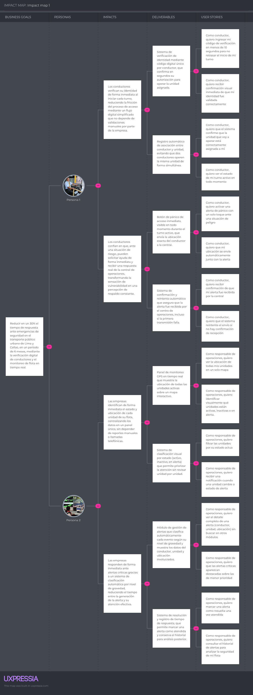

# Capítulo III: Requirements Specification

## 3.1. User Stories

<b>Lista de Epics</b>

| Epic ID | Título | Descripción |
| :-----: | :----- | :---------- |
| **EPAV01** | Verificación de identidad y gestión de turnos | Como sistema, necesito validar la identidad y autorización del conductor y registrar su turno de principio a fin, para garantizar que solo personal habilitado pueda operar cada unidad y mantener trazabilidad de cada servicio. |
| **EPAV02** | Gestión de emergencias | Como sistema, necesito procesar el envío, recepción, notificación y seguimiento de alertas, para habilitar una respuesta rápida ante situaciones de riesgo. |
| **EPAV03** | Monitoreo de flota y métricas | Como sistema, necesito registrar el estado y la ubicación de cada unidad en tiempo real y calcular indicadores de operación, para dar visibilidad operativa a las empresas de transporte. |
| **EPAV04** | Plataforma web informativa | Como visitante, quiero conocer la propuesta de Avisum y sus beneficios, para entender cómo la solución protege a conductores y pasajeros. |
| **EPAV05** | API RESTful del sistema | Como developer, necesito exponer endpoints que permitan interactuar con las funcionalidades del sistema, para integrar los distintos componentes de Avisum. |
| **EPAV06** | Administración de conductores y unidades | Como administrador de la empresa de transporte, necesito registrar, mantener y asignar a mis conductores y unidades, para controlar quién opera cada vehículo y en qué ruta. |
| **EPAV07** | Control de acceso por rol | Como sistema, necesito separar el acceso de conductores y administradores, para que cada persona vea y use solo las funciones que le corresponden. |

 

<table border="1" cellpadding="8" cellspacing="0" style="border-collapse: collapse; width: 100%;">
  <thead>
    <tr>
      <th>Story ID</th>
      <th>Título</th>
      <th>Descripción</th>
      <th>Criterios de Aceptación</th>
      <th>Epic ID</th>
      <th>Estado (Sprint 2)</th>
    </tr>
  </thead>
  <tbody>
    <tr><td>US01</td><td>Verificar identidad del conductor con su código</td><td>Como conductor, quiero ingresar mi código de empleado (por ejemplo, EMP-001) al iniciar mi jornada, para que el sistema confirme que soy una persona autorizada y deje trazabilidad de mi turno.</td><td><strong>Escenario (Éxito):</strong> Given un conductor activo con el código EMP-001 When ingresa "emp-001" (en minúsculas o con espacios) y presiona Verificar credenciales Then el sistema normaliza el código, lo valida con la API y muestra la pantalla de Acceso Autorizado  <strong>Escenario (Fracaso):</strong> Given un código que no existe (EMP-999) o un campo vacío When el conductor presiona Verificar credenciales Then el sistema muestra "Código inválido" y no permite continuar</td><td>EPAV01</td><td>Implementada</td></tr>
    <tr><td>US02</td><td>Registrar inicio de turno</td><td>Como conductor, quiero que mi turno quede registrado automáticamente al ser autorizado, para dejar evidencia de la hora de inicio y de la unidad que opero.</td><td><strong>Escenario (Éxito):</strong> Given un conductor validado con una unidad asignada When continúa desde Acceso Autorizado Then el sistema crea el turno con hora de inicio, estado activo, unidad y ruta, y abre el dashboard con el cronómetro en marcha  <strong>Escenario (Fracaso):</strong> Given que no hay un conductor validado When se intenta abrir el dashboard del servicio Then el sistema redirige al inicio de sesión y no registra ningún turno</td><td>EPAV01</td><td>Implementada</td></tr>
    <tr><td>US03</td><td>Activar alerta de pánico</td><td>Como conductor, quiero activar un botón de pánico desde cualquier pantalla de mi servicio, para avisar de inmediato a la central ante una situación de riesgo.</td><td><strong>Escenario (Éxito):</strong> Given un conductor con sesión iniciada en cualquier pantalla de su área When presiona PANIC SIGNAL Then el sistema crea una alerta crítica con la unidad, la hora y las coordenadas, la envía a la central y muestra "¡Alerta enviada!"  <strong>Escenario (Fracaso):</strong> Given que no hay una sesión de conductor When se intenta abrir la pantalla de pánico Then el sistema redirige al inicio de sesión y no genera ninguna alerta</td><td>EPAV02</td><td>Parcial</td></tr>
    <tr><td>US04</td><td>Recibir alertas en la central en tiempo real</td><td>Como administrador, quiero recibir de inmediato las alertas de mis conductores sin recargar la página, para gestionar la emergencia reportada.</td><td><strong>Escenario (Éxito):</strong> Given una alerta enviada por un conductor desde otra pestaña When el sistema la procesa Then aparece en Alertas recientes del Centro de control con tipo, unidad, conductor y hora, y la unidad se marca en rojo en el mapa  <strong>Escenario (Fracaso):</strong> Given una alerta de una unidad que no se puede identificar (datos incompletos) When se procesa Then el sistema la rechaza y no la muestra</td><td>EPAV02</td><td>Implementada</td></tr>
    <tr><td>US05</td><td>Registrar histórico de emergencias</td><td>Como sistema, necesito almacenar cada alerta generada en la API con su tipo, unidad, coordenadas y fecha, para poder darle seguimiento posterior.</td><td><strong>Escenario (Éxito):</strong> Given una alerta válida con unidad y conductor identificados When es generada Then se guarda en la API con tipo, coordenadas, fecha y hora, y estado "no resuelta"  <strong>Escenario (Fracaso):</strong> Given una alerta sin unidad o conductor identificables When se intenta registrar Then el sistema no la guarda en la API</td><td>EPAV02</td><td>Implementada</td></tr>
    <tr><td>US06</td><td>Actualizar estado de la unidad</td><td>Como administrador, quiero que el estado de cada unidad (activa, en alerta o inactiva) se actualice solo, para tener información confiable en mi panel.</td><td><strong>Escenario (Éxito):</strong> Given una unidad en operación When se genera una alerta, se resuelve o se desactiva a su conductor Then el estado de la unidad se actualiza en el panel  <strong>Escenario (Fracaso):</strong> Given datos de estado inválidos When se intenta actualizar Then el sistema conserva el último estado válido</td><td>EPAV03</td><td>Implementada</td></tr>
    <tr><td>US07</td><td>Consultar ubicación de la unidad</td><td>Como administrador, quiero ver en un mapa la ubicación actual de cada unidad, para dar seguimiento a la operación.</td><td><strong>Escenario (Éxito):</strong> Given una unidad activa When el administrador abre el Centro de control Then el mapa muestra la posición de cada unidad y la actualiza cada pocos segundos  <strong>Escenario (Fracaso):</strong> Given una unidad sin coordenadas When se consulta el mapa Then el sistema no la dibuja y la ubicación figura como no disponible</td><td>EPAV03</td><td>Implementada</td></tr>
    <tr><td>US08</td><td>Visualizar propuesta del servicio</td><td>Como visitante, quiero ver un mensaje principal y una descripción de qué ofrece Avisum, para entender sus beneficios.</td><td><strong>Escenario (Éxito):</strong> Given que el visitante ingresa al sitio When carga la página Then se muestra el mensaje principal y la descripción del servicio  <strong>Escenario (Fracaso):</strong> Given contenido no disponible When se accede al sitio Then se muestra un mensaje de indisponibilidad</td><td>EPAV04</td><td>Implementada (Sprint 1)</td></tr>
    <tr><td>US09</td><td>Visualizar funcionalidades del sistema</td><td>Como visitante, quiero conocer las funcionalidades de Avisum (verificación de identidad, alerta de pánico, seguimiento de flota), para evaluar su utilidad.</td><td><strong>Escenario (Éxito):</strong> Given que el visitante navega el sitio When accede a la sección de funcionalidades Then se muestra cada funcionalidad con su descripción  <strong>Escenario (Fracaso):</strong> Given que no hay funcionalidades registradas When se accede Then se indica la ausencia de contenido</td><td>EPAV04</td><td>Implementada (Sprint 1)</td></tr>
    <tr><td>US10</td><td>Endpoint de validación de conductor</td><td>Como developer, necesito consultar GET /employees/code/{código} para validar la identidad de un conductor en cualquier momento.</td><td><strong>Escenario (Éxito):</strong> Given el código EMP-001, existente y activo When se envía GET /employees/code/EMP-001 Then el API responde 200 con id, código, nombre, DNI, placa y estado  <strong>Escenario (Fracaso):</strong> Given un código inexistente o un conductor desactivado When se procesa la solicitud Then el API responde 404 (inexistente) o 403 (desactivado)</td><td>EPAV05</td><td>Implementada</td></tr>
    <tr><td>US11</td><td>Endpoint de inicio de servicio</td><td>Como developer, necesito registrar el inicio de un servicio con POST /shifts, para realizar pruebas del flujo.</td><td><strong>Escenario (Éxito):</strong> Given un employeeId y un busUnitId válidos When se envía POST /shifts Then el API responde 201 con el turno en estado ACTIVE, la hora de inicio y la ruta de la unidad  <strong>Escenario (Fracaso):</strong> Given una solicitud inválida When se procesa Then el API retorna un error</td><td>EPAV05</td><td>Parcial</td></tr>
    <tr><td>US12</td><td>Endpoint de alerta de emergencia</td><td>Como developer, necesito enviar alertas con POST /alerts, para testear el flujo de emergencia.</td><td><strong>Escenario (Éxito):</strong> Given datos completos (conductor, unidad, tipo y coordenadas) When el API recibe POST /alerts Then responde 201 con el id, la fecha de creación y el estado "no resuelta"  <strong>Escenario (Fracaso):</strong> Given datos incompletos When se procesa la alerta Then el API retorna un error</td><td>EPAV05</td><td>Parcial</td></tr>
    <tr><td>US13</td><td>Endpoint de estado y ubicación de unidad</td><td>Como developer, necesito actualizar el estado y la ubicación de una unidad con PATCH /bus-units/{id}, para simular cambios operativos.</td><td><strong>Escenario (Éxito):</strong> Given una unidad existente When se envía el nuevo estado, ruta o ubicación Then el API lo actualiza y responde con la unidad  <strong>Escenario (Fracaso):</strong> Given una unidad que no existe When se procesa la solicitud Then el API responde 404 y no modifica ningún registro</td><td>EPAV05</td><td>Implementada</td></tr>
    <tr><td>US14</td><td>Validar autorización del conductor</td><td>Como sistema, necesito rechazar a los conductores desactivados, para que solo personal autorizado opere las unidades.</td><td><strong>Escenario (Éxito):</strong> Given un conductor registrado y activo When se valida su código Then se confirma que puede operar  <strong>Escenario (Fracaso):</strong> Given un conductor desactivado por el administrador When ingresa su código Then el sistema muestra "Conductor no autorizado" y bloquea el acceso</td><td>EPAV01</td><td>Implementada</td></tr>
    <tr><td>US15</td><td>Asociar conductor a unidad</td><td>Como administrador, quiero que cada conductor tenga una unidad asignada (placa y ruta), para asegurar la trazabilidad del servicio.</td><td><strong>Escenario (Éxito):</strong> Given un conductor con una placa válida When se registra o se reasigna Then queda vinculado a esa unidad  <strong>Escenario (Fracaso):</strong> Given una placa que ya pertenece a otro conductor When se intenta registrar Then el sistema muestra "Esta placa ya está asignada a otro conductor" y no guarda</td><td>EPAV06</td><td>Implementada</td></tr>
    <tr><td>US16</td><td>Consultar historial de emergencias</td><td>Como administrador, quiero revisar las alertas con su gravedad y estado, para analizar la seguridad de mi flota.</td><td><strong>Escenario (Éxito):</strong> Given alertas generadas When abre el Centro de control Then ve la lista de alertas recientes con nivel, tipo, unidad, conductor, hora y estado (abierta o resuelta)  <strong>Escenario (Fracaso):</strong> Given que no existen alertas When consulta la lista Then el sistema indica que no hay alertas registradas</td><td>EPAV02</td><td>Parcial</td></tr>
    <tr><td>US17</td><td>Detección de unidad inactiva</td><td>Como administrador, quiero que el sistema me avise cuando una unidad deja de reportar señal, para actuar antes de que se convierta en un incidente.</td><td><strong>Escenario (Éxito):</strong> Given un intervalo sin señal definido (por ejemplo, 60 segundos) When una unidad supera ese intervalo Then el sistema genera una alerta y marca la unidad  <strong>Escenario (Fracaso):</strong> Given que no existe un intervalo definido When se evalúa la señal Then el sistema no genera alerta</td><td>EPAV03</td><td>Pendiente</td></tr>
    <tr><td>US18</td><td>Visualizar estadísticas de impacto</td><td>Como visitante, quiero ver cifras sobre la problemática de seguridad en el transporte, para evaluar la relevancia de la solución.</td><td><strong>Escenario (Éxito):</strong> Given datos disponibles When accede a la sección de estadísticas Then se muestran las cifras destacadas  <strong>Escenario (Fracaso):</strong> Given que no hay datos disponibles When accede Then se muestra un mensaje informativo</td><td>EPAV04</td><td>Implementada (Sprint 1)</td></tr>
    <tr><td>US19</td><td>Endpoint de consulta de historial de turnos</td><td>Como developer, necesito consultar el historial de turnos con GET /shifts y GET /shifts/employee/{id}, para extraer datos cuando se requiera.</td><td><strong>Escenario (Éxito):</strong> Given turnos registrados When se envía GET /shifts Then el API retorna la lista de turnos con estado, fechas, kilómetros, pasajeros y recaudación  <strong>Escenario (Fracaso):</strong> Given un conductor sin turnos When se consulta GET /shifts/employee/{id} Then el API retorna una lista vacía</td><td>EPAV05</td><td>Implementada</td></tr>
    <tr><td>US20</td><td>Endpoint de consulta de unidad</td><td>Como developer, necesito consultar el estado actual de una unidad con GET /bus-units/{id}, para conocer su condición operativa.</td><td><strong>Escenario (Éxito):</strong> Given un identificador válido When se consulta la unidad Then el API retorna placa, ruta, ubicación y estado  <strong>Escenario (Fracaso):</strong> Given un identificador inexistente When se consulta Then el API responde 404</td><td>EPAV05</td><td>Implementada</td></tr>
    <tr><td>US21</td><td>Navegar entre secciones del sitio</td><td>Como visitante, quiero desplazarme entre las secciones del sitio con el menú de navegación (Características, Cómo funciona, Estadística, Apoyo), para explorar el contenido disponible.</td><td><strong>Escenario (Éxito):</strong> Given que el visitante ingresa al sitio When selecciona una opción del menú Then se desplaza a la sección correspondiente  <strong>Escenario (Fracaso):</strong> Given un error de navegación When se intenta acceder a una sección Then el sistema indica error de acceso</td><td>EPAV04</td><td>Implementada (Sprint 1)</td></tr>
    <tr><td>US22</td><td>Endpoint de autenticación</td><td>Como developer, necesito autenticar el acceso al sistema mediante el código de cada usuario, para evitar accesos no controlados.</td><td><strong>Escenario (Éxito):</strong> Given un código de conductor válido When se envía la solicitud al API Then el API autoriza el acceso  <strong>Escenario (Fracaso):</strong> Given un código inválido When se envía la solicitud Then el API rechaza el acceso</td><td>EPAV05</td><td>Parcial</td></tr>
    <tr><td>US23</td><td>Confirmación de recepción de alerta</td><td>Como administrador, quiero ver si cada destinatario recibió la alerta, para tener certeza de que fue notificado.</td><td><strong>Escenario (Éxito):</strong> Given una alerta con destinatarios activos When pasan unos segundos desde su generación Then cada destinatario pasa de "pendiente" a "entregada" en el registro de entregas  <strong>Escenario (Fracaso):</strong> Given una alerta generada sin destinatarios activos When se consulta el registro Then el sistema indica que nadie fue notificado</td><td>EPAV02</td><td>Parcial</td></tr>
    <tr><td>US24</td><td>Reintentar envío de alerta</td><td>Como sistema, necesito reenviar alertas no confirmadas, para asegurar que sean atendidas.</td><td><strong>Escenario (Éxito):</strong> Given una alerta no confirmada When se ejecuta el reintento Then la alerta se reenvía  <strong>Escenario (Fracaso):</strong> Given múltiples intentos fallidos When se reintenta el envío Then la alerta se marca como fallida</td><td>EPAV02</td><td>Pendiente</td></tr>
    <tr><td>US25</td><td>Registrar cierre de turno</td><td>Como conductor, quiero finalizar mi servicio, para cerrar el registro del turno con sus cifras finales.</td><td><strong>Escenario (Éxito):</strong> Given un servicio en curso When el conductor presiona Finalizar servicio Then el sistema guarda la distancia, la duración, los pasajeros y la recaudación, marca el turno como finalizado y ofrece Ver reporte o Salir  <strong>Escenario (Fracaso):</strong> Given que no hay servicio activo When se intenta abrir el dashboard para finalizar Then el sistema redirige al inicio de sesión</td><td>EPAV01</td><td>Implementada</td></tr>
    <tr><td>US26</td><td>Consultar estado del servicio</td><td>Como conductor, quiero ver en mi dashboard el tiempo, la distancia, los pasajeros y la recaudación de mi turno, para tener claridad de mi servicio.</td><td><strong>Escenario (Éxito):</strong> Given un servicio activo When el conductor abre su dashboard Then ve el tiempo (hh:mm:ss) que avanza cada segundo, la distancia en km, los pasajeros, la recaudación y la ruta operada  <strong>Escenario (Fracaso):</strong> Given que no hay servicio activo When intenta abrir el dashboard Then el sistema redirige al inicio de sesión</td><td>EPAV01</td><td>Implementada</td></tr>
    <tr><td>US27</td><td>Visualizar estado de la flota</td><td>Como administrador, quiero conocer el estado de mis unidades en operación, para tener control de mi flota.</td><td><strong>Escenario (Éxito):</strong> Given unidades registradas When abre el Centro de control Then ve las unidades activas, las alertas activas, los pasajeros a bordo y el estado de cada unidad con su conductor y ruta  <strong>Escenario (Fracaso):</strong> Given que no hay unidades registradas When consulta Then el sistema indica ausencia de datos</td><td>EPAV03</td><td>Implementada</td></tr>
    <tr><td>US28</td><td>Monitorear flota en tiempo real</td><td>Como administrador, quiero monitorear mis unidades en un mapa operacional que se actualice solo, para gestionar el riesgo operativo.</td><td><strong>Escenario (Éxito):</strong> Given datos disponibles When el administrador mantiene abierto el Centro de control Then el mapa se actualiza sin recargar la página  <strong>Escenario (Fracaso):</strong> Given que la API no responde When se carga el panel Then el sistema no muestra datos incorrectos como si fueran reales</td><td>EPAV03</td><td>Implementada</td></tr>
    <tr><td>US29</td><td>Visualizar segmentos objetivo</td><td>Como visitante, quiero identificar a qué tipo de usuarios está dirigido Avisum (conductores y empresas de transporte), para conocer su alcance.</td><td><strong>Escenario (Éxito):</strong> Given contenido disponible When accede a la sección Then se muestran los segmentos definidos  <strong>Escenario (Fracaso):</strong> Given que no existe contenido When accede Then se muestra un mensaje informativo</td><td>EPAV04</td><td>Por verificar</td></tr>
    <tr><td>US30</td><td>Visualizar misión y visión</td><td>Como visitante, quiero conocer la misión y la visión de Avisum, para entender sus objetivos.</td><td><strong>Escenario (Éxito):</strong> Given contenido disponible When accede a la sección Then se muestra la misión y la visión  <strong>Escenario (Fracaso):</strong> Given contenido no disponible When accede Then se muestra un mensaje de error</td><td>EPAV04</td><td>Por verificar</td></tr>
    <tr><td>US31</td><td>Endpoint de finalización de servicio</td><td>Como developer, necesito cerrar un servicio con PATCH /shifts/{id}/end, para realizar pruebas del flujo completo.</td><td><strong>Escenario (Éxito):</strong> Given un turno activo y las cifras finales (distancia, duración, pasajeros, recaudación) When se envía PATCH /shifts/{id}/end Then el API responde 200 con el turno en estado FINISHED y la hora de fin  <strong>Escenario (Fracaso):</strong> Given un turno que no existe When se procesa Then el API responde 404</td><td>EPAV05</td><td>Implementada</td></tr>
    <tr><td>US32</td><td>Endpoint de consulta de flota</td><td>Como developer, necesito consultar las unidades con GET /bus-units, para conocer las unidades registradas y su estado.</td><td><strong>Escenario (Éxito):</strong> Given unidades registradas When se envía GET /bus-units Then el API retorna la lista con placa, ruta, ubicación y estado  <strong>Escenario (Fracaso):</strong> Given que no hay unidades registradas When se consulta Then el API retorna una lista vacía</td><td>EPAV05</td><td>Implementada</td></tr>
    <tr><td>US33</td><td>Notificar a múltiples destinatarios</td><td>Como sistema, necesito notificar cada alerta a todos los destinatarios activos, para aumentar el alcance de la notificación.</td><td><strong>Escenario (Éxito):</strong> Given varios destinatarios activos (policía, operaciones, empresa) When se genera una alerta Then la alerta guarda la lista de destinatarios notificados  <strong>Escenario (Fracaso):</strong> Given que ningún destinatario está activo When se genera una alerta Then el sistema registra que nadie fue notificado</td><td>EPAV02</td><td>Implementada</td></tr>
    <tr><td>US34</td><td>Registrar tiempo de respuesta</td><td>Como sistema, necesito registrar la hora de creación y de resolución de cada alerta, para medir el tiempo de respuesta.</td><td><strong>Escenario (Éxito):</strong> Given una alerta abierta When el administrador la resuelve Then el sistema registra la hora de resolución y calcula el tiempo transcurrido  <strong>Escenario (Fracaso):</strong> Given una alerta sin resolver When se calcula el tiempo de respuesta Then no se incluye en el promedio y se muestra como abierta</td><td>EPAV02</td><td>Implementada</td></tr>
    <tr><td>US35</td><td>Consultar tiempo promedio de respuesta</td><td>Como administrador, quiero conocer el tiempo promedio de respuesta ante alertas, para evaluar el desempeño operativo.</td><td><strong>Escenario (Éxito):</strong> Given alertas resueltas When abre Métricas Then ve el tiempo promedio en minutos y segundos, con la cantidad de alertas consideradas  <strong>Escenario (Fracaso):</strong> Given que no hay alertas resueltas When abre Métricas Then el indicador muestra "—" y el mensaje "Aún no hay alertas resueltas"</td><td>EPAV03</td><td>Implementada</td></tr>
    <tr><td>US36</td><td>Detección de desvío de ruta</td><td>Como administrador, quiero que el sistema detecte cuando una unidad se desvía de su ruta asignada, para actuar a tiempo.</td><td><strong>Escenario (Éxito):</strong> Given una ruta definida When se detecta un desvío significativo Then el sistema genera una alerta de desvío  <strong>Escenario (Fracaso):</strong> Given datos de ubicación inconsistentes When se analiza el desvío Then el sistema descarta el evento</td><td>EPAV03</td><td>Pendiente</td></tr>
    <tr><td>US37</td><td>Visualizar la problemática del transporte</td><td>Como visitante, quiero entender el problema que resuelve Avisum, para tener contexto de la situación actual.</td><td><strong>Escenario (Éxito):</strong> Given contenido disponible When accede a la sección Then se presenta la problemática  <strong>Escenario (Fracaso):</strong> Given contenido no disponible When accede Then se muestra un mensaje informativo</td><td>EPAV04</td><td>Por verificar</td></tr>
    <tr><td>US38</td><td>Visualizar propuesta de valor</td><td>Como visitante, quiero conocer la propuesta de valor de Avisum y cómo funciona en cuatro pasos, para entender su alcance.</td><td><strong>Escenario (Éxito):</strong> Given contenido definido When accede a las secciones principal y "Cómo funciona" Then se presenta la propuesta y el flujo operativo  <strong>Escenario (Fracaso):</strong> Given contenido incompleto When accede Then se muestra un mensaje de falta de información</td><td>EPAV04</td><td>Implementada (Sprint 1)</td></tr>
    <tr><td>US39</td><td>Validar unidad única por conductor activo</td><td>Como sistema, necesito impedir que un conductor tenga dos turnos activos a la vez, para evitar suplantación de identidad.</td><td><strong>Escenario (Éxito):</strong> Given un conductor con turno activo When intenta iniciar otro servicio Then el sistema rechaza la operación  <strong>Escenario (Fracaso):</strong> Given datos de identidad inconsistentes When se valida la operación Then el intento se marca como inválido</td><td>EPAV01</td><td>Pendiente</td></tr>
    <tr><td>US40</td><td>Clasificación de alertas por gravedad</td><td>Como sistema, necesito clasificar cada alerta según su tipo en un nivel de gravedad, para priorizar su atención.</td><td><strong>Escenario (Éxito):</strong> Given una alerta generada When el sistema evalúa su tipo Then asigna el nivel: pánico = crítico, exceso de velocidad = alto, desvío de ruta = medio  <strong>Escenario (Fracaso):</strong> Given un tipo de alerta no reconocido When se intenta clasificar Then se asigna una prioridad por defecto</td><td>EPAV02</td><td>Implementada</td></tr>
    <tr><td>US41</td><td>Escalar alertas no atendidas</td><td>Como sistema, necesito escalar alertas que superen un tiempo límite sin atención, para evitar que sean ignoradas.</td><td><strong>Escenario (Éxito):</strong> Given una alerta sin respuesta When se supera el tiempo límite (por ejemplo, 2 minutos) Then el sistema escala la alerta  <strong>Escenario (Fracaso):</strong> Given una alerta atendida When se evalúa el tiempo Then no se realiza escalamiento</td><td>EPAV02</td><td>Pendiente</td></tr>
    <tr><td>US42</td><td>Registrar ubicación de la alerta</td><td>Como sistema, necesito almacenar la ubicación exacta (latitud y longitud) de cada alerta, para uso estadístico posterior.</td><td><strong>Escenario (Éxito):</strong> Given una alerta generada por una unidad con ubicación When se procesa el evento Then el sistema guarda la latitud y la longitud de la alerta  <strong>Escenario (Fracaso):</strong> Given una alerta sin ubicación When se procesa Then el sistema registra la ausencia de datos</td><td>EPAV02</td><td>Implementada</td></tr>
    <tr><td>US43</td><td>Seguimiento de la unidad de un conductor en turno</td><td>Como administrador, quiero ver en mi mapa cómo se mueve la unidad de un conductor con turno activo, para conocer su posición actual.</td><td><strong>Escenario (Éxito):</strong> Given un conductor con turno activo en otra pestaña When el administrador observa el mapa Then la unidad de ese conductor se mueve en tiempo real  <strong>Escenario (Fracaso):</strong> Given ausencia de datos de ubicación When se consulta Then el sistema indica que la ubicación no está disponible</td><td>EPAV03</td><td>Implementada</td></tr>
    <tr><td>US44</td><td>Comparar operación entre unidades</td><td>Como administrador, quiero comparar el desempeño de mis unidades por kilómetros, pasajeros o recaudación, para identificar patrones entre rutas.</td><td><strong>Escenario (Éxito):</strong> Given turnos finalizados When selecciona Kilómetros, Pasajeros o Recaudado en Métricas Then ve una barra por unidad, ordenada de mayor a menor  <strong>Escenario (Fracaso):</strong> Given que no hay turnos finalizados When intenta comparar Then el sistema indica que aún no hay turnos finalizados</td><td>EPAV03</td><td>Implementada</td></tr>
    <tr><td>US45</td><td>Visualizar beneficios del sistema</td><td>Como visitante, quiero conocer los beneficios de Avisum para conductores y empresas, para comprender su valor.</td><td><strong>Escenario (Éxito):</strong> Given contenido disponible When accede a la sección Then se presentan los beneficios  <strong>Escenario (Fracaso):</strong> Given contenido no disponible When accede Then se muestra un mensaje informativo</td><td>EPAV04</td><td>Por verificar</td></tr>
    <tr><td>US46</td><td>Visualizar equipo de trabajo</td><td>Como visitante, quiero conocer al equipo detrás de Avisum, para identificar a los desarrolladores del proyecto.</td><td><strong>Escenario (Éxito):</strong> Given información registrada When accede a la sección Then se muestra el equipo  <strong>Escenario (Fracaso):</strong> Given ausencia de información When accede Then se muestra un mensaje de falta de contenido</td><td>EPAV04</td><td>Por verificar</td></tr>
    <tr><td>US47</td><td>Endpoint de actualización de conductor</td><td>Como developer, necesito actualizar los datos de un conductor con PATCH /employees/{id}, para mantenerlos al día.</td><td><strong>Escenario (Éxito):</strong> Given un conductor existente y datos válidos When se envía PATCH /employees/{id} Then el API actualiza el registro y responde con el conductor actualizado  <strong>Escenario (Fracaso):</strong> Given un conductor que no existe When se envía la solicitud Then el API responde 404</td><td>EPAV05</td><td>Implementada</td></tr>
    <tr><td>US48</td><td>Endpoint de desactivación lógica</td><td>Como developer, necesito desactivar un conductor sin eliminarlo, cambiando su estado a inactivo, para mantener control sobre los datos.</td><td><strong>Escenario (Éxito):</strong> Given un conductor existente When se envía PATCH /employees/{id} con estado INACTIVE Then el API cambia su estado y el conductor ya no puede iniciar sesión  <strong>Escenario (Fracaso):</strong> Given un registro inexistente When se solicita la operación Then el API responde 404</td><td>EPAV05</td><td>Implementada</td></tr>
    <tr><td>US49</td><td>Endpoint de métricas del sistema</td><td>Como developer, necesito obtener las métricas generales del sistema desde un endpoint, para tener una vista panorámica de los datos registrados.</td><td><strong>Escenario (Éxito):</strong> Given datos disponibles When se consulta el endpoint de métricas Then el API retorna los indicadores calculados  <strong>Escenario (Fracaso):</strong> Given falta de datos When se realiza la consulta Then el API retorna una respuesta vacía o un error</td><td>EPAV05</td><td>Pendiente</td></tr>
    <tr><td>US50</td><td>Endpoint de validación de permisos</td><td>Como developer, necesito que el sistema valide el rol del usuario antes de ejecutar una operación, para asegurar que cada quien haga solo lo que le corresponde.</td><td><strong>Escenario (Éxito):</strong> Given un usuario con el rol adecuado When se procesa la solicitud Then el sistema autoriza la operación  <strong>Escenario (Fracaso):</strong> Given un usuario con un rol insuficiente When se procesa la solicitud Then el sistema rechaza la operación</td><td>EPAV05</td><td>Parcial</td></tr>
    <tr><td>US51</td><td>Verificar identidad mediante QR o código manual</td><td>Como conductor, quiero verificar mi identidad escaneando mi credencial QR o escribiendo mi código, para iniciar mi turno incluso si no puedo usar la cámara.</td><td><strong>Escenario (Éxito):</strong> Given la pantalla de verificación por QR When el escáner detecta un código válido o el conductor lo escribe y presiona Validar identidad Then el sistema muestra al conductor identificado y le permite iniciar su turno  <strong>Escenario (Fracaso):</strong> Given un código no registrado o de un conductor desactivado When presiona Validar identidad Then el sistema muestra "Código inválido" o "Conductor no autorizado"</td><td>EPAV01</td><td>Parcial</td></tr>
    <tr><td>US52</td><td>Consultar reporte de turno finalizado</td><td>Como conductor, quiero ver un reporte con el resumen de mi turno al terminarlo, para revisar mi desempeño y dejar constancia.</td><td><strong>Escenario (Éxito):</strong> Given un turno finalizado When el conductor presiona Ver reporte Then ve su nombre, la unidad, la ruta, la distancia con la velocidad promedio, el tiempo total, los pasajeros, la recaudación con el monto por pasajero, la línea de tiempo y el protocolo de cierre  <strong>Escenario (Fracaso):</strong> Given que no hay un turno que reportar When intenta abrir el reporte Then el sistema redirige al inicio de sesión</td><td>EPAV01</td><td>Implementada</td></tr>
    <tr><td>US53</td><td>Consultar perfil del conductor</td><td>Como conductor, quiero ver mi carnet digital con mis datos y el estado de mi turno, para confirmar que mi información es correcta.</td><td><strong>Escenario (Éxito):</strong> Given un conductor con sesión iniciada When presiona el ícono de perfil Then ve su nombre, código, DNI y unidad asignada, junto con el cronómetro y las cifras de su turno en vivo  <strong>Escenario (Fracaso):</strong> Given que no hay sesión de conductor When intenta abrir el perfil Then el sistema redirige al inicio de sesión</td><td>EPAV01</td><td>Implementada</td></tr>
    <tr><td>US54</td><td>Resolver una alerta desde el centro de control</td><td>Como administrador, quiero marcar una alerta como resuelta cuando ya fue atendida, para cerrar el incidente y devolver la unidad a su estado normal.</td><td><strong>Escenario (Éxito):</strong> Given una alerta abierta en Alertas recientes When el administrador presiona Resolver Then la alerta pasa a "Resuelta", se registra la hora de resolución, la unidad vuelve a "Activa" y el conductor ve la alerta como resuelta  <strong>Escenario (Fracaso):</strong> Given una alerta que ya fue resuelta When se visualiza en la lista Then el sistema no ofrece el botón Resolver</td><td>EPAV02</td><td>Implementada</td></tr>
    <tr><td>US55</td><td>Consultar mis alertas del servicio</td><td>Como conductor, quiero ver las alertas generadas en mi servicio y su estado, para saber si la central ya atendió mi aviso.</td><td><strong>Escenario (Éxito):</strong> Given alertas generadas por mi unidad When abro Alert Logs Then veo un resumen por tipo y una tabla con nivel, tipo, hora, coordenadas y estado (activa o resuelta)  <strong>Escenario (Fracaso):</strong> Given que no hay alertas en mi servicio When abro Alert Logs Then el sistema muestra "Sin alertas registradas en este turno"</td><td>EPAV02</td><td>Parcial</td></tr>
    <tr><td>US56</td><td>Activar o desactivar destinatarios de alertas</td><td>Como administrador, quiero activar o desactivar a los destinatarios de las alertas, para decidir quién se entera de cada emergencia.</td><td><strong>Escenario (Éxito):</strong> Given la lista de destinatarios en Notificaciones When el administrador desactiva uno con el interruptor Then las alertas siguientes ya no lo incluyen y el cambio se conserva al recargar  <strong>Escenario (Fracaso):</strong> Given que todos los destinatarios están desactivados When se genera una alerta Then el registro indica "No había destinatarios activos. Nadie fue notificado."</td><td>EPAV02</td><td>Implementada</td></tr>
    <tr><td>US57</td><td>Agregar y eliminar destinatarios de alertas</td><td>Como administrador, quiero agregar y eliminar destinatarios (policía, operaciones, empresa, gestión), para mantener actualizada la lista de contactos de emergencia.</td><td><strong>Escenario (Éxito):</strong> Given el formulario de nuevo destinatario When ingresa un nombre, un tipo y un teléfono o correo de al menos 3 caracteres, y guarda Then el destinatario se agrega como activo; y para eliminarlo debe confirmar con un segundo toque  <strong>Escenario (Fracaso):</strong> Given un nombre o un contacto con menos de 3 caracteres When intenta guardar Then el sistema muestra un mensaje junto al campo y no guarda</td><td>EPAV02</td><td>Implementada</td></tr>
    <tr><td>US58</td><td>Visualizar el historial de turnos en vivo</td><td>Como administrador, quiero ver el estado de todos mis conductores durante el día, actualizado cada segundo, para saber quién está en ruta, quién finalizó y quién no labora.</td><td><strong>Escenario (Éxito):</strong> Given conductores activos When abre Historial de turnos Then ve una fila por conductor con unidad, ruta, horario, duración, kilómetros, pasajeros, recaudado y estado (En ruta, Finalizado o No laborable), con cifras que se actualizan cada segundo; y si un conductor inicia turno en otra pestaña, su fila pasa a "En ruta" con sus cifras reales  <strong>Escenario (Fracaso):</strong> Given un conductor que cierra su sesión sin avisar When pasan 5 segundos sin datos de su turno Then su fila deja de mostrarse "En ruta" con datos reales</td><td>EPAV03</td><td>Implementada</td></tr>
    <tr><td>US59</td><td>Filtrar el historial de turnos</td><td>Como administrador, quiero filtrar el historial por conductor y por estado, para encontrar rápido la información que necesito.</td><td><strong>Escenario (Éxito):</strong> Given el historial de turnos When elige un conductor o un estado (En ruta, Finalizados, No laborable) Then la tabla y los totales (turnos, kilómetros, pasajeros y recaudado) muestran solo lo filtrado  <strong>Escenario (Fracaso):</strong> Given una combinación de filtros sin resultados When se aplica Then el sistema muestra "No hay conductores con estos filtros"</td><td>EPAV03</td><td>Implementada</td></tr>
    <tr><td>US60</td><td>Visualizar mi ubicación en el mapa</td><td>Como conductor, quiero ver mi posición en un mapa junto con el tiempo y la distancia de mi turno, para orientarme durante la ruta.</td><td><strong>Escenario (Éxito):</strong> Given un servicio activo When el conductor presiona Ver mapa Then ve su unidad sobre el mapa con su posición actualizada, el tiempo total, la distancia y su código  <strong>Escenario (Fracaso):</strong> Given que no hay sesión de conductor When intenta abrir el mapa Then el sistema redirige al inicio de sesión</td><td>EPAV03</td><td>Implementada</td></tr>
    <tr><td>US61</td><td>Monitorear el conteo de pasajeros a bordo</td><td>Como conductor, quiero ver cuántos pasajeros hay a bordo y qué tan llena va la unidad, para conocer cuántas vidas están expuestas ante una emergencia.</td><td><strong>Escenario (Éxito):</strong> Given un turno en curso When abre Conteo de pasajeros Then ve los pasajeros a bordo, los que abordaron, los que bajaron, la capacidad máxima (80) y una barra con el nivel de ocupación  <strong>Escenario (Fracaso):</strong> Given una ocupación mayor al 90 % de la capacidad When se actualiza el conteo Then la pantalla marca "Anomalía detectada"</td><td>EPAV03</td><td>Parcial</td></tr>
    <tr><td>US62</td><td>Consultar métricas operativas</td><td>Como administrador, quiero ver indicadores calculados con los datos reales del sistema, para evaluar la operación de mi flota.</td><td><strong>Escenario (Éxito):</strong> Given datos del sistema When abre Métricas Then ve seis indicadores: conductores activos, unidades en ruta, alertas activas, tiempo de respuesta, alertas resueltas (%) y turnos finalizados con sus kilómetros y pasajeros  <strong>Escenario (Fracaso):</strong> Given que aún no hay alertas When abre Métricas Then los indicadores de alertas muestran "—" y un mensaje explicativo</td><td>EPAV03</td><td>Implementada</td></tr>
    <tr><td>US63</td><td>Consultar alertas por tipo</td><td>Como administrador, quiero ver cuántas alertas hubo de cada tipo, para identificar qué riesgos son más frecuentes.</td><td><strong>Escenario (Éxito):</strong> Given alertas generadas When abre Métricas Then ve una barra por tipo (pánico, exceso de velocidad, desvío de ruta) con su cantidad  <strong>Escenario (Fracaso):</strong> Given que no hay alertas When abre Métricas Then el sistema muestra un mensaje explicativo en lugar del gráfico</td><td>EPAV03</td><td>Implementada</td></tr>
    <tr><td>US64</td><td>Buscar y listar conductores</td><td>Como administrador, quiero ver y buscar a mis conductores por nombre, DNI, código o placa, para ubicarlos rápidamente.</td><td><strong>Escenario (Éxito):</strong> Given conductores registrados When el administrador escribe parte de un nombre, DNI, código o placa Then la tabla se filtra y el encabezado indica "n activos de m registrados"  <strong>Escenario (Fracaso):</strong> Given una búsqueda sin coincidencias When se aplica Then el sistema muestra "No hay conductores que coincidan con la búsqueda"</td><td>EPAV06</td><td>Implementada</td></tr>
    <tr><td>US65</td><td>Registrar un nuevo conductor</td><td>Como administrador, quiero registrar a un conductor con su unidad y ruta, para que pueda iniciar sesión con un código propio.</td><td><strong>Escenario (Éxito):</strong> Given el formulario con nombres, apellidos, DNI de 8 dígitos, placa con formato ABC-1234 y ruta When el administrador guarda Then el sistema crea la unidad y el conductor, le asigna un código automático (EMP-006, EMP-007...) y muestra un aviso con ese código  <strong>Escenario (Fracaso):</strong> Given un DNI o una placa ya registrados, o un formato inválido When intenta guardar Then el sistema muestra el mensaje junto al campo y no guarda</td><td>EPAV06</td><td>Implementada</td></tr>
    <tr><td>US66</td><td>Editar los datos de un conductor</td><td>Como administrador, quiero corregir los datos de un conductor (nombres, DNI, placa y ruta), para mantener la información al día.</td><td><strong>Escenario (Éxito):</strong> Given un conductor registrado When el administrador modifica sus datos y guarda Then el sistema actualiza al conductor y su unidad, y muestra un aviso de confirmación  <strong>Escenario (Fracaso):</strong> Given una placa o un DNI que pertenecen a otro conductor When intenta guardar Then el sistema rechaza el cambio y muestra el mensaje junto al campo</td><td>EPAV06</td><td>Implementada</td></tr>
    <tr><td>US67</td><td>Desactivar y reactivar a un conductor</td><td>Como administrador, quiero desactivar a un conductor sin borrarlo y poder reactivarlo, para impedir su acceso cuando deja de estar autorizado.</td><td><strong>Escenario (Éxito):</strong> Given un conductor activo When el administrador confirma la desactivación Then el conductor aparece como inactivo, su unidad queda inactiva y ya no puede iniciar sesión; y puede reactivarlo con un clic  <strong>Escenario (Fracaso):</strong> Given que el administrador cancela la confirmación When cierra la ventana Then el conductor sigue activo</td><td>EPAV06</td><td>Implementada</td></tr>
    <tr><td>US68</td><td>Eliminar a un conductor</td><td>Como administrador, quiero eliminar a un conductor y su unidad, para depurar los registros que ya no se usan.</td><td><strong>Escenario (Éxito):</strong> Given un conductor registrado When el administrador confirma la eliminación Then el conductor y su unidad desaparecen de la lista, su código no se reutiliza y sus turnos pasados se conservan como "Conductor eliminado"  <strong>Escenario (Fracaso):</strong> Given que el administrador cancela la confirmación When cierra la ventana Then el conductor no se elimina</td><td>EPAV06</td><td>Implementada</td></tr>
    <tr><td>US69</td><td>Visualizar la asignación de unidades en vivo</td><td>Como administrador, quiero ver cada unidad con su conductor, ruta, estado, pasajeros y velocidad, para saber cómo está distribuida mi flota.</td><td><strong>Escenario (Éxito):</strong> Given unidades registradas When abre Asignación de unidades Then ve una tarjeta por unidad con su estado en vivo y el resumen "n unidades: activas, en alerta e inactivas"  <strong>Escenario (Fracaso):</strong> Given que las unidades aún no se cargan When abre la pantalla Then el sistema muestra "Cargando unidades…"</td><td>EPAV06</td><td>Implementada</td></tr>
    <tr><td>US70</td><td>Reasignar una unidad a otro conductor</td><td>Como administrador, quiero cambiar el conductor de una unidad, para cubrir ausencias o reorganizar los turnos.</td><td><strong>Escenario (Éxito):</strong> Given una unidad con su conductor actual When el administrador elige a otro conductor activo y guarda Then los dos conductores intercambian de unidad y se muestra un aviso con el cambio  <strong>Escenario (Fracaso):</strong> Given que no se cambió ni el conductor ni la ruta When presiona Guardar cambios Then el sistema muestra "No hubo cambios"</td><td>EPAV06</td><td>Implementada</td></tr>
    <tr><td>US71</td><td>Cambiar la ruta de una unidad</td><td>Como administrador, quiero asignar otra ruta a una unidad, para ajustar el servicio según la demanda.</td><td><strong>Escenario (Éxito):</strong> Given una unidad When el administrador elige una de las rutas disponibles (R-07, R-15, R-22, R-33 o R-42) y guarda Then la unidad queda con esa ruta en todo el sistema  <strong>Escenario (Fracaso):</strong> Given la misma ruta que ya tiene la unidad When guarda Then el sistema muestra "No hubo cambios"</td><td>EPAV06</td><td>Implementada</td></tr>
    <tr><td>US72</td><td>Iniciar sesión como administrador</td><td>Como administrador, quiero ingresar al panel con mi propio código (ADMIN-001), para gestionar la operación desde un acceso distinto al de los conductores.</td><td><strong>Escenario (Éxito):</strong> Given la pantalla de acceso de administrador When escribe "admin-001" (en mayúsculas o minúsculas) y presiona Ingresar Then el sistema abre el Centro de control y mantiene la sesión aunque recargue la página  <strong>Escenario (Fracaso):</strong> Given un código incorrecto o un campo vacío When presiona Ingresar Then el sistema muestra "Código inválido" o "Escribe tu código de administrador"</td><td>EPAV07</td><td>Implementada</td></tr>
    <tr><td>US73</td><td>Restringir el acceso por rol</td><td>Como sistema, necesito que cada persona entre solo a las pantallas de su rol, para que un conductor no use funciones de administración ni al revés.</td><td><strong>Escenario (Éxito):</strong> Given un administrador con sesión iniciada When abre las pantallas del panel de administración Then el sistema le permite el acceso  <strong>Escenario (Fracaso):</strong> Given un conductor con sesión iniciada When escribe una dirección de administración (por ejemplo, /admin/drivers) Then el sistema lo redirige al acceso de administrador, y a la inversa para las pantallas del conductor</td><td>EPAV07</td><td>Implementada</td></tr>
    <tr><td>US74</td><td>Cerrar sesión</td><td>Como usuario del sistema, quiero cerrar mi sesión, para que nadie más use mi cuenta en este equipo.</td><td><strong>Escenario (Éxito):</strong> Given una sesión iniciada When presiona Cerrar sesión Then el sistema limpia la sesión y vuelve al inicio de sesión de su rol  <strong>Escenario (Fracaso):</strong> Given una sesión cerrada When intenta abrir una pantalla interna desde el historial del navegador Then el sistema lo redirige al inicio de sesión</td><td>EPAV07</td><td>Implementada</td></tr>
    <tr><td>US75</td><td>Endpoint de alta de conductor</td><td>Como developer, necesito registrar un conductor con POST /employees y que el servidor le asigne su código, para evitar códigos repetidos.</td><td><strong>Escenario (Éxito):</strong> Given nombres, apellidos, DNI y placa When se envía POST /employees Then el API responde 201 con el id y un código EMP-### asignados por el servidor y el estado ACTIVE  <strong>Escenario (Regla de negocio):</strong> Given que se eliminó el conductor con el último código entregado When se registra un nuevo conductor Then recibe un código nuevo y no reutiliza el eliminado</td><td>EPAV05</td><td>Implementada</td></tr>
    <tr><td>US76</td><td>Endpoint de alta de unidad</td><td>Como developer, necesito registrar una unidad con POST /bus-units, para asociarla a un conductor y a una ruta.</td><td><strong>Escenario (Éxito):</strong> Given una placa y una ruta When se envía POST /bus-units Then el API responde 201 con la unidad, su id, ubicación inicial y estado ACTIVE  <strong>Escenario (Regla de negocio):</strong> Given que se eliminó la unidad con el último id entregado When se registra una unidad nueva Then recibe un id nuevo y no reutiliza el anterior</td><td>EPAV05</td><td>Implementada</td></tr>
    <tr><td>US77</td><td>Endpoint de eliminación de registros</td><td>Como developer, necesito eliminar un conductor o una unidad con DELETE, para depurar los registros que ya no se usan.</td><td><strong>Escenario (Éxito):</strong> Given un conductor o una unidad existentes When se envía DELETE /employees/{id} o DELETE /bus-units/{id} Then el API elimina el registro y deja de listarlo  <strong>Escenario (Fracaso):</strong> Given un identificador inexistente When se envía la solicitud Then el API responde 404</td><td>EPAV05</td><td>Implementada</td></tr>
    <tr><td>US78</td><td>Endpoint de resolución de alerta</td><td>Como developer, necesito marcar una alerta como resuelta con PATCH /alerts/{id}/resolve, para cerrar el ciclo de la emergencia.</td><td><strong>Escenario (Éxito):</strong> Given una alerta abierta When se envía PATCH /alerts/{id}/resolve Then el API responde 200 con la alerta marcada como resuelta  <strong>Escenario (Fracaso):</strong> Given una alerta que no existe When se envía la solicitud Then el API responde 404</td><td>EPAV05</td><td>Implementada</td></tr>
  </tbody>
</table>

---  
## 3.2. Impact Mapping

El Impact Mapping permite organizar y priorizar las funcionalidades del producto en función del objetivo de negocio que se busca alcanzar. Para Avisum, este ejercicio se estructura a partir de la meta principal (why), los actores que pueden ayudar a alcanzarla (who), el cambio de comportamiento esperado en cada uno (how), y las funcionalidades necesarias para lograrlo (what).

**Why (Objetivo de negocio):** Reducir la exposición al riesgo de conductores y pasajeros del transporte público urbano, mediante verificación de identidad, respuesta inmediata ante emergencias y visibilidad operativa en tiempo real.

**Who (Actores):**
- Conductores de transporte público.
- Empresas o consorcios de transporte.
- Visitantes/potenciales clientes del sitio web.
- Developers que integran o consumen el sistema.

**How (Impacto esperado por actor):**
- El conductor se siente respaldado y puede actuar rápido ante una emergencia.
- La empresa gana visibilidad de su flota y reduce el tiempo de reacción ante incidentes.
- El visitante comprende la propuesta de valor y decide evaluar la adopción del sistema.
- El developer puede integrar el sistema de forma confiable mediante servicios documentados.

**What (Funcionalidades / Epics relacionados):**
- Verificación de identidad (EPAV01).
- Gestión de emergencias (EPAV02).
- Monitoreo de flota (EPAV03).
- Plataforma web informativa (EPAV04).
- API RESTful (EPAV05).

 

## 3.3. Product Backlog

A continuación se presenta el Product Backlog de Avisum con las User Stories priorizadas según su valor para el negocio y la complejidad estimada en Story Points.

<table border="1" cellpadding="8" cellspacing="0" style="border-collapse: collapse; width: 100%;">
  <thead>
    <tr>
      <th># Orden</th>
      <th>US_ID</th>
      <th>Título</th>
      <th>Descripción</th>
      <th>Story Points</th>
    </tr>
  </thead>
  <tbody>
    <tr><td>1</td><td>US05</td><td>Registro histórico de emergencias</td><td>Como sistema, necesito almacenar cada alerta generada, para poder darle seguimiento posterior.</td><td>8</td></tr>
    <tr><td>2</td><td>US10</td><td>Endpoint de validación de conductor</td><td>Como developer, necesito validar la identidad del conductor mediante un servicio API, para consultarla en cualquier momento.</td><td>8</td></tr>
    <tr><td>3</td><td>US12</td><td>Endpoint de alerta de emergencia</td><td>Como developer, necesito enviar alertas mediante API, para testear el flujo de emergencia.</td><td>8</td></tr>
    <tr><td>4</td><td>US27</td><td>Visualizar estado de la flota</td><td>Como empresa, quiero conocer el estado de mis unidades en operación, para tener control de mi flota.</td><td>8</td></tr>
    <tr><td>5</td><td>US15</td><td>Asociar conductor a unidad</td><td>Como sistema, necesito vincular un conductor a una unidad, para asegurar la trazabilidad del servicio.</td><td>8</td></tr>
    <tr><td>6</td><td>US40</td><td>Clasificación de alertas por gravedad</td><td>Como sistema, necesito clasificar cada alerta según su nivel de gravedad, para priorizar su atención.</td><td>8</td></tr>
    <tr><td>7</td><td>US01</td><td>Verificar identidad del conductor</td><td>Como conductor, quiero validar mi identidad antes de iniciar el servicio, para asegurar la trazabilidad del turno.</td><td>5</td></tr>
    <tr><td>8</td><td>US02</td><td>Registrar inicio de turno</td><td>Como conductor, quiero registrar el inicio de mi turno, para dejar evidencia del recorrido realizado.</td><td>5</td></tr>
    <tr><td>9</td><td>US04</td><td>Recepción de alerta en central</td><td>Como sistema, necesito notificar a la central de operaciones, para gestionar la emergencia reportada.</td><td>5</td></tr>
    <tr><td>10</td><td>US06</td><td>Actualizar estado de la unidad</td><td>Como sistema, necesito reflejar el estado operativo de cada unidad, para mantener información confiable.</td><td>5</td></tr>
    <tr><td>11</td><td>US07</td><td>Consultar ubicación de la unidad</td><td>Como empresa, quiero conocer la ubicación actual de cada unidad, para dar seguimiento a la operación.</td><td>5</td></tr>
    <tr><td>12</td><td>US08</td><td>Visualizar propuesta del servicio</td><td>Como visitante, quiero conocer qué ofrece Avisum, para entender sus beneficios.</td><td>5</td></tr>
    <tr><td>13</td><td>US09</td><td>Visualizar funcionalidades del sistema</td><td>Como visitante, quiero conocer las funcionalidades de Avisum, para evaluar su utilidad.</td><td>5</td></tr>
    <tr><td>14</td><td>US11</td><td>Endpoint de inicio de servicio</td><td>Como developer, necesito registrar el inicio de un servicio mediante API, para realizar pruebas del flujo.</td><td>5</td></tr>
    <tr><td>15</td><td>US14</td><td>Validar autorización del conductor</td><td>Como sistema, necesito verificar que el conductor esté autorizado para operar la unidad asignada.</td><td>5</td></tr>
    <tr><td>16</td><td>US17</td><td>Detección de unidad inactiva</td><td>Como sistema, necesito identificar cuando una unidad deja de reportar señal, para alertar a la empresa.</td><td>5</td></tr>
    <tr><td>17</td><td>US21</td><td>Navegar entre secciones del sitio</td><td>Como visitante, quiero desplazarme entre secciones, para explorar el contenido disponible.</td><td>5</td></tr>
    <tr><td>18</td><td>US41</td><td>Escalar alertas no atendidas</td><td>Como sistema, necesito escalar alertas sin atención, para evitar que sean ignoradas.</td><td>5</td></tr>
    <tr><td>19</td><td>US38</td><td>Visualizar propuesta de valor</td><td>Como visitante, quiero conocer la propuesta de valor de Avisum, para entender su alcance.</td><td>5</td></tr>
    <tr><td>20</td><td>US39</td><td>Validar unidad única por conductor activo</td><td>Como sistema, necesito impedir que un conductor opere más de una unidad a la vez.</td><td>5</td></tr>
    <tr><td>21</td><td>US44</td><td>Comparar operación entre unidades</td><td>Como empresa, quiero comparar el desempeño de mis distintas unidades, para identificar patrones.</td><td>5</td></tr>
    <tr><td>22</td><td>US50</td><td>Endpoint de validación de permisos</td><td>Como developer, necesito validar permisos antes de ejecutar una operación.</td><td>5</td></tr>
    <tr><td>23</td><td>US13</td><td>Endpoint de estado de unidad</td><td>Como developer, necesito actualizar el estado de una unidad mediante API.</td><td>3</td></tr>
    <tr><td>24</td><td>US03</td><td>Activar alerta de pánico</td><td>Como conductor, quiero enviar una alerta de emergencia, para notificar una situación de riesgo.</td><td>3</td></tr>
    <tr><td>25</td><td>US16</td><td>Consultar historial de emergencias</td><td>Como empresa, quiero revisar el historial de alertas, para analizar la seguridad de mi flota.</td><td>3</td></tr>
    <tr><td>26</td><td>US20</td><td>Endpoint de consulta de estado</td><td>Como developer, necesito consultar el estado actual de una unidad.</td><td>3</td></tr>
    <tr><td>27</td><td>US22</td><td>Endpoint de autenticación</td><td>Como developer, necesito autenticar las solicitudes al sistema.</td><td>3</td></tr>
    <tr><td>28</td><td>US23</td><td>Confirmación de recepción de alerta</td><td>Como sistema, necesito confirmar que una alerta fue recibida por la central.</td><td>3</td></tr>
    <tr><td>29</td><td>US49</td><td>Endpoint de métricas del sistema</td><td>Como developer, necesito obtener métricas generales del sistema.</td><td>3</td></tr>
    <tr><td>30</td><td>US25</td><td>Registrar cierre de turno</td><td>Como conductor, quiero finalizar mi servicio, para cerrar el registro del turno.</td><td>3</td></tr>
    <tr><td>31</td><td>US26</td><td>Consultar estado del servicio</td><td>Como conductor, quiero conocer el estado actual de mi servicio.</td><td>3</td></tr>
    <tr><td>32</td><td>US24</td><td>Reintentar envío de alerta</td><td>Como sistema, necesito reenviar alertas no confirmadas.</td><td>3</td></tr>
    <tr><td>33</td><td>US47</td><td>Endpoint de actualización de conductor</td><td>Como developer, necesito actualizar información de conductores mediante API.</td><td>3</td></tr>
    <tr><td>34</td><td>US46</td><td>Visualizar equipo de trabajo</td><td>Como visitante, quiero conocer al equipo detrás de Avisum.</td><td>3</td></tr>
    <tr><td>35</td><td>US45</td><td>Visualizar beneficios del sistema</td><td>Como visitante, quiero conocer los beneficios de Avisum.</td><td>3</td></tr>
    <tr><td>36</td><td>US42</td><td>Registrar ubicación de la alerta</td><td>Como sistema, necesito almacenar la ubicación exacta de cada alerta.</td><td>3</td></tr>
    <tr><td>37</td><td>US43</td><td>Seguimiento de ubicación de la unidad asignada</td><td>Como empresa, quiero contar con seguimiento de ubicación de mis unidades.</td><td>3</td></tr>
    <tr><td>38</td><td>US19</td><td>Endpoint de consulta de historial</td><td>Como developer, necesito consultar el historial de eventos mediante API.</td><td>2</td></tr>
    <tr><td>39</td><td>US18</td><td>Visualizar estadísticas de impacto</td><td>Como visitante, quiero conocer cifras sobre la problemática de seguridad.</td><td>2</td></tr>
    <tr><td>40</td><td>US30</td><td>Visualizar misión y visión</td><td>Como visitante, quiero conocer la misión y visión de Avisum.</td><td>2</td></tr>
    <tr><td>41</td><td>US31</td><td>Endpoint de finalización de servicio</td><td>Como developer, necesito finalizar un servicio mediante API.</td><td>2</td></tr>
    <tr><td>42</td><td>US48</td><td>Endpoint de desactivación lógica</td><td>Como developer, necesito desactivar registros sin eliminarlos.</td><td>2</td></tr>
    <tr><td>43</td><td>US29</td><td>Visualizar segmentos objetivo</td><td>Como visitante, quiero identificar a qué tipo de usuarios está dirigido Avisum.</td><td>1</td></tr>
    <tr><td>44</td><td>US28</td><td>Monitorear flota en tiempo real</td><td>Como empresa, quiero monitorear mis unidades en tiempo real.</td><td>1</td></tr>
    <tr><td>45</td><td>US32</td><td>Endpoint de consulta de flota</td><td>Como developer, necesito consultar el estado de la flota mediante API.</td><td>1</td></tr>
    <tr><td>46</td><td>US33</td><td>Notificar a múltiples destinatarios</td><td>Como sistema, necesito enviar alertas a más de un destinatario.</td><td>1</td></tr>
    <tr><td>47</td><td>US34</td><td>Registrar tiempo de respuesta</td><td>Como sistema, necesito medir el tiempo de respuesta ante una alerta.</td><td>1</td></tr>
    <tr><td>48</td><td>US35</td><td>Consultar tiempo promedio de respuesta</td><td>Como empresa, quiero conocer el tiempo promedio de respuesta ante alertas.</td><td>1</td></tr>
    <tr><td>49</td><td>US36</td><td>Detección de desvío de ruta</td><td>Como sistema, necesito identificar cuando una unidad se desvía de su ruta.</td><td>1</td></tr>
    <tr><td>50</td><td>US37</td><td>Visualizar la problemática del transporte</td><td>Como visitante, quiero entender el problema que resuelve Avisum.</td><td>1</td></tr>
  </tbody>
</table>
