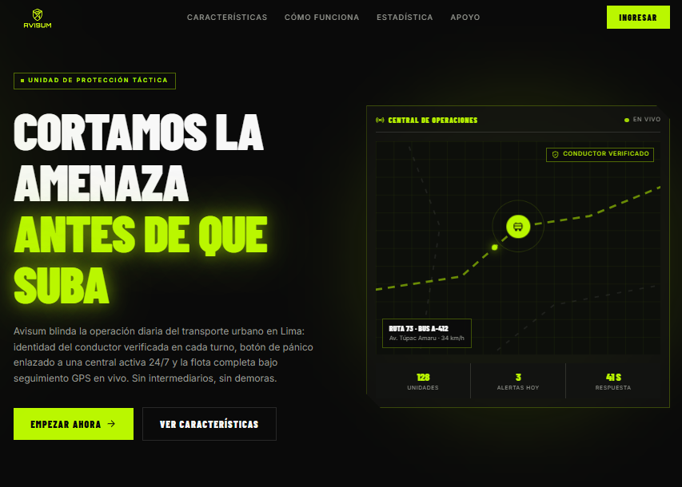
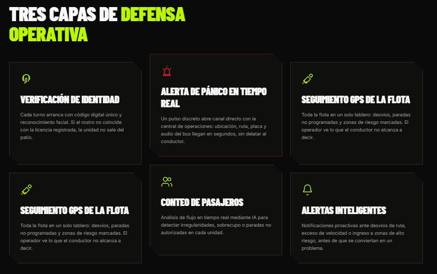
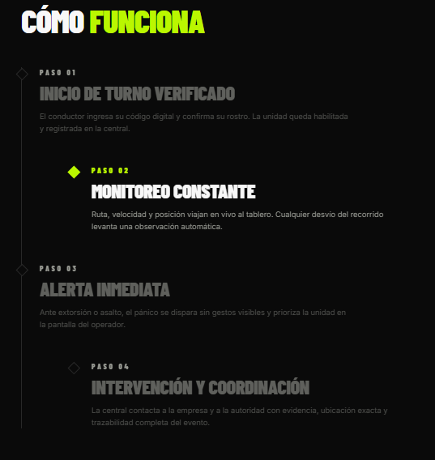

# Capítulo V: Product Implementation, Validation & Deployment

En este capítulo el equipo documenta el proceso de implementación, configuración, despliegue y validación de los productos digitales de Avisum. Para la entrega AV1, el alcance cubre la configuración del entorno de trabajo del equipo y el Sprint 1, correspondiente a la primera versión desplegada del Landing Page.

## 5.1. Software Configuration Management

En esta sección se documentan las decisiones y convenciones adoptadas por el equipo para mantener la consistencia del proyecto durante su ciclo de vida.

### 5.1.1. Software Development Environment Configuration

| Producto | Propósito de uso | Ruta de referencia / descarga |
|---|---|---|
| WebStorm 2024.1+ | IDE principal para desarrollo Angular/TypeScript | https://www.jetbrains.com/webstorm/ |
| Node.js 18.19+ / 20.9+ | Entorno de ejecución de JavaScript | https://nodejs.org |
| npm 9+ | Gestor de paquetes | Incluido con Node.js |
| Angular CLI 18.2 | Scaffolding y build tooling del Landing Page | https://angular.io/cli |
| Angular 18 (standalone components) | Framework de construcción del Landing Page | https://angular.io |
| Tailwind CSS v4 (`@tailwindcss/postcss`) | Sistema de utilidades de estilos | https://tailwindcss.com |
| TypeScript 5.5 | Lenguaje de programación del Landing Page | https://www.typescriptlang.org |
| Prettier 3.7 | Formateo automático de código (`npm run format`) | https://prettier.io |
| GitHub | Control de versiones y colaboración | > **PENDIENTE:** URL del repositorio |
| Trello / Jira / YouTrack | Gestión del Product Backlog y Sprint Backlog | > **PENDIENTE:** URL del board |
| Figma / UXPressia | Diseño UX/UI (ya referenciado en Cap. IV) | Ver Cap. IV |


- **Consistencia arquitectónica:** el Landing Page se organiza bajo una estructura de capas inspirada en Domain-Driven Design (`domain → application ← infrastructure`, consumida por `presentation`), con la regla de dependencia `presentation → application → domain ← infrastructure`. Esto permite que el equipo aplique el mismo lenguaje arquitectónico que se documentará para la Web Application (Cap. 4.6), facilitando la curva de aprendizaje interna.
- **Reemplazo de fuente de datos sin fricción:** el contenido del Landing Page hoy proviene de un repositorio en memoria (`InMemoryLandingContentRepository`) que implementa el puerto `LandingContentRepository` del dominio; el equipo puede sustituirlo en el futuro por un repositorio conectado a una API real sin modificar el dominio ni la presentación.
- **El artefacto final sí es estático:** `npm run build:prod` genera un `dist/avisum-landing` compuesto enteramente por HTML, CSS y JavaScript compilado — sin necesidad de un servidor Node en producción — por lo que el despliegue cumple con la naturaleza de "sitio web estático" exigida en el enunciado, aunque el proceso de autoría difiera de HTML/CSS/JS puro.

Esta decisión se documenta de forma transparente como una desviación deliberada, sujeta a la validación del docente durante la sustentación de AV1.

### 5.1.2. Source Code Management

El equipo utiliza GitHub como plataforma de control de versiones, aplicando GitFlow como workflow de branching.

| Repositorio | URL |
|---|---|
| Landing Page (`avisum-landing`) | https://github.com/G3-Avisum-OpenSource/avisum-landing.git |

**Convenciones de branches:**

| Branch | Convención de nombre | Ejemplo |
|---|---|---|
| Principal | `main` | `main` |
| Desarrollo | `develop` | `develop` |
| Feature |  | |
| Release |  | |
| Hotfix |  |  |

**Conventional Commits:** se aplican los tipos estándar (`feat:`, `fix:`, `docs:`, `style:`, `refactor:`, `chore:`, `test:`), redactados en inglés y en modo imperativo (p. ej. `feat: add hero section with live monitoring widget`).


### 5.1.3. Source Code Style Guide & Coding Conventions

- **Angular / TypeScript:** se sigue el [Angular coding style guide](https://angular.io/guide/styleguide) y el [Google TypeScript Style Guide](https://google.github.io/styleguide/tsguide.html). Todo el código (variables, clases, componentes, archivos) se nombra en inglés.
- **Formateo automático:** Prettier, ejecutado vía `npm run format` sobre `src/**/*.{ts,html,scss}`, garantiza un estilo consistente sin intervención manual.
- **Nomenclatura de archivos:** kebab-case para archivos (`hero.component.ts`), PascalCase para clases e interfaces (`LandingContentService`), camelCase para métodos y propiedades.
- **Organización por capas (DDD):** cada feature del Landing Page (por ahora, `landing/`) se organiza en cuatro carpetas:

  ```
  landing/
  ├── domain/            Modelos y contratos (LandingContentRepository), sin dependencias externas
  ├── application/        Casos de uso (LandingContentService)
  ├── infrastructure/      Implementaciones concretas (InMemoryLandingContentRepository)
  └── presentation/        Componentes y páginas Angular (navbar, hero, stats-section, etc.)
  ```

  Esta separación evita que el dominio conozca detalles de Angular o de la fuente de datos concreta, y es consistente con el vocabulario de Bounded Contexts que el equipo usará en el diseño de la Web Application (ver Cap. 4.6).

### 5.1.4. Software Deployment Configuration

## 5.2. Landing Page, Services & Applications Implementation

### 5.2.1. Sprint 1

#### 5.2.1.1. Sprint Planning 1

| Sprint # | Sprint 1 |
|---|---|
| **Sprint Planning Background** | |
| Date | > **PENDIENTE** |
| Time | > **PENDIENTE** |
| Location | > **PENDIENTE** |
| Prepared By | > **PENDIENTE** (Team Leader) |
| Attendees | > **PENDIENTE** |
| Sprint 0 Review Summary | |
| Sprint 0 Retrospective Summary |  |
| **Sprint Goal & User Stories** | |
| Sprint 1 Goal | *Propuesta:* "Our focus is on presenting Avisum's value proposition and problem context through a public Landing Page. We believe it delivers a clear first understanding of the service to visitors from both target segments — drivers and transport companies. This will be confirmed when the Landing Page is deployed and visitors can navigate through the problem, solution, and value proposition sections without assistance." |
| Sprint 1 Velocity | > **PENDIENTE** (Story Points que el equipo acuerda poder asumir) |
| Sum of Story Points | 32 (según propuesta de alcance en 5.2.1.3) |

#### 5.2.1.2. Aspect Leaders and Collaborators

| Team Member (Last Name, First Name) | GitHub Username | Contenido & Copy | UI / Estilos (Tailwind) | Arquitectura Angular/DDD | Documentación del Informe |
|---|---|---|---|---|---|
| Edson Diego Llamozas Diaz | DiegoLlamozas | | | | |

#### 5.2.1.3. Sprint Backlog 1

Dado que el alcance de AV1 requiere únicamente la primera versión del Landing Page desplegada, el Sprint 1 prioriza las User Stories del Product Backlog (ver Cap. 3.3) directamente relacionadas con el Epic EPAV04 (Plataforma web informativa), ordenadas según su prioridad ya establecida:

> **PENDIENTE:** screenshot del board (Trello/Jira/YouTrack) y URL pública.

| Sprint # | Sprint 1 | | | | | | |
|---|---|---|---|---|---|---|---|
| **Story Id** | **Story Title** | **Task Id** | **Task Title** | **Task Description** | **Estimation (Hours)** | **Assigned To** | **Status** |
| US08 | Visualizar propuesta del servicio | | > PENDIENTE descomposición en tasks | | | | |
| US38 | Visualizar propuesta de valor | | | | | | |
| US09 | Visualizar funcionalidades del sistema | | | | | | |
| US21 | Navegar entre secciones del sitio | | | | | | |
| US45 | Visualizar beneficios del sistema | | | | | | |
| US46 | Visualizar equipo de trabajo | | | | | | |
| US18 | Visualizar estadísticas de impacto | | | | | | |
| US30 | Visualizar misión y visión | | | | | | |
| US29 | Visualizar segmentos objetivo | | | | | | |
| US37 | Visualizar la problemática del transporte | | | | | | |

#### 5.2.1.4. Development Evidence for Sprint Review

> **PENDIENTE:** exportar el historial real de commits (`git log`) del repositorio del Landing Page.

| Repository | Branch | Commit Id | Commit Message | Commit Message Body | Committed on (Date) |
|---|---|---|---|---|---|
| > PENDIENTE | | | | | |

#### 5.2.1.5. Execution Evidence for Sprint Review

Durante el Sprint 1 se implementó y desplegó la primera versión del Landing Page de Avisum, cubriendo las siguientes vistas:

**Sección Hero y navegación principal**



La vista de entrada presenta el navbar con acceso a las secciones "Características", "Cómo Funciona", "Estadística" y "Apoyo" (US21), junto con el mensaje principal de propuesta de valor ("Cortamos la amenaza antes de que suba") y una descripción del servicio orientada a ambos frentes del negocio: verificación de identidad, botón de pánico y seguimiento GPS de flota (US08, US38). Se incluye además un mockup del panel "Central de Operaciones" que anticipa visualmente el panel de monitoreo descrito en el Impact Map (Cap. 3.2).


**Sección de estadísticas de impacto**


Se presentan tres cifras destacadas (rutas monitoreadas, conductores protegidos, reducción de incidentes reportados), correspondientes a US18. *Pendiente de definición:* dado que Avisum aún no opera comercialmente, el equipo debe decidir si estas cifras se presentan como métricas objetivo/proyectadas (con el rótulo correspondiente) o si se sustituyen por las estadísticas de la problemática ya documentadas en el Cap. 1.2.1 (p. ej. los datos de la PNP y el Ministerio Público), para mantener coherencia y transparencia con el resto del informe.

**Sección "Tres capas de defensa operativa"**



Se listan las funcionalidades del sistema (US09): Verificación de Identidad, Alerta de Pánico en Tiempo Real, Seguimiento GPS de la Flota, Conteo de Pasajeros, y Alertas Inteligentes. *Nota de consistencia:* "reconocimiento facial" (mencionado en la descripción de Verificación de Identidad) y "Conteo de Pasajeros" no cuentan aún con User Stories propias en el Product Backlog (Cap. 3.1); se recomienda añadirlas o ajustar la copy para que el informe y el producto cuenten la misma historia ante el jurado.

**Sección "Cómo funciona"**



Se presenta el flujo operativo en cuatro pasos (inicio de turno verificado, monitoreo constante, alerta inmediata, intervención y coordinación), reforzando la comprensión de la propuesta de valor (US08/US38) mediante una narrativa secuencial del servicio.