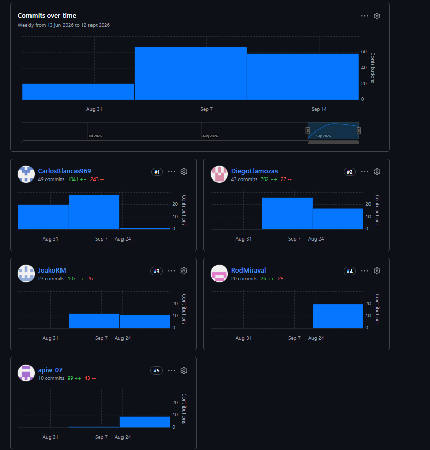

# Capítulo V: Product Implementation, Validation & Deployment

En este capítulo el equipo documenta el proceso de implementación, configuración, despliegue y validación de los productos digitales de Avisum. Para la entrega AV1, el alcance cubre la configuración del entorno de trabajo del equipo y el Sprint 1, correspondiente a la primera versión desplegada del Landing Page.

## 5.1. Software Configuration Management

En esta sección se documentan las decisiones y convenciones adoptadas por el equipo para mantener la consistencia del proyecto durante su ciclo de vida.

### 5.1.1. Software Development Environment Configuration

| Producto | Propósito de uso | Ruta de referencia / descarga |
|---|---|---|
| WebStorm 2024.1+ | IDE principal para desarrollo Angular/TypeScript | https://www.jetbrains.com/webstorm/ |
| Node.js 18.19+ / 20.9+ | Entorno de ejecución de JavaScript | https://nodejs.org |
| npm 9+ | Gestor de paquetes | Incluido con Node.js |
| Angular CLI 18.2 | Scaffolding y build tooling del Landing Page | https://angular.io/cli |
| Angular 18 (standalone components) | Framework de construcción del Landing Page | https://angular.io |
| Tailwind CSS v4 (`@tailwindcss/postcss`) | Sistema de utilidades de estilos | https://tailwindcss.com |
| TypeScript 5.5 | Lenguaje de programación del Landing Page | https://www.typescriptlang.org |
| Prettier 3.7 | Formateo automático de código (`npm run format`) | https://prettier.io |
| GitHub | Control de versiones y colaboración | > **PENDIENTE:** URL del repositorio |
| Trello / Jira / YouTrack | Gestión del Product Backlog y Sprint Backlog | > **PENDIENTE:** URL del board |
| Figma / UXPressia | Diseño UX/UI (ya referenciado en Cap. IV) | Ver Cap. IV |


- **Consistencia arquitectónica:** el Landing Page se organiza bajo una estructura de capas inspirada en Domain-Driven Design (`domain → application ← infrastructure`, consumida por `presentation`), con la regla de dependencia `presentation → application → domain ← infrastructure`. Esto permite que el equipo aplique el mismo lenguaje arquitectónico que se documentará para la Web Application (Cap. 4.6), facilitando la curva de aprendizaje interna.
- **Reemplazo de fuente de datos sin fricción:** el contenido del Landing Page hoy proviene de un repositorio en memoria (`InMemoryLandingContentRepository`) que implementa el puerto `LandingContentRepository` del dominio; el equipo puede sustituirlo en el futuro por un repositorio conectado a una API real sin modificar el dominio ni la presentación.
- **El artefacto final sí es estático:** `npm run build:prod` genera un `dist/avisum-landing` compuesto enteramente por HTML, CSS y JavaScript compilado — sin necesidad de un servidor Node en producción — por lo que el despliegue cumple con la naturaleza de "sitio web estático" exigida en el enunciado, aunque el proceso de autoría difiera de HTML/CSS/JS puro.

Esta decisión se documenta de forma transparente como una desviación deliberada, sujeta a la validación del docente durante la sustentación de AV1.

### 5.1.2. Source Code Management

El equipo utiliza GitHub como plataforma de control de versiones, aplicando GitFlow como workflow de branching.

| Repositorio | URL |
|---|---|
| Landing Page (`avisum-landing`) | https://github.com/G3-Avisum-OpenSource/avisum-landing.git |

**Convenciones de branches:**

| Branch | Convención de nombre | Ejemplo |
|---|---|---|
| Principal | `main` | `main` |
| Desarrollo | `develop` | `develop` |
| Feature |  | |
| Release |  | |
| Hotfix |  |  |

**Conventional Commits:** se aplican los tipos estándar (`feat:`, `fix:`, `docs:`, `style:`, `refactor:`, `chore:`, `test:`), redactados en inglés y en modo imperativo (p. ej. `feat: add hero section with live monitoring widget`).


### 5.1.3. Source Code Style Guide & Coding Conventions

- **Angular / TypeScript:** se sigue el [Angular coding style guide](https://angular.io/guide/styleguide) y el [Google TypeScript Style Guide](https://google.github.io/styleguide/tsguide.html). Todo el código (variables, clases, componentes, archivos) se nombra en inglés.
- **Formateo automático:** Prettier, ejecutado vía `npm run format` sobre `src/**/*.{ts,html,scss}`, garantiza un estilo consistente sin intervención manual.
- **Nomenclatura de archivos:** kebab-case para archivos (`hero.component.ts`), PascalCase para clases e interfaces (`LandingContentService`), camelCase para métodos y propiedades.
- **Organización por capas (DDD):** cada feature del Landing Page (por ahora, `landing/`) se organiza en cuatro carpetas:

  ```
  landing/
  ├── domain/            Modelos y contratos (LandingContentRepository), sin dependencias externas
  ├── application/        Casos de uso (LandingContentService)
  ├── infrastructure/      Implementaciones concretas (InMemoryLandingContentRepository)
  └── presentation/        Componentes y páginas Angular (navbar, hero, stats-section, etc.)
  ```

  Esta separación evita que el dominio conozca detalles de Angular o de la fuente de datos concreta, y es consistente con el vocabulario de Bounded Contexts que el equipo usará en el diseño de la Web Application (ver Cap. 4.6).


## 5.2. Landing Page, Services & Applications Implementation

#### 5.2.1. Sprint 1

##### 5.2.1.1. Sprint Planning 1

Para este primer Sprint, el equipo estableció como objetivo principal la implementación y despliegue de la primera versión de la Landing Page del sistema Avisum.

| Campo | Detalle |
|-------|---------|
| Sprint # | Sprint 1 |
| Date | 2026-04-10 |
| Time | 08:00 PM |
| Location | Reunión virtual vía Google Meet |
| Prepared By | Blancas Chavez, Carlos |
| Attendees | Portal Inga, Waldo Alonso / Diego Llamozas / Blancas Chavez, Carlos / Reyes, Joaquin / Rodrigo Miraval |
| Sprint N-1 Review Summary | Al ser el primer Sprint del proyecto, no existe un Sprint anterior que revisar. Se inicia desde cero con la implementación del producto. |
| Sprint N-1 Retrospective Summary | Al ser el primer Sprint, no existe retrospectiva previa. El equipo acordó mantener comunicación constante y respetar los tiempos establecidos. |
| Sprint 1 Goal | Our focus is on developing and deploying the first version of the Avisum Landing Page, aimed at communicating the value proposition of improving security in public transportation. We believe it delivers a clear understanding of the system's benefits (driver verification, panic button, and passenger monitoring) to potential clients. This will be confirmed when the Landing Page is accessible, includes all key sections, and allows smooth navigation for users. |
| Sprint N Velocity | 10 |
| Sum of Story Points | 10 |

##### 5.2.1.2. Aspect Leaders and Collaborators

| Team Member | GitHub Username | Configuración del Repositorio y CI/CD (L/C) | Estructura Base del Landing Page (L/C) | Funcionalidades Interactivas (L/C) | Corrección de Contenido (L/C) |
|------------|-----------------|---------------------------------------------|----------------------------------------|-----------------------------------|-------------------------------|
| Portal Inga, Waldo Alonso | apiw-07 | L | C | C | C |
| Llamozas Diaz, Edson Diego | DiegoLlamozas | C | C | C | L |
| Blancas Chavez, Carlos | CarlosBlancas969 | C | L | L | C |
| Reyes, Joaquin | JoakoRM | C | C | C | L |
|  | RodMiraval | C | C | C | L |

##### 5.2.1.3. Sprint Backlog 1

El objetivo principal de este Sprint fue implementar y desplegar la primera versión de la Landing Page del sistema Avisum.

| Sprint # | Sprint 1 | | | | | | |
|----------|----------|-|-|-|-|-|-|
| **User Story** | | **Work-item / Task** | | | | | |
| Id | Title | Id | Title | Description | Estimation | Assigned To | Status |
| US-08 | Visualizar información del servicio | T-01 | Configuración inicial del repositorio | Crear repositorio en GitHub, inicializar proyecto con HTML/CSS/JS y configurar archivos base (.gitignore, README). | 2 | Waldo Portal | Done |
| US-08 | Visualizar información del servicio | T-02 | Configurar despliegue | Configurar Vercel para publicar la Landing Page. | 3 | Carlos Blancas | Done |
| US-08 | Visualizar información del servicio | T-03 | Desarrollo estructura base | Implementar secciones principales: hero, problemática, propuesta, beneficios y footer. | 4 | Carlos Blancas | Done |
| US-08 | Visualizar información del servicio | T-04 | Implementar funcionalidades del sistema | Mostrar funcionalidades clave: QR, botón de pánico y conteo de pasajeros. | 3 | Carlos Blancas | Done |
| US-08 | Visualizar información del servicio | T-05 | Implementar navegación | Permitir navegación entre secciones (scroll y menú). | 2 | Joaquin Reyes | Done |
| US-08 | Visualizar información del servicio | T-06 | Integración de contenido | Redactar contenido basado en problemática y solución Avisum. | 2 | Llamozas Diaz, Edson Diego | Done |
| US-08 | Visualizar información del servicio | T-07 | Revisión y validación | Corrección de errores, ortografía y pruebas de navegación. | 2 | [RodMiraval] | Done |

#### 5.2.1.4. Development Evidence for Sprint Review

Esta sección detalla los pasos necesarios para desplegar de forma satisfactoria los productos digitales que componen la solución:

**1\. Landing Page \- HTML, CSS y TypeScript**

Para que nuestra landing page esté disponible para todos nuestros usuarios, la publicamos como un sitio web utilizando la plataforma de GitHub. El proceso se llevó a cabo de la siguiente manera:

Registro en GitHub Creamos una cuenta en GitHub para poder gestionar los repositorios del proyecto y almacenar el código de la Landing Page de Avisum

#### 5.2.1.5. Execution Evidence for Sprint Review

Durante el Sprint 1 se implementó y desplegó la primera versión del Landing Page de Avisum, cubriendo las siguientes vistas:

**Sección Hero y navegación principal**


La vista de entrada presenta el navbar con acceso a las secciones "Características", "Cómo Funciona", "Estadística" y "Apoyo" (US21), junto con el mensaje principal de propuesta de valor ("Cortamos la amenaza antes de que suba") y una descripción del servicio orientada a ambos frentes del negocio: verificación de identidad, botón de pánico y seguimiento GPS de flota (US08, US38). Se incluye además un mockup del panel "Central de Operaciones" que anticipa visualmente el panel de monitoreo descrito en el Impact Map (Cap. 3.2).


**Sección de estadísticas de impacto**


Se presentan tres cifras destacadas (rutas monitoreadas, conductores protegidos, reducción de incidentes reportados), correspondientes a US18. *Pendiente de definición:* dado que Avisum aún no opera comercialmente, el equipo debe decidir si estas cifras se presentan como métricas objetivo/proyectadas (con el rótulo correspondiente) o si se sustituyen por las estadísticas de la problemática ya documentadas en el Cap. 1.2.1 (p. ej. los datos de la PNP y el Ministerio Público), para mantener coherencia y transparencia con el resto del informe.

**Sección "Tres capas de defensa operativa"**


Se listan las funcionalidades del sistema (US09): Verificación de Identidad, Alerta de Pánico en Tiempo Real, Seguimiento GPS de la Flota, Conteo de Pasajeros, y Alertas Inteligentes. *Nota de consistencia:* "reconocimiento facial" (mencionado en la descripción de Verificación de Identidad) y "Conteo de Pasajeros" no cuentan aún con User Stories propias en el Product Backlog (Cap. 3.1); se recomienda añadirlas o ajustar la copy para que el informe y el producto cuenten la misma historia ante el jurado.

**Sección "Cómo funciona"**


Se presenta el flujo operativo en cuatro pasos (inicio de turno verificado, monitoreo constante, alerta inmediata, intervención y coordinación), reforzando la comprensión de la propuesta de valor (US08/US38) mediante una narrativa secuencial del servicio.

**Sección de cierre (CTA) y footer**


Incluye un llamado a la acción ("Solicita una auditoría de seguridad para tu flota") orientado al segmento de empresas, con dos botones ("Solicitar Demo", "Hablar con Operaciones"), y el footer con enlaces de navegación repetidos. *Pendiente:* el enunciado exige un call-to-action por cada segmento objetivo, redirigiendo a la vista correspondiente en la Web Application. Actualmente solo existe un CTA orientado a empresas; falta un CTA equivalente para el segmento de conductores (p. ej. "Regístrate como conductor"). Dado que la Web Application se implementa recién en TB1, se puede dejar el enlace apuntando a un ancla temporal o página "próximamente", documentando la limitación.

##### 5.2.1.6. Services Documentation Evidence for Sprint Review

Durante el Sprint 1, el alcance de implementación se limitó exclusivamente al Landing Page estático. No se desarrollaron ni desplegaron Web Services (RESTful API) en esta iteración, por lo que no aplicadocumentación de endpoints para este Sprint. La documentación de servicios web se incorporará a partir del Sprint 2, conforme a lo planificado en el Product Backlog.

##### 5.2.1.7. Software Deployment Evidence for Sprint Review

Las principales funcionalidades implementadas durante este sprint abarcan desde la estructura básica de navegación hasta características avanzadas de experiencia de usuario. Se estableció una arquitectura sólida que incluye la implementación de componentes reutilizables, un sistema de enrutamiento eficiente, y la integración de estilos globales que reflejan la identidad visual de SafeBus definida previamente en las guías de estilo.
El trabajo de desarrollo se organizó siguiendo las mejores prácticas de versionado con Git Flow, donde cada funcionalidad fue desarrollada en ramas específicas y posteriormente integrada a través de pull requests debidamente revisados. Esto garantizó la calidad del código y la colaboración efectiva entre los miembros del equipo de UrbanGuard, cada uno especializado en diferentes aspectos del desarrollo front-end.
Adicionalmente, se implementaron mejoras significativas en diseño responsive para asegurar una experiencia óptima en diferentes dispositivos, optimizaciones de rendimiento para cargas rápidas de página, y consideraciones de accesibilidad web siguiendo estándares WCAG para garantizar que la plataforma sea inclusiva para todos los operadores de transporte, conductores y usuarios potenciales de SafeBus.

1. Primera funcionalidad: Sección Hero con título principal, estadísticas de impacto (340+ Rutas monitoreadas en Lima y Callao, +1000 conductores protegidos, 68% Reduccion de incidentes reportados) y llamada a la acción.
2. Segunda funcionalidad: Sección de características con las 6 funcionalidades del sistema (Verificación QR, Botón de Pánico, Conteo de Pasajeros, Monitoreo Real, Alertas Inteligentes, Soporte 24/7).
3. Tercera funcionalidad: Sección ¿Cómo funciona SafeBus? con los 4 pasos del flujo operativo (Inicio de Turno, Monitoreo Constante, Alerta Inmediata, Intervención).
Otras mejoras: Banda de estadísticas, sección CTA de auditoría de seguridad, footer con información de UrbanGuard, ajustes de diseño responsive y optimización de rendimiento.
Durante el Sprint 1 se realizó el despliegue de la Landing Page de SafeBus utilizando dos plataformas de hosting: GitHub Pages y Vercel. La lading page fue desarrollado con **React + Vite** y el código fuente se encuentra alojado en el repositorio público de la organización UrbanGuard en GitHub.
---

### Despliegue en GitHub Pages

1. Se creó el repositorio público en la organización de GitHub del equipo UrbanGuard y se subió el código fuente de la landing page construida con React + Vite.
2. Se accedió a la sección **Settings** del repositorio. Dentro de **Pages**, se seleccionó la rama `main` como origen de publicación y se guardaron los cambios para activar la publicación automática.
3. Se configuró el archivo `vite.config.js` con el parámetro `base: '/avisum-landing/'` para que las rutas de los assets funcionen correctamente bajo el subdominio de GitHub Pages.
4. Se creó el archivo de workflow `.github/workflows/deploy.yml` para automatizar el build y despliegue mediante GitHub Actions cada vez que se realice un push a la rama `main`.
5. Una vez activado el despliegue, GitHub Pages generó la URL pública del sitio desde donde cualquier usuario puede acceder a la landing page de SafeBus sin necesidad de credenciales.

---

### Despliegue en Vercel

1. Se vinculó el repositorio de GitHub con una cuenta de Vercel mediante la integración oficial de GitHub en la plataforma.
2. Vercel detectó automáticamente el framework Angular y configuró el build sin necesidad de parámetros adicionales.
3. Se generó la URL pública del sitio:

   > **https://lading-page-six-psi.vercel.app/**


4. Vercel realiza redeploy automático cada vez que se hace un push a la rama `main`, garantizando que la versión publicada siempre refleje el estado más reciente del repositorio.

##### 5.2.1.8. Team Collaboration Insights during Sprint

Durante el Sprint 1, todos los miembros del equipo participaron activamente en la implementación del Landing Page, evidenciando a traves de los commits registrados en el repositorio `informe-del-proyecto`. El trabajo se distribuyó de manera colaborativa: Fernando Espiritu lideró la configuración del repositorio y el pipeline de despliegue; Carlos Blancas y Leonardo Delgado se encargaron del desarrollo de funcionalidades interactivas y animaciones; Boris Alvarado e Ivonne Ibañez contribuyeron con correcciones de contenido y en la estructura base de la página.

El equipo aplicó GitFlow como estrategia de control de versiones, trabajando en la rama `develop` y realizando la integración a `main` mediante Pull Requests revisados y aprobados por otros miembros. Se realizaron un total de 4 Pull Requests durante el Sprint.



