# Capítulo V: Product Implementation, Validation & Deployment

En este capítulo el equipo documenta el proceso de implementación, configuración, despliegue y validación de los productos digitales de Avisum. Para la entrega AV1, el alcance cubre la configuración del entorno de trabajo del equipo y el Sprint 1, correspondiente a la primera versión desplegada del Landing Page.

## 5.1. Software Configuration Management

En esta sección se documentan las decisiones y convenciones adoptadas por el equipo para mantener la consistencia del proyecto durante su ciclo de vida.

### 5.1.1. Software Development Environment Configuration

| Producto | Propósito de uso | Ruta de referencia / descarga |
|---|---|---|
| WebStorm 2024.1+ | IDE principal para desarrollo Angular/TypeScript | https://www.jetbrains.com/webstorm/ |
| Node.js 18.19+ / 20.9+ | Entorno de ejecución de JavaScript | https://nodejs.org |
| npm 9+ | Gestor de paquetes | Incluido con Node.js |
| Angular CLI 18.2 | Scaffolding y build tooling del Landing Page | https://angular.io/cli |
| Angular 18 (standalone components) | Framework de construcción del Landing Page | https://angular.io |
| Tailwind CSS v4 (`@tailwindcss/postcss`) | Sistema de utilidades de estilos | https://tailwindcss.com |
| TypeScript 5.5 | Lenguaje de programación del Landing Page | https://www.typescriptlang.org |
| Prettier 3.7 | Formateo automático de código (`npm run format`) | https://prettier.io |
| GitHub | Control de versiones y colaboración | > **PENDIENTE:** URL del repositorio |
| Trello / Jira / YouTrack | Gestión del Product Backlog y Sprint Backlog | > **PENDIENTE:** URL del board |
| Figma / UXPressia | Diseño UX/UI (ya referenciado en Cap. IV) | Ver Cap. IV |


- **Consistencia arquitectónica:** el Landing Page se organiza bajo una estructura de capas inspirada en Domain-Driven Design (`domain → application ← infrastructure`, consumida por `presentation`), con la regla de dependencia `presentation → application → domain ← infrastructure`. Esto permite que el equipo aplique el mismo lenguaje arquitectónico que se documentará para la Web Application (Cap. 4.6), facilitando la curva de aprendizaje interna.
- **Reemplazo de fuente de datos sin fricción:** el contenido del Landing Page hoy proviene de un repositorio en memoria (`InMemoryLandingContentRepository`) que implementa el puerto `LandingContentRepository` del dominio; el equipo puede sustituirlo en el futuro por un repositorio conectado a una API real sin modificar el dominio ni la presentación.
- **El artefacto final sí es estático:** `npm run build:prod` genera un `dist/avisum-landing` compuesto enteramente por HTML, CSS y JavaScript compilado — sin necesidad de un servidor Node en producción — por lo que el despliegue cumple con la naturaleza de "sitio web estático" exigida en el enunciado, aunque el proceso de autoría difiera de HTML/CSS/JS puro.

Esta decisión se documenta de forma transparente como una desviación deliberada, sujeta a la validación del docente durante la sustentación de AV1.

### 5.1.2. Source Code Management

El equipo utiliza GitHub como plataforma de control de versiones, aplicando GitFlow como workflow de branching.

| Repositorio | URL |
|---|---|
| Landing Page (`avisum-landing`) | https://github.com/G3-Avisum-OpenSource/avisum-landing.git |

**Convenciones de branches:**

| Branch | Convención de nombre | Ejemplo |
|---|---|---|
| Principal | `main` | `main` |
| Desarrollo | `develop` | `develop` |
| Feature |  | |
| Release |  | |
| Hotfix |  |  |

**Conventional Commits:** se aplican los tipos estándar (`feat:`, `fix:`, `docs:`, `style:`, `refactor:`, `chore:`, `test:`), redactados en inglés y en modo imperativo (p. ej. `feat: add hero section with live monitoring widget`).


### 5.1.3. Source Code Style Guide & Coding Conventions

- **Angular / TypeScript:** se sigue el [Angular coding style guide](https://angular.io/guide/styleguide) y el [Google TypeScript Style Guide](https://google.github.io/styleguide/tsguide.html). Todo el código (variables, clases, componentes, archivos) se nombra en inglés.
- **Formateo automático:** Prettier, ejecutado vía `npm run format` sobre `src/**/*.{ts,html,scss}`, garantiza un estilo consistente sin intervención manual.
- **Nomenclatura de archivos:** kebab-case para archivos (`hero.component.ts`), PascalCase para clases e interfaces (`LandingContentService`), camelCase para métodos y propiedades.
- **Organización por capas (DDD):** cada feature del Landing Page (por ahora, `landing/`) se organiza en cuatro carpetas:

  ```
  landing/
  ├── domain/            Modelos y contratos (LandingContentRepository), sin dependencias externas
  ├── application/        Casos de uso (LandingContentService)
  ├── infrastructure/      Implementaciones concretas (InMemoryLandingContentRepository)
  └── presentation/        Componentes y páginas Angular (navbar, hero, stats-section, etc.)
  ```

  Esta separación evita que el dominio conozca detalles de Angular o de la fuente de datos concreta, y es consistente con el vocabulario de Bounded Contexts que el equipo usará en el diseño de la Web Application (ver Cap. 4.6).


## 5.2. Landing Page, Services & Applications Implementation

#### 5.2.1. Sprint 1

##### 5.2.1.1. Sprint Planning 1

Para este primer Sprint, el equipo estableció como objetivo principal la implementación y despliegue de la primera versión de la Landing Page del sistema Avisum.

| Campo | Detalle |
|-------|---------|
| Sprint # | Sprint 1 |
| Date | 2026-04-10 |
| Time | 08:00 PM |
| Location | Reunión virtual vía Google Meet |
| Prepared By | Blancas Chavez, Carlos |
| Attendees | Portal Inga, Waldo Alonso / Diego Llamozas / Blancas Chavez, Carlos / Reyes, Joaquin / Rodrigo Miraval |
| Sprint N-1 Review Summary | Al ser el primer Sprint del proyecto, no existe un Sprint anterior que revisar. Se inicia desde cero con la implementación del producto. |
| Sprint N-1 Retrospective Summary | Al ser el primer Sprint, no existe retrospectiva previa. El equipo acordó mantener comunicación constante y respetar los tiempos establecidos. |
| Sprint 1 Goal | Our focus is on developing and deploying the first version of the Avisum Landing Page, aimed at communicating the value proposition of improving security in public transportation. We believe it delivers a clear understanding of the system's benefits (driver verification, panic button, and passenger monitoring) to potential clients. This will be confirmed when the Landing Page is accessible, includes all key sections, and allows smooth navigation for users. |
| Sprint N Velocity | 10 |
| Sum of Story Points | 10 |

##### 5.2.1.2. Aspect Leaders and Collaborators

| Team Member | GitHub Username | Configuración del Repositorio y CI/CD (L/C) | Estructura Base del Landing Page (L/C) | Funcionalidades Interactivas (L/C) | Corrección de Contenido (L/C) |
|------------|-----------------|---------------------------------------------|----------------------------------------|-----------------------------------|-------------------------------|
| Portal Inga, Waldo Alonso | apiw-07 | L | C | C | C |
| Llamozas Diaz, Edson Diego | DiegoLlamozas | C | C | C | L |
| Blancas Chavez, Carlos | CarlosBlancas969 | C | L | L | C |
| Reyes, Joaquin | JoakoRM | C | C | C | L |
|  | RodMiraval | C | C | C | L |

##### 5.2.1.3. Sprint Backlog 1

El objetivo principal de este Sprint fue implementar y desplegar la primera versión de la Landing Page del sistema Avisum.

| Sprint # | Sprint 1 | | | | | | |
|----------|----------|-|-|-|-|-|-|
| **User Story** | | **Work-item / Task** | | | | | |
| Id | Title | Id | Title | Description | Estimation | Assigned To | Status |
| US-08 | Visualizar información del servicio | T-01 | Configuración inicial del repositorio | Crear repositorio en GitHub, inicializar proyecto con HTML/CSS/JS y configurar archivos base (.gitignore, README). | 2 | Waldo Portal | Done |
| US-08 | Visualizar información del servicio | T-02 | Configurar despliegue | Configurar Vercel para publicar la Landing Page. | 3 | Carlos Blancas | Done |
| US-08 | Visualizar información del servicio | T-03 | Desarrollo estructura base | Implementar secciones principales: hero, problemática, propuesta, beneficios y footer. | 4 | Carlos Blancas | Done |
| US-08 | Visualizar información del servicio | T-04 | Implementar funcionalidades del sistema | Mostrar funcionalidades clave: QR, botón de pánico y conteo de pasajeros. | 3 | Carlos Blancas | Done |
| US-08 | Visualizar información del servicio | T-05 | Implementar navegación | Permitir navegación entre secciones (scroll y menú). | 2 | Joaquin Reyes | Done |
| US-08 | Visualizar información del servicio | T-06 | Integración de contenido | Redactar contenido basado en problemática y solución Avisum. | 2 | Llamozas Diaz, Edson Diego | Done |
| US-08 | Visualizar información del servicio | T-07 | Revisión y validación | Corrección de errores, ortografía y pruebas de navegación. | 2 | [RodMiraval] | Done |

#### 5.2.1.4. Development Evidence for Sprint Review

Esta sección detalla los pasos necesarios para desplegar de forma satisfactoria los productos digitales que componen la solución:

**1\. Landing Page \- HTML, CSS y TypeScript**

Para que nuestra landing page esté disponible para todos nuestros usuarios, la publicamos como un sitio web utilizando la plataforma de GitHub. El proceso se llevó a cabo de la siguiente manera:

Registro en GitHub Creamos una cuenta en GitHub para poder gestionar los repositorios del proyecto y almacenar el código de la Landing Page de Avisum

#### 5.2.1.5. Execution Evidence for Sprint Review

Durante el Sprint 1 se implementó y desplegó la primera versión del Landing Page de Avisum, cubriendo las siguientes vistas:

**Sección Hero y navegación principal**

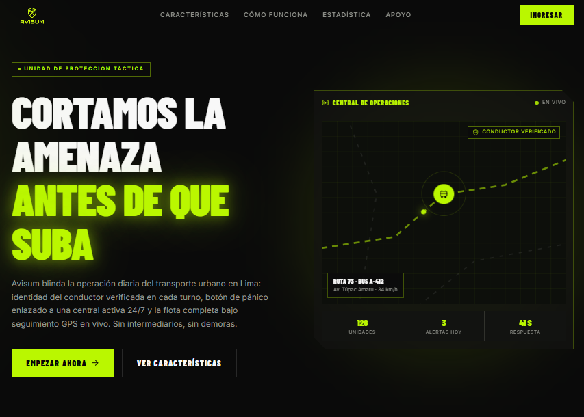

La vista de entrada presenta el navbar con acceso a las secciones "Características", "Cómo Funciona", "Estadística" y "Apoyo" (US21), junto con el mensaje principal de propuesta de valor ("Cortamos la amenaza antes de que suba") y una descripción del servicio orientada a ambos frentes del negocio: verificación de identidad, botón de pánico y seguimiento GPS de flota (US08, US38). Se incluye además un mockup del panel "Central de Operaciones" que anticipa visualmente el panel de monitoreo descrito en el Impact Map (Cap. 3.2).


**Sección de estadísticas de impacto**

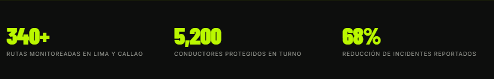

Se presentan tres cifras destacadas (rutas monitoreadas, conductores protegidos, reducción de incidentes reportados), correspondientes a US18. *Pendiente de definición:* dado que Avisum aún no opera comercialmente, el equipo debe decidir si estas cifras se presentan como métricas objetivo/proyectadas (con el rótulo correspondiente) o si se sustituyen por las estadísticas de la problemática ya documentadas en el Cap. 1.2.1 (p. ej. los datos de la PNP y el Ministerio Público), para mantener coherencia y transparencia con el resto del informe.

**Sección "Tres capas de defensa operativa"**

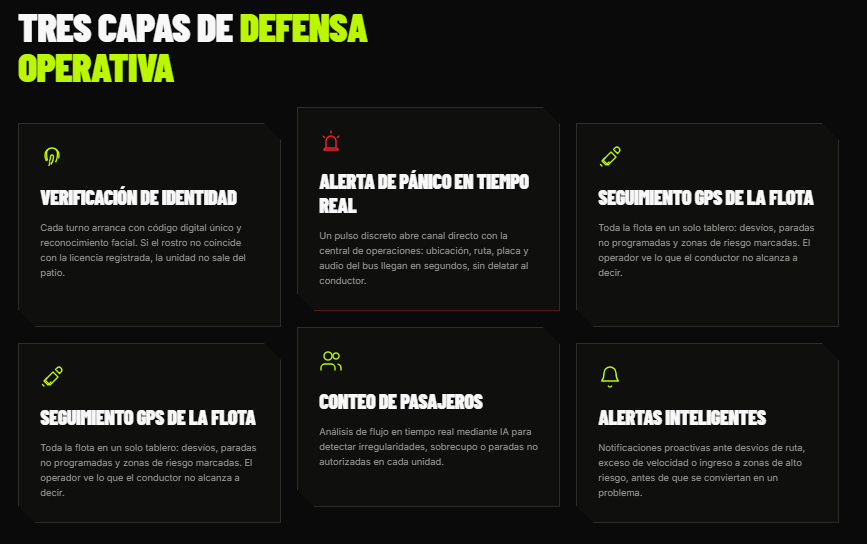

Se listan las funcionalidades del sistema (US09): Verificación de Identidad, Alerta de Pánico en Tiempo Real, Seguimiento GPS de la Flota, Conteo de Pasajeros, y Alertas Inteligentes. *Nota de consistencia:* "reconocimiento facial" (mencionado en la descripción de Verificación de Identidad) y "Conteo de Pasajeros" no cuentan aún con User Stories propias en el Product Backlog (Cap. 3.1); se recomienda añadirlas o ajustar la copy para que el informe y el producto cuenten la misma historia ante el jurado.

**Sección "Cómo funciona"**

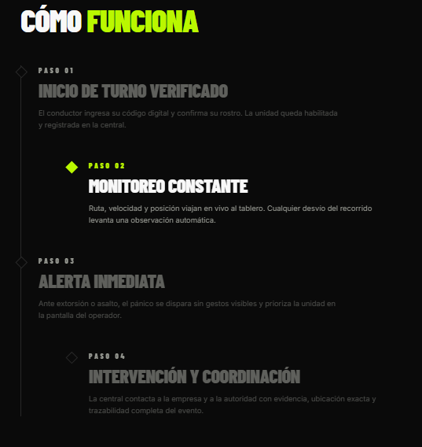

Se presenta el flujo operativo en cuatro pasos (inicio de turno verificado, monitoreo constante, alerta inmediata, intervención y coordinación), reforzando la comprensión de la propuesta de valor (US08/US38) mediante una narrativa secuencial del servicio.

**Sección de cierre (CTA) y footer**


Incluye un llamado a la acción ("Solicita una auditoría de seguridad para tu flota") orientado al segmento de empresas, con dos botones ("Solicitar Demo", "Hablar con Operaciones"), y el footer con enlaces de navegación repetidos. *Pendiente:* el enunciado exige un call-to-action por cada segmento objetivo, redirigiendo a la vista correspondiente en la Web Application. Actualmente solo existe un CTA orientado a empresas; falta un CTA equivalente para el segmento de conductores (p. ej. "Regístrate como conductor"). Dado que la Web Application se implementa recién en TB1, se puede dejar el enlace apuntando a un ancla temporal o página "próximamente", documentando la limitación.

##### 5.2.1.6. Services Documentation Evidence for Sprint Review

Durante el Sprint 1, el alcance de implementación se limitó exclusivamente al Landing Page estático. No se desarrollaron ni desplegaron Web Services (RESTful API) en esta iteración, por lo que no aplicadocumentación de endpoints para este Sprint. La documentación de servicios web se incorporará a partir del Sprint 2, conforme a lo planificado en el Product Backlog.

##### 5.2.1.7. Software Deployment Evidence for Sprint Review

Las principales funcionalidades implementadas durante este sprint abarcan desde la estructura básica de navegación hasta características avanzadas de experiencia de usuario. Se estableció una arquitectura sólida que incluye la implementación de componentes reutilizables, un sistema de enrutamiento eficiente, y la integración de estilos globales que reflejan la identidad visual de SafeBus definida previamente en las guías de estilo.
El trabajo de desarrollo se organizó siguiendo las mejores prácticas de versionado con Git Flow, donde cada funcionalidad fue desarrollada en ramas específicas y posteriormente integrada a través de pull requests debidamente revisados. Esto garantizó la calidad del código y la colaboración efectiva entre los miembros del equipo de UrbanGuard, cada uno especializado en diferentes aspectos del desarrollo front-end.
Adicionalmente, se implementaron mejoras significativas en diseño responsive para asegurar una experiencia óptima en diferentes dispositivos, optimizaciones de rendimiento para cargas rápidas de página, y consideraciones de accesibilidad web siguiendo estándares WCAG para garantizar que la plataforma sea inclusiva para todos los operadores de transporte, conductores y usuarios potenciales de SafeBus.

1. Primera funcionalidad: Sección Hero con título principal, estadísticas de impacto (340+ Rutas monitoreadas en Lima y Callao, +1000 conductores protegidos, 68% Reduccion de incidentes reportados) y llamada a la acción.
2. Segunda funcionalidad: Sección de características con las 6 funcionalidades del sistema (Verificación QR, Botón de Pánico, Conteo de Pasajeros, Monitoreo Real, Alertas Inteligentes, Soporte 24/7).
3. Tercera funcionalidad: Sección ¿Cómo funciona SafeBus? con los 4 pasos del flujo operativo (Inicio de Turno, Monitoreo Constante, Alerta Inmediata, Intervención).
Otras mejoras: Banda de estadísticas, sección CTA de auditoría de seguridad, footer con información de UrbanGuard, ajustes de diseño responsive y optimización de rendimiento.
Durante el Sprint 1 se realizó el despliegue de la Landing Page de SafeBus utilizando dos plataformas de hosting: GitHub Pages y Vercel. La lading page fue desarrollado con **React + Vite** y el código fuente se encuentra alojado en el repositorio público de la organización UrbanGuard en GitHub.
---

### Despliegue en GitHub Pages

1. Se creó el repositorio público en la organización de GitHub del equipo UrbanGuard y se subió el código fuente de la landing page construida con React + Vite.
2. Se accedió a la sección **Settings** del repositorio. Dentro de **Pages**, se seleccionó la rama `main` como origen de publicación y se guardaron los cambios para activar la publicación automática.
3. Se configuró el archivo `vite.config.js` con el parámetro `base: '/avisum-landing/'` para que las rutas de los assets funcionen correctamente bajo el subdominio de GitHub Pages.
4. Se creó el archivo de workflow `.github/workflows/deploy.yml` para automatizar el build y despliegue mediante GitHub Actions cada vez que se realice un push a la rama `main`.
5. Una vez activado el despliegue, GitHub Pages generó la URL pública del sitio desde donde cualquier usuario puede acceder a la landing page de SafeBus sin necesidad de credenciales.

---

### Despliegue en Vercel

1. Se vinculó el repositorio de GitHub con una cuenta de Vercel mediante la integración oficial de GitHub en la plataforma.
2. Vercel detectó automáticamente el framework Angular y configuró el build sin necesidad de parámetros adicionales.
3. Se generó la URL pública del sitio:

   > **https://lading-page-six-psi.vercel.app/**


4. Vercel realiza redeploy automático cada vez que se hace un push a la rama `main`, garantizando que la versión publicada siempre refleje el estado más reciente del repositorio.

##### 5.2.1.8. Team Collaboration Insights during Sprint

Durante el Sprint 1, todos los miembros del equipo participaron activamente en la implementación del Landing Page, evidenciando a traves de los commits registrados en el repositorio `informe-del-proyecto`. El trabajo se distribuyó de manera colaborativa: Fernando Espiritu lideró la configuración del repositorio y el pipeline de despliegue; Carlos Blancas y Leonardo Delgado se encargaron del desarrollo de funcionalidades interactivas y animaciones; Boris Alvarado e Ivonne Ibañez contribuyeron con correcciones de contenido y en la estructura base de la página.

El equipo aplicó GitFlow como estrategia de control de versiones, trabajando en la rama `develop` y realizando la integración a `main` mediante Pull Requests revisados y aprobados por otros miembros. Se realizaron un total de 4 Pull Requests durante el Sprint.


------

##### 5.2. Sprint 2


----

##### 5.2.2.1.Sprint Planning 2.

---
| Campo | Detalle |
|---|---|
| Sprint # | Sprint 2 |
| Date | 2026-10-07 |
| Time | 07:00 PM |
| Location | Reunión virtual vía Meet |
| Prepared By | Reyes Muñoz, Joaquin Leonardo |
| Attendees | Portal Inga, Waldo Alonso / Diego Llamozas / Blancas Chavez, Carlos / Reyes, Joaquin / Rodrigo Miraval |
| Sprint 1 Review Summary | Durante el Sprint 1 se logró implementar exitosamente la primera versión funcional de la plataforma UrbanGuard, incluyendo autenticación del conductor, monitoreo básico y visualización inicial del sistema. El equipo cumplió los objetivos planteados y consolidó la estructura principal del proyecto. |
| Sprint 1 Retrospective Summary | En la retrospectiva del Sprint 1, el equipo identificó como fortalezas la buena comunicación, la correcta distribución de tareas y el trabajo colaborativo mediante GitHub. Como mejora, se acordó optimizar la integración de componentes y realizar validaciones más frecuentes antes de los merges. |
| Sprint 2 Goal | Our focus for Sprint 2 is implementing and integrating the core operational functionalities of UrbanGuard, including emergency alerts, real-time monitoring, passenger tracking, driver validation, and administrative dashboards. We believe this sprint will strengthen the platform’s operational flow and improve the monitoring experience for transport management personnel. This will be confirmed when all modules are functional, interconnected, and accessible through the application dashboard. |
| Sprint 2 Velocity | 24 |
| Sum of Story Points | 24 |


##### 5.2.2.2. Aspect Leaders and Collaborators

----

##### 5.2.2.3.Sprint Backlog 2.

El objetivo del Sprint 2 fue implementar e integrar las funcionalidades principales de Avisum, incluyendo verificación del conductor, gestión de turnos, alertas de emergencia, monitoreo de flota y herramientas administrativas.

| User Story ID | Título de la historia | Task ID | Tarea | Descripción | Estimación (horas) | Responsable propuesto | Estado |
|---|---|---|---|---|---|---|---|
| US01, US14 | Verificar identidad y autorización del conductor | T-01 | Implementar acceso del conductor | Validar el código contra la API simulada, mostrar errores y bloquear el ingreso de conductores desactivados. | 10 | Waldo Portal | Done |
| US01 | Verificar identidad del conductor | T-02 | Implementar pantalla de verificación QR | Crear la interfaz de escaneo simulado y la alternativa de ingreso manual del código. | 6 | Rodrigo Miraval | Done |
| US02 | Registrar inicio de turno | T-03 | Registrar acceso autorizado e inicio de turno | Mostrar la confirmación de acceso y guardar el turno asociado al conductor y su unidad en la API simulada. | 8 | Edson Diego Llamozas | Done |
| US26 | Consultar estado del servicio | T-04 | Implementar dashboard del conductor | Presentar el estado del turno, tiempo transcurrido, ruta y cifras simuladas de distancia, pasajeros y recaudación. | 8 | Waldo Portal | Done |
| US03, US42 | Activar alerta de pánico y registrar su ubicación | T-05 | Implementar botón de pánico | Registrar una alerta crítica con la unidad y sus coordenadas, y mostrar la confirmación al conductor. | 10 | Carlos Blancas | Done |
| US04, US40 | Recepción y clasificación de alertas | T-06 | Implementar atención de alertas en la central | Mostrar las alertas recibidas y su gravedad, permitir resolverlas y sincronizar los cambios entre pestañas del mismo navegador. | 10 | Joaquin Reyes | Done |
| US06, US07, US27, US28, US43 | Estado y ubicación de la flota | T-07 | Implementar monitoreo operacional | Integrar el mapa y la visualización de unidades activas, inactivas y en alerta en el centro de control. | 10 | Rodrigo Miraval | Done |
| US14, US47, US48 | Autorización, actualización y desactivación de conductores | T-08 | Implementar gestión de conductores | Crear las opciones de registro, edición, desactivación, reactivación y eliminación sobre la API simulada, con validaciones de formulario. | 10 | Edson Diego Llamozas | Done |
| US15 | Asociar conductor a unidad | T-09 | Implementar asignación de unidades | Mostrar las unidades y permitir reasignar conductores y rutas, guardando los cambios en la API simulada. | 8 | Carlos Blancas | Done |
| US23, US33 | Confirmación de recepción y notificación a destinatarios | T-10 | Implementar gestión de notificaciones | Administrar destinatarios y mostrar el registro de entregas con confirmación simulada por tiempo. | 8 | Joaquin Reyes | Done |
| US26 | Consultar estado del servicio | T-11 | Implementar historial de turnos | Mostrar turnos actuales y anteriores, incorporando filtros por conductor y estado y un resumen de totales. | 8 | Rodrigo Miraval | Done |
| US34, US35, US44 | Tiempo de respuesta y comparación entre unidades | T-12 | Implementar panel de métricas | Calcular indicadores, tiempo promedio de respuesta y comparaciones de kilómetros, pasajeros y recaudación. | 6 | Edson Diego Llamozas | Done |
| US25 | Registrar cierre de turno | T-13 | Implementar cierre y reporte del servicio | Guardar la finalización del turno y presentar un reporte con duración, recorrido, pasajeros, recaudación y eventos. | 6 | Carlos Blancas | Done |
| US16 | Consultar historial de emergencias | T-14 | Implementar consulta de alertas registradas | Mostrar las alertas anteriores y el resumen de alertas de pánico asociadas al servicio. | 6 | Joaquin Reyes | Done |
| US01, US02, US03, US25, US26 | Flujo operativo del conductor | T-15 | Validar integración del flujo | Revisar el recorrido de verificación, inicio de turno, dashboard, alerta y cierre, dentro del entorno de demostración. | 6 | Waldo Portal | Por verificar |
---

##### 5.2.2.4. Development Evidence for Sprint Review


###### Introducción

Durante el Sprint 2, el equipo implementó el frontend de la Web Application de Avisum en Angular 18 (standalone components), cubriendo las funcionalidades núcleo del sistema: verificación de identidad del conductor, alerta de pánico, monitoreo de flota en tiempo real, gestión de conductores y paneles diferenciados por rol (conductor y administrador). La aplicación se organizó por Bounded Contexts —`iam`, `users`, `monitoring`, `alert-management`, `camera`, `profile`— replicando la misma estructura de capas adoptada para el Landing Page en el Sprint 1 (`domain → application ← infrastructure`, consumida por `presentation`), lo que permitió mantener la coherencia arquitectónica entre ambos productos digitales y facilitar la incorporación de los Web Services en el Sprint 3.

Como el backend real (RESTful API en Spring Boot) se implementa recién en el Sprint 3, el equipo construyó una **API falsa** con `json-server` (`server/db.json`) y un `fake-api.interceptor.ts` en `shared/infrastructure`, que simula los endpoints RESTful diseñados en el Capítulo IV sin modificar el dominio ni la capa de presentación de la aplicación. La sincronización en vivo entre la vista del conductor y la del administrador se logró mediante `BroadcastChannel`, funcional entre pestañas del mismo navegador.

El desarrollo se organizó aplicando GitFlow: el trabajo se realizó sobre la rama `develop`, con una rama de correcciones (`fix/sprint2-review-fixes`) creada a partir de la revisión interna del Sprint, e integrada a `main` mediante Pull Requests revisados. Se aplicaron **Conventional Commits** en las correcciones finales del Sprint (`fix(conductor):`, `docs:`); el equipo reconoce como oportunidad de mejora extender la convención a la totalidad de los commits desde el Sprint 3 en adelante.

###### Tabla de commits del Sprint 2

| Repository | Branch | Commit Id | Commit Message | Commit Message Body | Committed on (Date) |
|---|---|---|---|---|---|
| `G3-Avisum-OpenSource/avisum-frontend` | `main` | `2d769ab` | Merge pull request #2 from G3-Avisum-OpenSource/develop | Develop | 2026-10-08 |
| `G3-Avisum-OpenSource/avisum-frontend` | `develop` | `e88ed29` | Merge pull request #1 from G3-Avisum-OpenSource/fix/sprint2-review-fixes | Fix/sprint2 review fixes | 2026-10-08 |
| `G3-Avisum-OpenSource/avisum-frontend` | `fix/sprint2-review-fixes` | `0d0095c` | fix(conductor): display shift revenue in Peruvian soles | — | 2026-10-08 |
| `G3-Avisum-OpenSource/avisum-frontend` | `fix/sprint2-review-fixes` | `55f8c8e` | docs: add class-level TSDoc to core services and views | — | 2026-10-08 |
| `G3-Avisum-OpenSource/avisum-frontend` | `fix/sprint2-review-fixes` | `e2457e7` | fix(conductor): set default GPS coordinates to Lima Metropolitana | — | 2026-10-08 |
| `G3-Avisum-OpenSource/avisum-frontend` | `develop` | `bbe5a87` | Update conductor-layout.ts | — | 2026-10-07 |
| `G3-Avisum-OpenSource/avisum-frontend` | `develop` | `0346009` | Update page-not-found.ts | — | 2026-10-07 |
| `G3-Avisum-OpenSource/avisum-frontend` | `develop` | `657daab` | Update api-console.ts | — | 2026-10-07 |
| `G3-Avisum-OpenSource/avisum-frontend` | `develop` | `f948e7a` | Update shift-history.ts | — | 2026-10-06 |
| `G3-Avisum-OpenSource/avisum-frontend` | `develop` | `cdf8565` | Update shifts-response.ts | — | 2026-10-06 |
| `G3-Avisum-OpenSource/avisum-frontend` | `develop` | `bffef8f` | Update README.md | — | 2026-10-06 |
| `G3-Avisum-OpenSource/avisum-frontend` | `main` | `673a2cb` | Initial commit | — | 2026-10-06 |

###### Relación de commits con los Bounded Contexts implementados

A continuación se relaciona cada commit con el Bounded Context o módulo del frontend sobre el que impacta, evidenciando la trazabilidad entre el trabajo de implementación y la arquitectura definida en el Capítulo IV:

| Bounded Context (Cap. IV) | Módulo en `src/app/` | Commits asociados | User Stories cubiertas |
|---|---|---|---|
| Identity & Access Management | `iam/` | `0346009`, `673a2cb` | US01, US14, US22 |
| Driver Management | `users/` | `cdf8565`, `f948e7a` | US14, US47, US48 |
| Emergency & Alert Management | `alert-management/` | `e2457e7`, `0d0095c`, `bbe5a87` | US03, US04, US05, US16, US23, US33, US34, US40, US42 |
| Fleet & Real-Time Monitoring | `monitoring/`, `shared/fleet-tracking.service.ts` | `f948e7a`, `657daab` | US06, US07, US26, US27, US28, US35, US43, US44 |
| Driver Profile (fuera del backlog) | `profile/` | `55f8c8e` | — (mejora de experiencia) |
| QR Scanner (soporte a verificación) | `camera/` | `0346009` | US01 |
| Infraestructura compartida | `shared/` (`fake-api`, `base-*`) | `673a2cb`, `0d0095c` | — (transversal) |
| Documentación y configuración | `README.md`, TSDoc | `bffef8f`, `55f8c8e` | — (transversal) |

Los commits `2d769ab` y `e88ed29` corresponden a merges de Pull Requests y no introducen cambios funcionales por sí mismos, pero se incluyen como evidencia de la aplicación de GitFlow y del flujo de revisión por pares durante el Sprint.

###### Notas de cierre

- La totalidad de los commits del Sprint 2 se registraron entre el 6 y el 8 de octubre de 2026, coincidiendo con la ventana de trabajo planificada en el Sprint Planning 2 (fecha del planning: 2026-10-07).
- La corrección de los mensajes de commit para alinearlos al estándar de Conventional Commits queda registrada como acción de mejora para el Sprint 3, junto con la incorporación de pruebas unitarias y de integración al repositorio de Web Services (ver 5.2.3.4).
- La evidencia de colaboración por autor (gráficos de commits de JoakoRM, DiegoLlamozas y CarlosBlancas969) se detalla y analiza en la sección 5.2.2.8. Team Collaboration Insights during Sprint.


----

##### 5.2.2.5. Execution Evidence for Sprint Review

Durante el Sprint 2 se implementó el frontend de la Web Application de Avisum en Angular, consumiendo una API falsa construida con **json-server** (`server/db.json`) en lugar de un backend real. La aplicación quedó dividida en **dos áreas separadas por rol**, cada una con su propio acceso por código y su propia navegación: el área del **conductor** y el área del **administrador**. Un conductor no puede abrir pantallas de administración, ni un administrador las del conductor, aunque escriba la dirección directamente: el sistema lo redirige a su inicio de sesión.

| Área | Pantalla | Ruta | User Stories relacionadas |
|---|---|---|---|
| Conductor | Verificación de identidad (código) | `/conductor/login` | US01, US14 |
| Conductor | Verificación por QR | `/conductor/qr-scanner` | US01 |
| Conductor | Acceso autorizado | `/conductor/access-authorized` | US02 |
| Conductor | Dashboard del servicio | `/conductor/dashboard` | US26 |
| Conductor | Alerta de pánico | `/conductor/panic-alert` | US03, US42 |
| Conductor | Reporte de turno finalizado | `/conductor/service-summary` | US25 |
| Conductor | Perfil del conductor | `/conductor/profile` | (mejora fuera del backlog) |
| Administrador | Acceso de administrador | `/admin/login` | — |
| Administrador | Centro de control | `/admin/control-center` | US04, US06, US07, US16, US27, US28, US40, US43 |
| Administrador | Gestión de conductores | `/admin/drivers` | US14, US47, US48 |
| Administrador | Asignación de unidades | `/admin/units` | US15 |
| Administrador | Notificaciones | `/admin/notifications` | US23, US33 |
| Administrador | Historial de turnos | `/admin/shifts` | US26 |
| Administrador | Métricas | `/admin/impact` | US34, US35, US44 |

----

**Acceso del conductor: verificación de identidad**

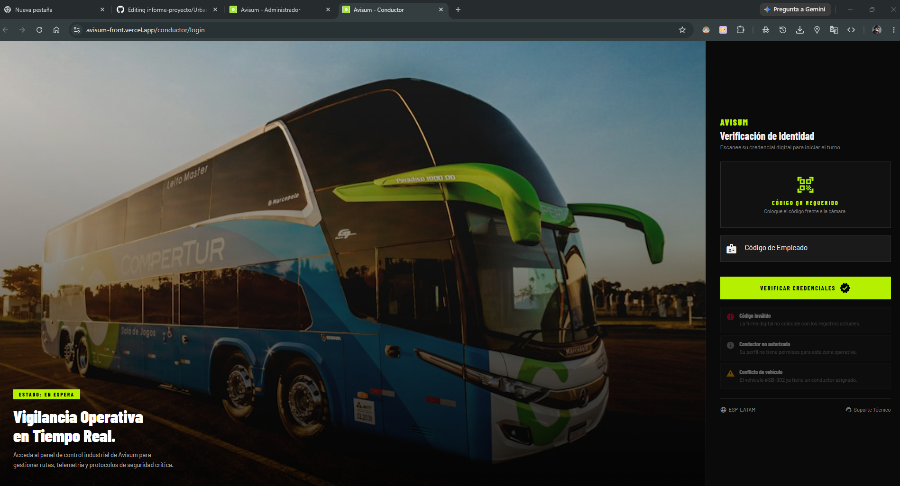

El conductor inicia su jornada ingresando su código de empleado (por ejemplo `EMP-001`). El sistema acepta el código en mayúsculas o minúsculas y con el prefijo `QR-`, lo consulta en la API y, si existe y está activo, lo lleva a la pantalla de acceso autorizado (US01). Los tres mensajes de error se muestran de forma independiente: *Código inválido* cuando el código no existe, y *Conductor no autorizado* cuando el conductor fue desactivado por el administrador (US14). El mensaje *Conflicto de vehículo* está maquetado, pero no tiene una regla de negocio asociada todavía.

---

**Verificación por QR**

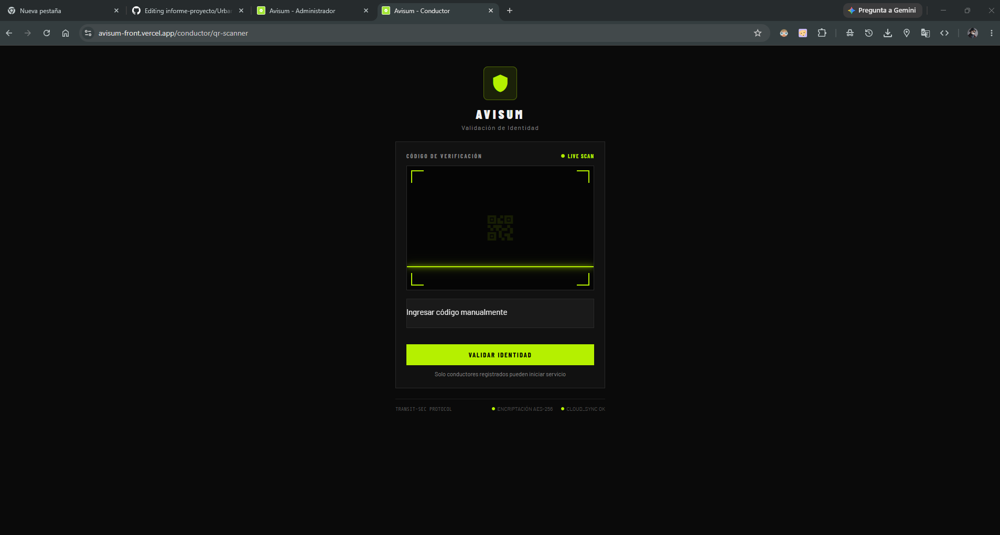

Pantalla alternativa de verificación con un recuadro de escaneo y un campo para ingresar el código manualmente. El escaneo es una **simulación**: a los pocos segundos se selecciona un conductor registrado, y la lectura real con la cámara no está implementada.

---

**Acceso autorizado e inicio de turno**

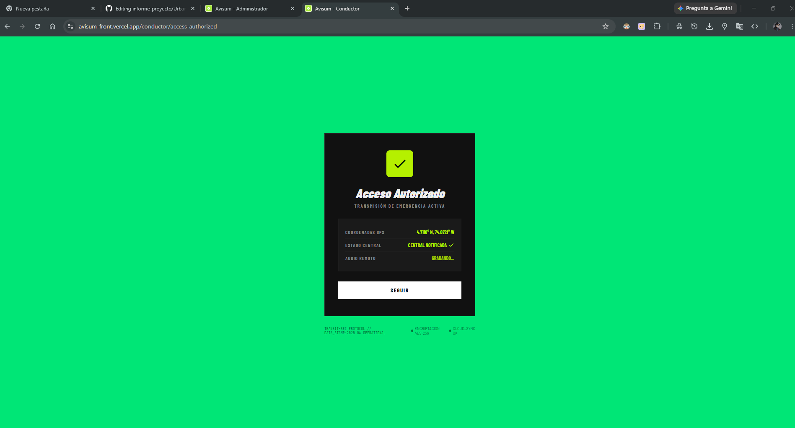

Al validar la identidad, el sistema registra el inicio del turno en la API (`POST /shifts`) asociando al conductor con su unidad (US02), y el conductor continúa al dashboard. Si alguien entra al dashboard sin un turno activo, el sistema lo devuelve al inicio de sesión.

----

**Dashboard del servicio**

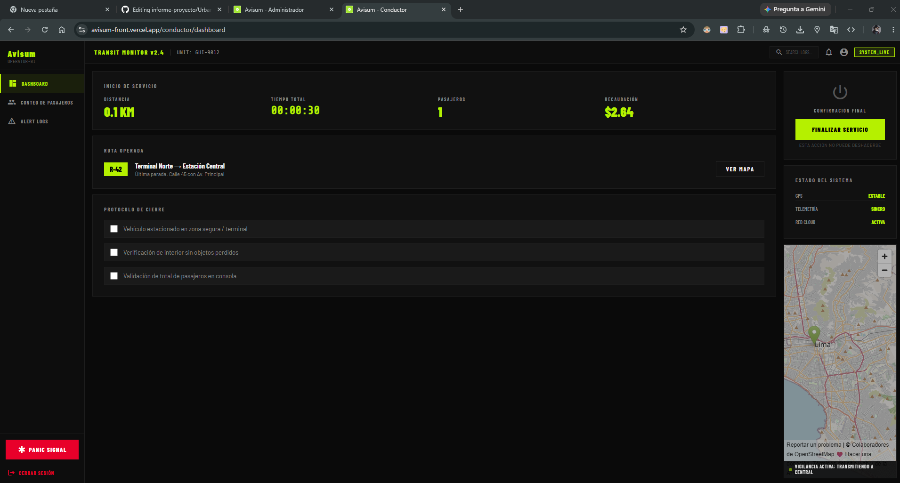

-----

**Perfil del conductor**

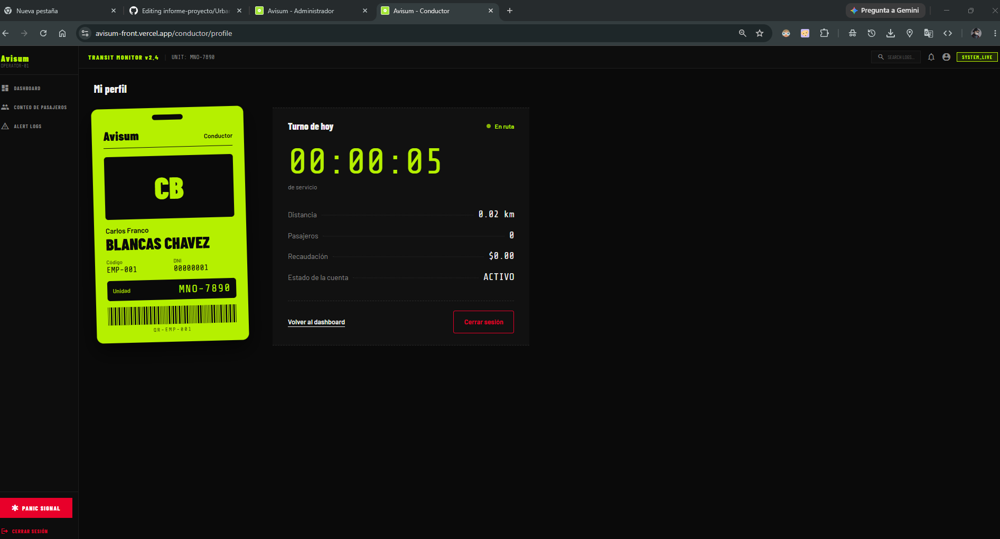

Pantalla adicional, no incluida en el Product Backlog, que presenta un carnet digital con los datos del conductor (nombre, código, DNI y unidad asignada) junto al estado de su turno actual en vivo. Se documenta como mejora de experiencia de usuario.

----

**Mapa del Conductor**

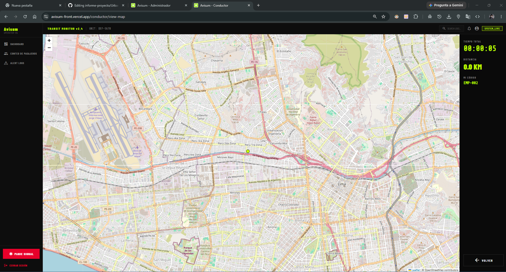

Muestra en tiempo real el avance del turno: tiempo transcurrido, distancia recorrida, pasajeros y recaudación, junto con la ruta operada, el estado del sistema y un mapa (US26). La barra superior indica la placa real de la unidad del conductor. Desde aquí el conductor puede activar el botón de pánico o finalizar el servicio, como tambien se puede observar el mapa en tiempo real del conductor. Las cifras de distancia, pasajeros y recaudación son **simuladas** por el frontend.

---

**Conteo de Pasajeros**

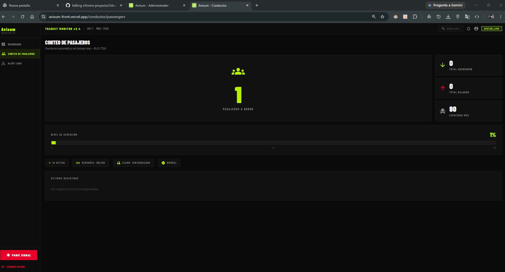

Muestra el conteo de pasajeros tanto a los que estan subiendo y bajando como los que estan actualmente en el bus.

----

**Alerta de pánico**

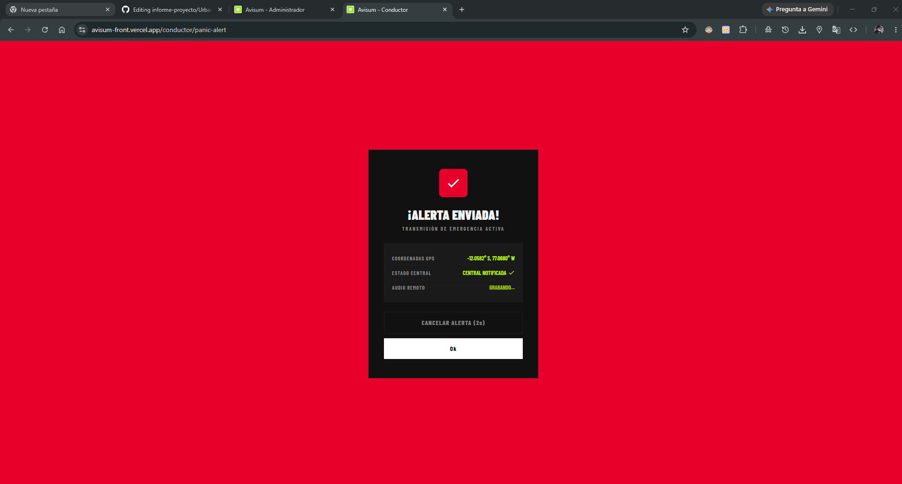

El botón de pánico genera una alerta crítica asociada a la unidad y a las coordenadas del momento (US03, US42), la guarda en la API (`POST /alerts`) y muestra al conductor la confirmación con el estado de la central. La alerta aparece de inmediato en el Centro de control del administrador, sin recargar, incluso si está abierta en otra pestaña del mismo navegador.

----
**Alert Logs**

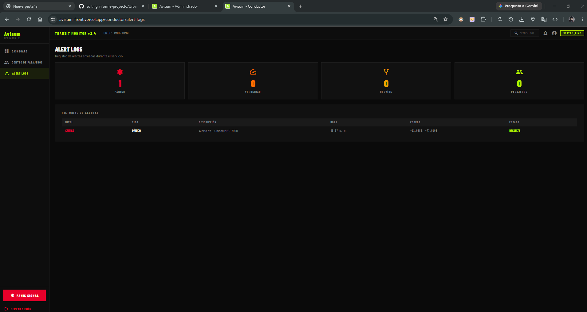

Muestra el resumen del viaje del conductor y cuantas alertas de panico envio al centro de operaciones

---

**Reporte de turno finalizado**

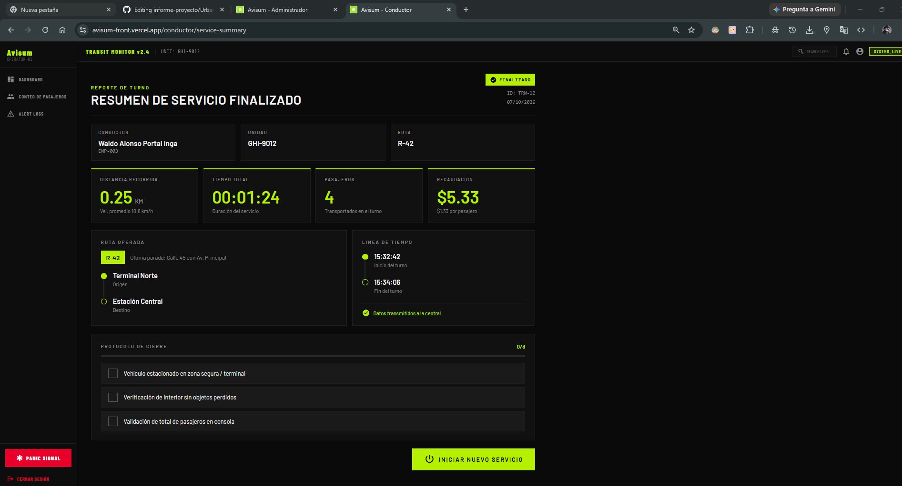

Al finalizar el servicio, el sistema cierra el turno en la API (`PATCH /shifts/:id/end`) y ofrece *Ver reporte* o *Salir* (US25). El reporte resume el conductor, la unidad, la ruta, la distancia con su velocidad promedio, el tiempo total, los pasajeros, la recaudación con el monto por pasajero, la línea de tiempo del turno y el protocolo de cierre.

----

**Acceso del administrador**

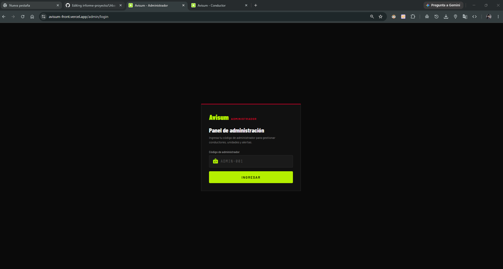

El administrador ingresa con su propio código (`ADMIN-001`) desde una dirección distinta a la del conductor. Existe una sola cuenta de administrador fija; no hay gestión de administradores. La validación es del lado del frontend y sirve para separar los roles en esta etapa, pero no constituye seguridad real: con un backend definitivo, el servidor debe validar el rol en cada petición.


---

**Centro de control**

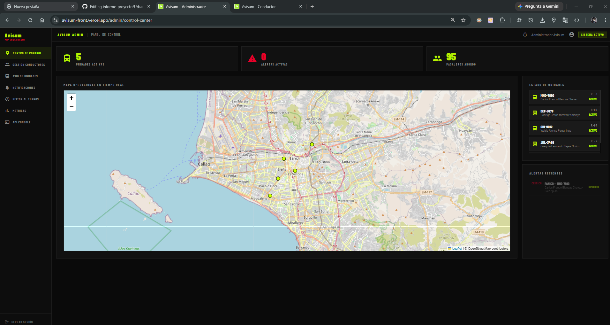

Panel principal del administrador. Muestra los indicadores de unidades activas, alertas activas y pasajeros a bordo, un mapa operacional con la posición de cada unidad (US07, US43, US28), el estado de cada una (activa, en alerta, inactiva) (US06, US27) y la lista de alertas recientes con su nivel de gravedad (US40, US04, US16). Desde la lista, el administrador resuelve las alertas, y la unidad vuelve a su estado normal.

----

**Gestión de conductores**

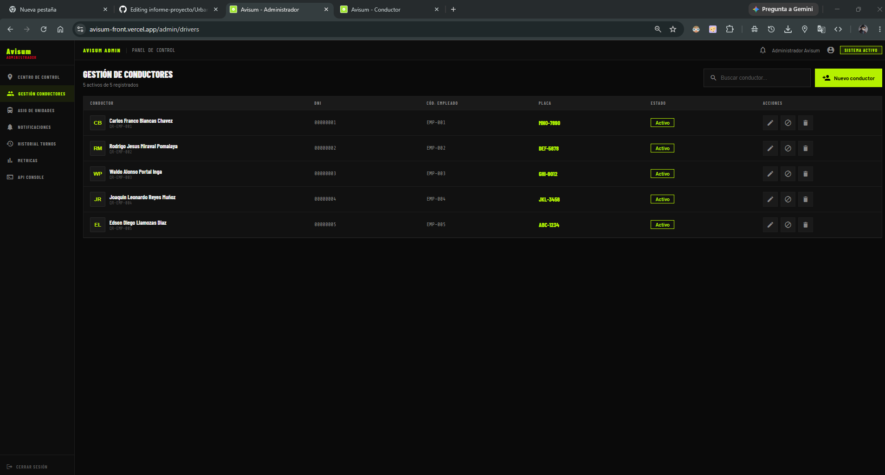

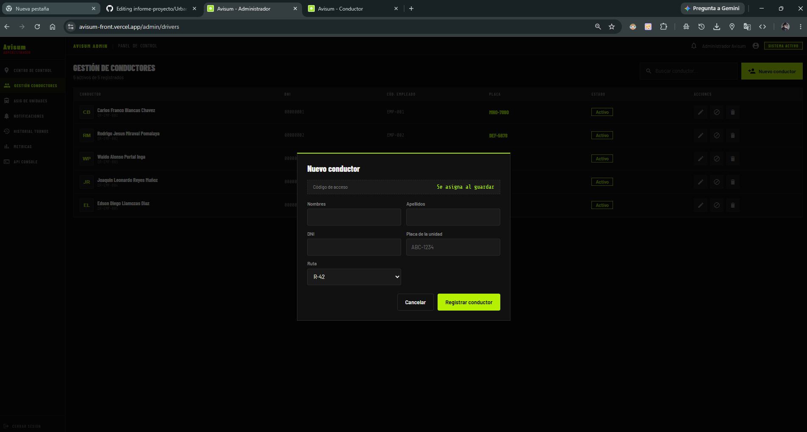

CRUD completo de conductores sobre la API: crear, editar, desactivar, reactivar y eliminar, con ventanas de confirmación y validación en línea (DNI de 8 dígitos único, placa con formato `ABC-1234` única, ruta obligatoria). Al crear un conductor, el servidor le asigna su código de acceso automáticamente (`EMP-006`, `EMP-007`, ...), que no se reutiliza si luego se elimina. Un conductor desactivado deja de poder iniciar sesión (US14, US47, US48 a nivel de API).

----
**Asignación de unidades**

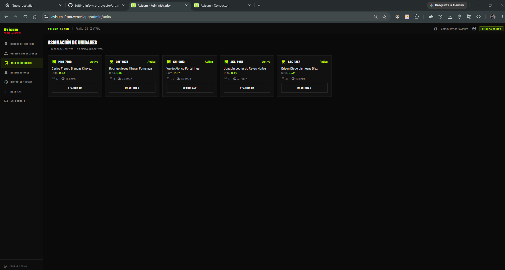

Muestra cada unidad con su estado en vivo, su conductor, su ruta, los pasajeros y la velocidad. El botón *Reasignar* permite cambiar el conductor de la unidad (los dos conductores intercambian de unidad) y su ruta (US15). Los cambios se guardan en la API.

---
**Notificaciones**

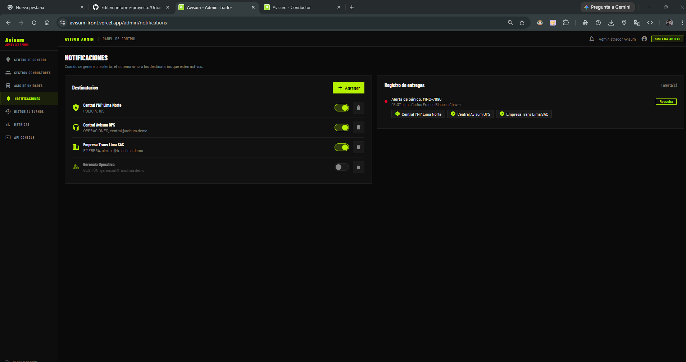

El administrador gestiona los destinatarios de las alertas (policía, operaciones, empresa, gestión): puede activarlos o desactivarlos, agregar nuevos y eliminarlos. Cada alerta guarda a qué destinatarios activos se notificó (US33), y el registro de entregas muestra, por alerta, el estado de la entrega a cada destinatario (US23). El paso de *pendiente* a *entregada* es **simulado** por tiempo; no hay envío real de mensajes.

----
**Historial de turnos**

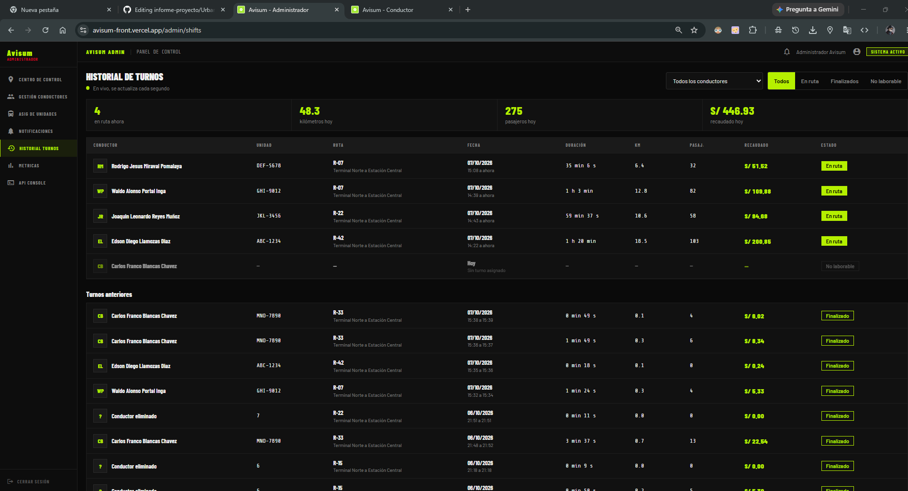

Tablero con una fila por conductor que se actualiza cada segundo. Cuando un conductor inicia sesión desde otra pestaña, su fila pasa a *En ruta* con sus cifras reales, y a *Finalizado* cuando termina su turno. Los conductores sin sesión abierta muestran un estado simulado (en ruta, finalizado o no laborable) para efectos de la demostración. Debajo se listan los *turnos anteriores* guardados en la API, con filtros por conductor y por estado y una franja de totales (US26).

-----
**Métricas**

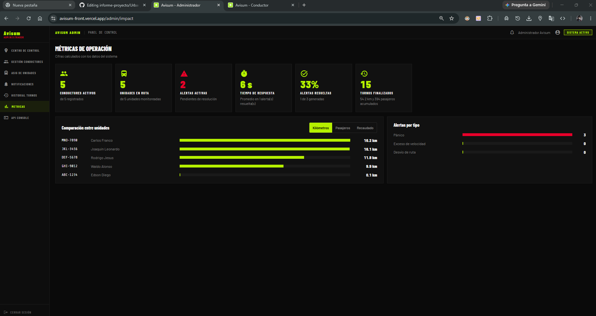

Indicadores calculados con los datos del sistema: conductores activos, unidades en ruta, alertas activas, alertas resueltas, turnos finalizados y **tiempo de respuesta promedio**, medido desde que se genera una alerta hasta que el administrador la resuelve (US34, US35). Incluye una comparación entre unidades por kilómetros, pasajeros o recaudación (US44) y un gráfico de alertas por tipo. El tiempo de respuesta permite contrastar la *Hypothesis Statement 2* (primera atención en menos de 2 minutos).

----
**Reproducción de la demostración**

Para ejecutar la aplicación con la API falsa:

```bash
npm install
npm run server    # API falsa en http://localhost:3000/api/v1 (base de datos: server/db.json)
npm start         # aplicación en http://localhost:4200
```

| Rol | Dirección | Código de acceso |
|---|---|---|
| Conductor | `/conductor/login` | `EMP-001` a `EMP-005` |
| Administrador | `/admin/login` | `ADMIN-001` |

Para ver la sincronización en vivo, se abren dos pestañas del mismo navegador: el conductor en una y el administrador en la otra. Al activar el pánico en la primera, la alerta aparece en la segunda.

**Alcance y limitaciones del Sprint 2**

- Los datos persisten en `server/db.json` mediante json-server (servicios REST simulados). La documentación detallada de los endpoints se presenta en la sección 5.2.2.6.
- La sincronización en vivo entre conductor y administrador usa `BroadcastChannel`, por lo que funciona entre pestañas del **mismo navegador**; entre dos computadoras requeriría consulta periódica a la API o WebSockets con un backend real.
- *Pendiente:* la lectura real del código QR con la cámara (hoy es una simulación).
- *Pendiente:* las User Stories US17 (detección de unidad sin señal), US24 (reintento de envío de alertas), US36 (desvío de ruta), US39 (una sola unidad por conductor activo) y US41 (escalamiento de alertas no atendidas) no están implementadas en esta iteración.
- Los destinatarios de notificaciones se guardan en el navegador y no en la API.
- La distancia, los pasajeros y la recaudación del turno son simulados por el frontend.

---

##### 5.2.2.6.Services Documentation Evidence for Sprint Review


##### 5.2.2.7.Software Deployment Evidence for Sprint Review


##### 5.2.2.8.Team Collaboration Insights during Sprint.    
